# <a name="configure-power-bi-report-server-with-azure-application-proxy"></a>为 Power BI 报表服务器配置 Azure 应用程序代理

本文介绍了如何使用 Azure Active Directory 应用程序代理连接到 Power BI 报表服务器和 SQL Server Reporting Services (SSRS) 2016 及更高版本。 通过这种集成，未接入企业网络的用户可以从自己的客户端浏览器访问 Power BI 报表服务器和 Reporting Services 报表，同时受到 Azure Active Directory (AD) 保护。 详细了解如何通过 [Azure Active Directory 应用程序代理](https://docs.microsoft.com/azure/active-directory/manage-apps/application-proxy)远程访问本地应用程序。

## <a name="environment-details"></a>环境详细信息

我们在创建的示例中使用了这些值。 

- 域：umacontoso.com
- Power BI 报表服务器：PBIRSAZUREAPP.umacontoso.com
- SQL Server 数据源：SQLSERVERAZURE.umacontoso.com

## <a name="configure-power-bi-report-server"></a>配置 Power BI 报表服务器

安装 Power BI 报表服务器（假定安装在 Azure VM 上）后，请配置 Power BI 报表服务器 Web 服务和 Web 门户 URL，具体步骤如下：

1. 在 VM 防火墙上为端口 80（如果配置了 https URL，则为端口 443）创建入站和出站规则。 此外，在 Azure 门户中为 TCP 协议（即端口 80）创建 Azure VM 的入站和出站规则。
2. 为环境中的 VM 配置的 DNS 名称是 `pbirsazureapp.eastus.cloudapp.azure.com`。
3. 配置 Power BI 报表服务器外部 Web 服务和 Web 门户 URL，具体方法为依次选择“高级”选项卡 >“添加”按钮 >“选择主机头名称”，并添加如下所示的主机名（DNS 名称）。

    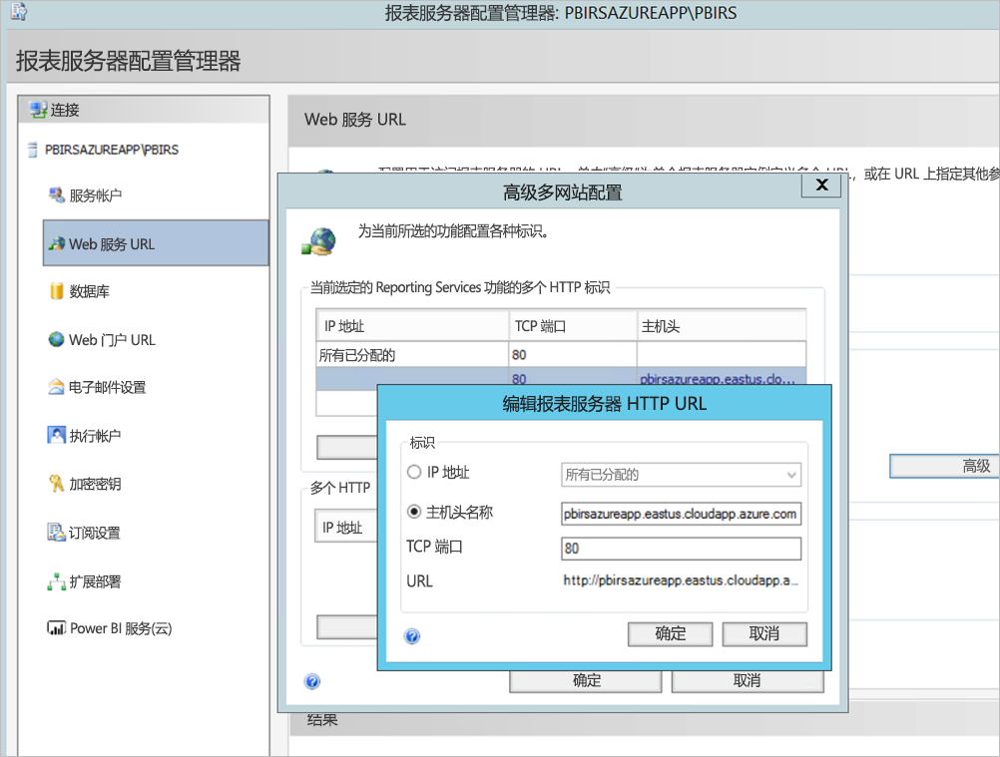

1. 我们为 Web 服务和 Web 门户这两个部分执行了前面的步骤，并在报表服务器配置管理器上注册了 URL：

    - `https://pbirsazureapp.eastus.cloudapp.azure.com/ReportServer`
    - `https://pbirsazureapp.eastus.cloudapp.azure.com/Reports`

2. 在 Azure 门户中，可以看到此 VM 在“网络”部分中有两个 IP 地址 

    - **公共 IP**。 
    - **专用 IP**。 
    
    公共 IP 地址用于从虚拟机外部访问。

3. 因此，我们在 VM（Power BI 报表服务器）上添加了主机文件条目，用于包含公共 IP 地址和主机名 `pbirsazureapp.eastus.cloudapp.azure.com`。
4. 请注意，在 VM 重启后，动态 IP 地址可能会更改，你可能需要在主机文件中重新添加正确的 IP 地址。 为了避免这种情况，可以在 Azure 门户中将公共 IP 地址设置为静态。
5. 在进行了上述更改之后，Web 服务和 Web 门户 URL 应该是可成功访问的。
6. 在访问服务器上的 URL `https://pbirsazureapp.eastus.cloudapp.azure.com/ReportServer` 时，我们看到三次输入凭据提示，且屏幕是空白的。
7. 添加以下注册表项：

    `HKEY\_LOCAL\_MACHINE \SYSTEM\CurrentControlset\Control \Lsa\ MSV1\_0` 注册表项

1. 添加新值 `BackConnectionHostNames`（多字符串值），并提供主机名 `pbirsazureapp.eastus.cloudapp.azure.com`。

之后，我们就还可以访问服务器上的 URL 了。

## <a name="configure-power-bi-report-server-to-work-with-kerberos"></a>将 Power BI 报表服务器配置为使用 Kerberos

### <a name="1-configure-the-authentication-type"></a>1.配置身份验证类型

我们需要将报表服务器的身份验证类型配置为允许 Kerberos 约束委派。 此配置是在 rsreportserver.config 文件中完成的。

在 rsreportserver.config 文件中，查找“Authentication/AuthenticationTypes”部分。

我们需要确保 RSWindowsNegotiate 被列为身份验证类型列表中的第一个类型。 它应类似于下面这样。

```
<AuthenticationTypes>

    <RSWindowsNegotiate/>

</AuthenticationTypes>
```

如果必须更改配置文件，请在报表服务器配置管理器中停止并重启报表服务器服务，以确保更改生效。

### <a name="2-register-service-principal-names-spns"></a>2.注册服务主体名称 (SPN)

以管理员身份打开命令提示符，并执行以下步骤：

运行下面的命令，以在 Power BI 报表服务器服务帐户下注册以下 SPN

```
setspn -s http/ Netbios name\_of\_Power BI Report Server\_server<space> Power BI Report Server\_ServiceAccount

setspn -s http/ FQDN\_of Power BI Report Server\_server<space> Power BI Report Server\_ServiceAccount
```

运行下面的命令（对于默认 SQL Server 实例），以在 SQL Server 服务帐户下注册以下 SPN：

```
setspn -s MSSQLSVC/FQDN\_of\_SQL\_Server: 1433 (PortNumber) <SQL service service account>

setspn -s MSSQLSVC/FQDN\_of\_SQL\_Server<SQL service service account>
```

### <a name="3-configure-delegation-settings"></a>3.配置委派设置

必须对报表服务器服务帐户配置委派设置。

1. 打开“Active Directory 用户和计算机”。
2. 在“Active Directory 用户和计算机”中，打开报表服务器服务帐户的“属性”。
3. 我们需要通过协议传输来配置约束委派。 使用约束委派时，我们需要明确要委派哪些服务。
4. 右键单击报表服务器服务帐户，然后选择“属性”。
5. 选择“**委派**”选项卡。
6. 选中“仅信任此计算机来委派指定的服务”。
7. 选中“使用任意身份验证协议”。
8. 在“可以由此帐户提供委派凭据的服务:”下，选择“添加”。
9. 在新对话框中，选择“用户或计算机”。
10. 输入 SQL Server 服务帐户，然后选择“确定”。

    它以 MSSQLSVC 开头。

1. 添加 SPN。
2. 选择“确定”。 现在，列表中应该会显示 SPN。

执行这些步骤有助于将 Power BI 报表服务器配置为使用 Kerberos 身份验证机制，并在本地计算机上与数据源建立测试连接。

## <a name="configure-azure-application-proxy-connector"></a>配置 Azure 应用程序代理连接器

请参阅关于[与应用程序代理连接器相关的配置](https://docs.microsoft.com/azure/active-directory/manage-apps/application-proxy-add-on-premises-application#add-an-on-premises-app-to-azure-ad)文章

我们在 Power BI 报表服务器上安装了应用程序代理连接器，但你可以在单独的服务器上配置它，并确保正确设置了委派。

### <a name="ensure-the-connector-is-trusted-for-delegation"></a>确保连接器是受信任的，可进行委派

请确保连接器是受信任的，可委派添加到报表服务器应用程序池帐户的 SPN。

配置 Kerberos 约束委派 (KCD)，这样 Azure AD 应用程序代理服务就能向报表服务器应用程序池帐户委派用户标识。 可通过让应用程序代理连接器检索已在 Azure AD 中进行身份验证的用户的 Kerberos 票证，配置 KCD。 然后，此服务器会将上下文传递给目标应用程序（在此示例中为 Power BI 报表服务器）。

若要配置 KCD，请针对每个连接器计算机重复执行以下步骤：

1. 以域管理员身份登录域控制器，然后打开“Active Directory 用户和计算机”。
2. 找到运行连接器的计算机。
3. 双击此计算机，然后选择“委派”选项卡。
4. 将委派设置设为“信任此计算机仅委派指定服务”。 然后，选择“使用任意身份验证协议”。
5. 依次选择“添加”和“用户或计算机”。
6. 输入用于 Power BI 报表服务器的服务帐户。 此帐户是在报表服务器配置中将 SPN 添加到其中的帐户。
7. 单击“确定”。 
8. 若要保存更改，请再次单击“确定”。

## <a name="publish-through-azure-ad-application-proxy"></a>通过 Azure AD 应用程序代理发布

现在可以配置 Azure AD 应用程序代理了。

使用以下设置通过应用程序代理发布 Power BI 报表服务器。 有关如何通过应用程序代理发布应用程序的分步说明，请参阅[使用 Azure AD 应用程序代理发布应用程序](https://docs.microsoft.com/azure/active-directory/manage-apps/application-proxy-add-on-premises-application#add-an-on-premises-app-to-azure-ad)。

- **内部 URL**：输入连接器可以在企业网络中访问的报表服务器的 URL。 请确保此 URL 是可以从连接器安装所在的服务器进行访问的。 最佳做法是使用一级域名（如 `https://servername/`），以免通过应用程序代理发布的子路径出现问题。 例如，使用 `https://servername/`，而不是 `https://servername/reports/` 或 `https://servername/reportserver/`。 我们为环境配置了 `https://pbirsazureapp.eastus.cloudapp.azure.com/`。

    > [!NOTE]
    > 建议使用与报表服务器的安全 HTTPS 连接。 若要详细了解操作说明，请参阅[在本机模式报表服务器上配置 SSL 连接](https://docs.microsoft.com/sql/reporting-services/security/configure-ssl-connections-on-a-native-mode-report-server?view=sql-server-2017)。

- **外部 URL**：输入 Power BI 移动应用将连接到的公共 URL。 例如，如果使用的是自定义域，外部 URL 可能为 `https://reports.contoso.com`。 若要使用自定义域，请上传域证书，然后将 DNS 记录指向应用程序的默认 msappproxy.net 域。 有关详细步骤，请参阅[在 Azure AD 应用程序代理中使用自定义域](https://docs.microsoft.com/azure/active-directory/manage-apps/application-proxy-configure-custom-domain)。

我们为环境配置了外部 URL `https://pbirsazureapp-umacontoso2410.msappproxy.net/`。

- **预身份验证方法**：Azure Active Directory。
- **连接器组：** 默认值。

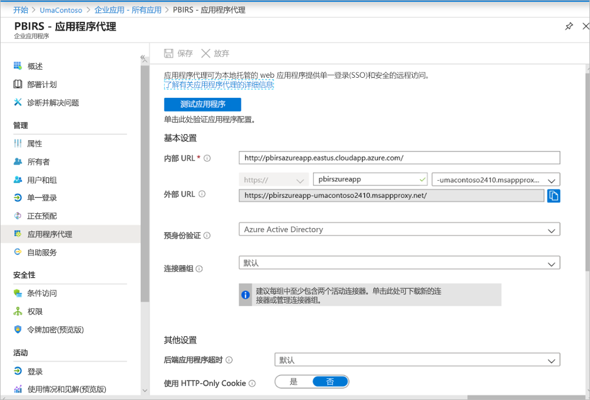

我们未在“其他设置”部分中进行任何更改。 此部分配置为使用默认选项。

> [!IMPORTANT]
> 配置应用程序代理时，请注意，“后端应用程序超时”属性设置为“默认值”（85 秒） 。 如果报表的执行时间超过 85 秒，请将此属性设置为“长”（180 秒），这是可能的最高超时值。 配置为“长”时，所有报表都需要在 180 秒内完成，否则便会超时并导致错误。


### <a name="configure-single-sign-on"></a>配置单一登录

发布应用后，请执行以下步骤来配置单一登录设置：

1. 在门户中的应用程序页上，选择“单一登录”。
2. 对于“单一登录模式”，选择“集成 Windows 身份验证”。
3. 将“内部应用程序 SPN”设置为此前设置的值。 若要确定此值，可以按照以下步骤操作：

    - 尝试生成报表，或与数据源建立测试连接，这样就能创建 Kerberos 票证了。
    - 成功生成报表/建立测试连接后，打开命令提示符，并运行命令 `klist`。 在“结果”部分中，应该会看到包含 `http/` SPN 的票证。 如果它与你已为 Power BI 报表服务器配置的 SPN 相同，请在这一部分中使用此 SPN。

1. 针对你要代表你的用户使用的连接器选择“委派的登录标识”。 有关详细信息，请参阅[使用不同的本地标识和云标识](https://docs.microsoft.com/azure/active-directory/manage-apps/application-proxy-configure-single-sign-on-with-kcd#working-with-different-on-premises-and-cloud-identities)。

    建议使用用户主体名称。 我们的示例配置为使用“用户主体名称”选项：

    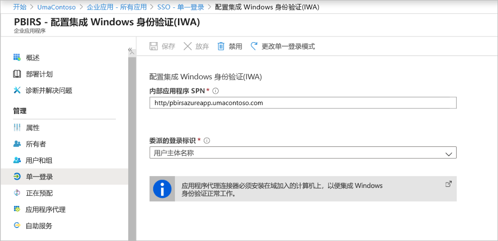

1. 单击“保存”以保存更改。

### <a name="finish-setting-up-your-application"></a>完成应用程序设置

要完成应用程序设置，请转到“用户和组”部分，分配要访问此应用程序的用户。

1. 在 Power BI 报表服务器应用程序的“应用注册”的“身份验证”部分中，配置“重定向 URL”和“高级设置”，如下所示：

    - 新建重定向 URL，并将它配置为“类型” = “Web”、“重定向 URI” = `https://pbirsazureapp-umacontoso2410.msappproxy.net/`
    - 在“高级设置”部分中，将“注销 URL”配置为“`https://pbirsazureapp-umacontoso2410.msappproxy.net/?Appproxy=logout`”。

    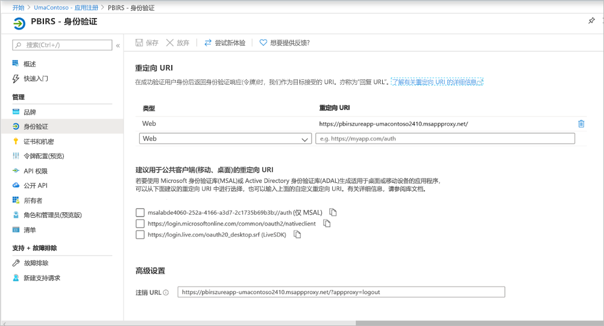

1. 在 Power BI 报表服务器应用程序的“应用注册”的“身份验证”部分中，继续配置“隐式授权”、“默认客户端类型”和“支持的帐户类型”，如下所示：

    - 将“隐式授权”设置为“ID 令牌”。
    - 将“默认客户端类型”设置为“否”。
    - 将“支持的帐户类型”设置为“仅此组织目录(仅 UmaContoso - 单一租户)中的帐户”。

    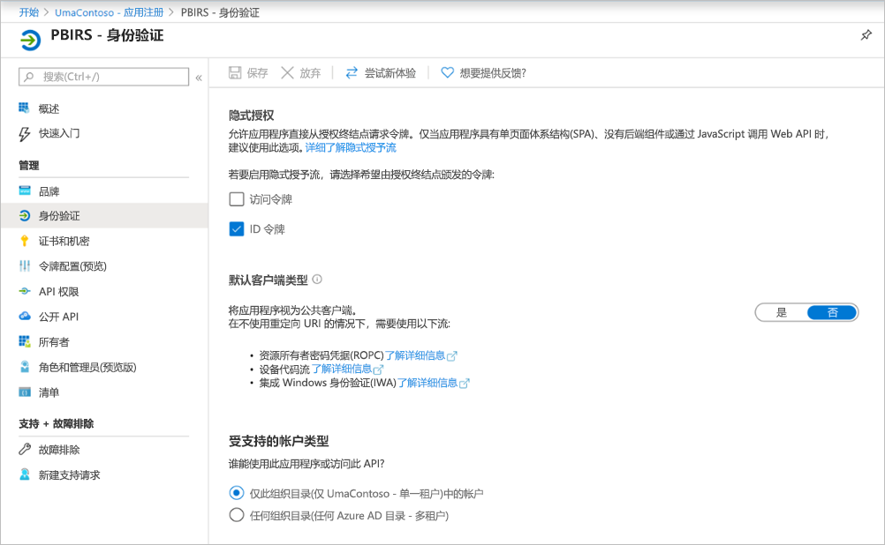

1. 在单一登录设置完成且 URL `https://pbirsazureapp-umacontoso2410.msappproxy.net` 可以运行后，我们需要确保登录帐户与在 Power BI 报表服务器中提供权限的帐户同步。

1. 首先，必须配置我们计划在登录时使用的自定义域，然后确保它是经过验证的
2. 在此示例中，我们购买了 umacontoso.com 域，并为 DNS 区域配置了条目。 也可以尝试使用 `onmicrosoft.com` 域，并将它与本地 AD 同步。

    有关参考，请参阅[教程：将现有自定义 DNS 名称映射到 Azure 应用服务](https://docs.microsoft.com/Azure/app-service/app-service-web-tutorial-custom-domain)一文。

1. 成功验证自定义域的 DNS 条目后，应该能够在门户中看到域对应的“已验证”状态。

    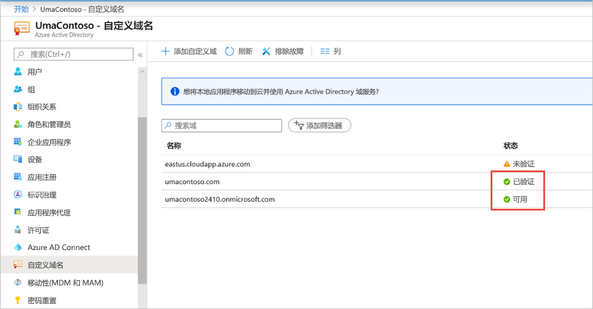

1. 在域控制器服务器上安装 Microsoft Azure AD Connect，并将它配置为与 Azure AD 同步。

    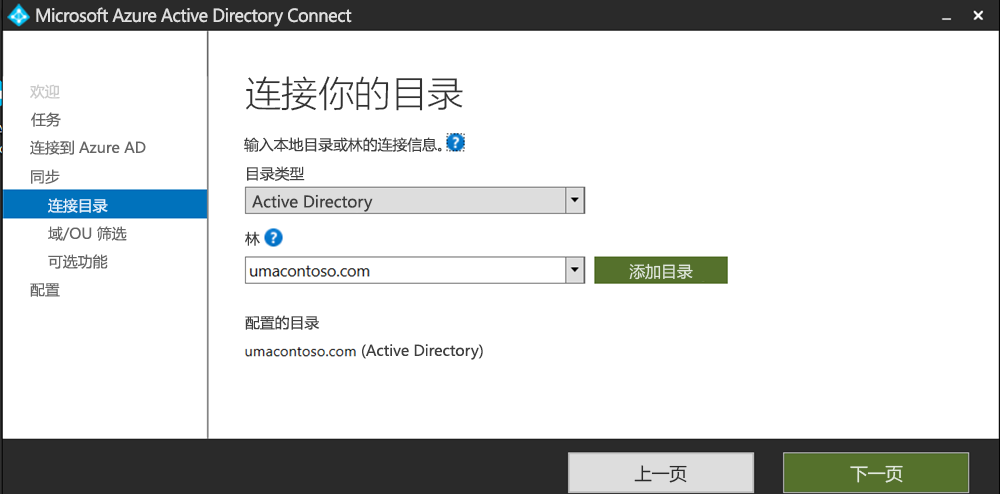

1. 在 Azure AD 与本地 AD 同步后，Azure 门户中显示以下状态：

    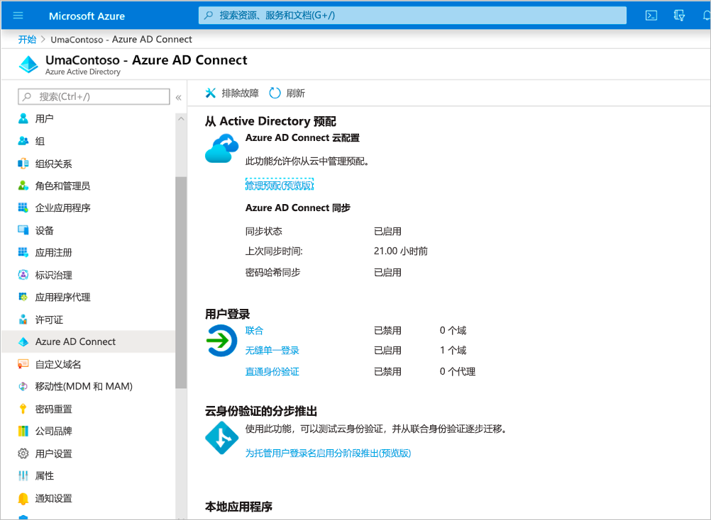

1. 此外，在同步成功后，在域控制器上打开“AD 域和信任”。 右键单击“Active Directory 域和信任”，选择“属性”，然后添加 UPN。 在环境中，我们购买的自定义域是 `umacontoso.com`。

1. 添加 UPN 后，应该可以为用户帐户配置 UPN，这样就能连接 Azure AD 帐户和本地 AD 帐户，并在身份验证过程中识别令牌。

    在你完成上一步后，AD 域名就会在“用户登录名”部分的下拉列表中列出。 在 AD 用户属性的“用户登录名”部分中，配置用户名，然后从下拉列表中选择域。

    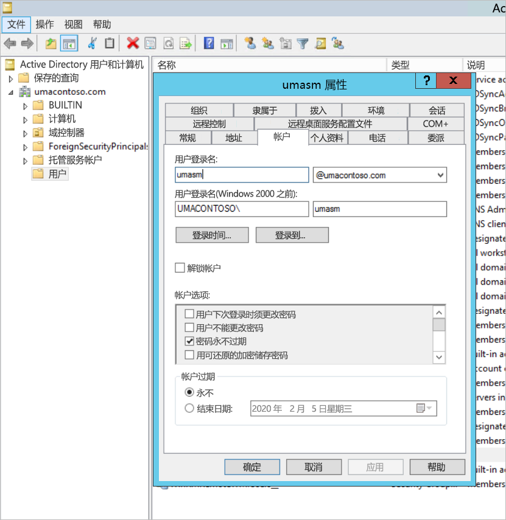

1. 在 AD 同步成功后，Azure 门户中应用程序的“用户和组”部分下就会显示本地 AD 帐户。 此帐户的源是 Windows Server AD。
2. 使用 `umasm@umacontoso.com` 登录相当于使用 Windows 凭据 `Umacontoso\umasm` 登录。

    如果你已配置本地 AD，并计划将它与 Azure AD 同步，则上述步骤适用。

    实现上述步骤后，应该就会登录成功：

    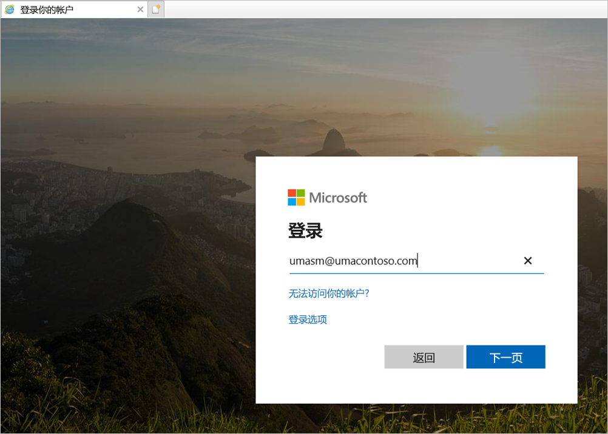

    然后看到 Web 门户：

    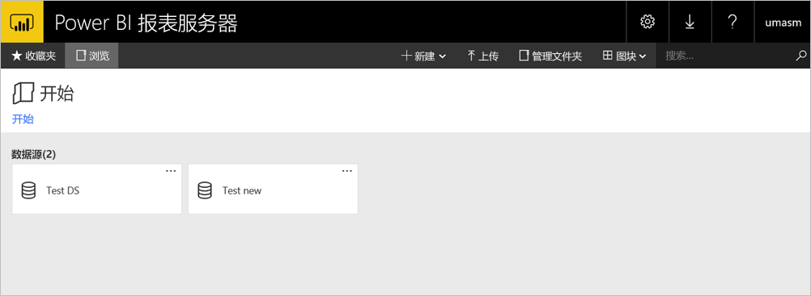

    使用 Kerberos 身份验证机制，与数据源成功建立测试连接：

    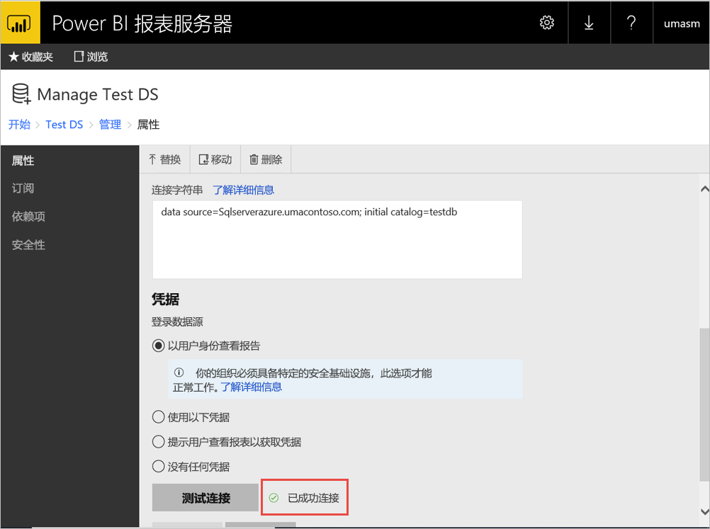

## <a name="access-from-power-bi-mobile-apps"></a>从 Power BI 移动应用访问

### <a name="configure-the-application-registration"></a>配置应用注册

你必须先配置在本文前面的[“通过 Azure AD 应用程序代理发布”](#publish-through-azure-ad-application-proxy)中自动为你创建的应用注册，然后 Power BI 移动应用才能连接和访问 Power BI 报表服务器。

1. 在 Azure Active Directory 的“概览”页中，选择“应用注册”。
2. 在“所有应用程序”选项卡上，搜索为 Power BI 报表服务器创建的应用程序。
3. 依次选择应用程序和“身份验证”。
4. 根据所使用的平台，添加以下重定向 URI。

    为 Power BI iOS 移动版配置应用时，添加以下类型为公共客户端（移动和桌面）的重定向 URI：

    - `msauth://code/mspbi-adal%3a%2f%2fcom.microsoft.powerbimobile`
    - `msauth://code/mspbi-adalms%3a%2f%2fcom.microsoft.powerbimobilems`
    - `mspbi-adal://com.microsoft.powerbimobile`
    - `mspbi-adalms://com.microsoft.powerbimobilems`

    为 Power BI Android 移动版配置应用时，添加以下类型为公共客户端（移动和桌面）的重定向 URI：

    - `urn:ietf:wg:oauth:2.0:oob`
    - `mspbi-adal://com.microsoft.powerbimobile`
    - `msauth://com.microsoft.powerbim/g79ekQEgXBL5foHfTlO2TPawrbI%3D`
    - `msauth://com.microsoft.powerbim/izba1HXNWrSmQ7ZvMXgqeZPtNEU%3D`

    同时为 Power BI iOS 和 Android 移动版配置应用时，将以下类型为公共客户端（移动和桌面）的重定向 URI 添加到为 iOS 配置的重定向 URI 列表中：

    - `urn:ietf:wg:oauth:2.0:oob`

    > [!IMPORTANT]
    > 必须添加重定向 URI，这样应用程序才能正常运行。

### <a name="connect-from-the-power-bi-mobile-apps"></a>从 Power BI 移动应用连接

1. 在 Power BI 移动应用中，连接到报表服务器实例。 若要连接，请输入通过应用程序代理发布的应用程序的“外部 URL”。
2. 选择“连接”。 此时会定向到 Azure Active Directory 登录页。
3. 输入用户的有效凭据，然后选择“登录”。 此时会看到报表服务器中的元素。

## <a name="next-steps"></a>后续步骤

[使用 Azure AD 应用程序代理启用对 Power BI 移动版的远程访问](https://docs.microsoft.com/azure/active-directory/manage-apps/application-proxy-integrate-with-power-bi)

更多问题？ [尝试咨询 Power BI 社区](https://community.powerbi.com/)

                
