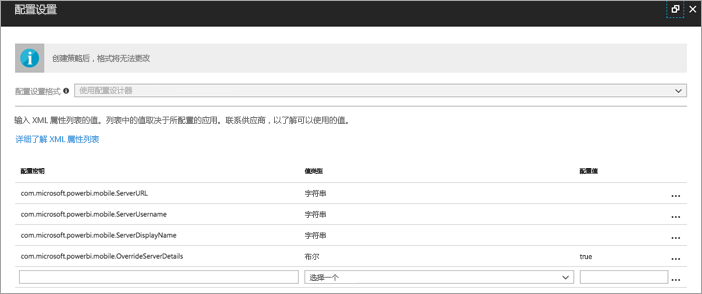
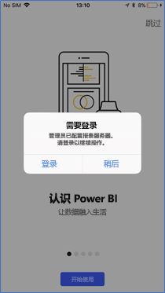

# 远程配置 Power BI iOS 移动应用对报表服务器的访问权限

在本文中，可了解如何使用组织的 MDM 工具来配置 Power BI iOS 移动应用对报表服务器的访问权限。 若要配置该权限，IT 管理员将创建应用配置策略，指定要推送到应用的必要信息。 

 配置报表服务器连接后，Power BI iOS 移动应用用户就可以更轻松地连接到其组织的报表服务器。 

## 在 MDM 工具中创建应用配置策略 

管理员在 Microsoft Intune 中执行这些步骤，即可创建应用配置策略。 在其他 MDM 工具中，生成应用配置策略的步骤和体验可能有所不同。 

1. 连接 MDM 工具。 
2. 创建并命名新的应用配置策略。 
3. 选择要将此应用配置策略分发到的用户。 
4. 创建键值对。 

键值对拼写如下表所示。

|密钥  |类型  |说明  |
|---------|---------|---------|
| com.microsoft.powerbi.mobile.ServerURL | 字符串 | 报表服务器 URL   应以 http/https 开头 |
| com.microsoft.powerbi.mobile.ServerUsername | 字符串 | [可选]   要用于连接服务器的用户名。   如果不存在此项，应用将提示用户键入用于连接的用户名。| 
| com.microsoft.powerbi.mobile.ServerDisplayName | 字符串 | [可选]   默认值为“报表服务器”   应用中用于表示服务器的友好名称 | 
| com.microsoft.powerbi.mobile.OverrideServerDetails | 布尔 | 默认值为 True  设置为“True”时，它将替代移动设备中已有的任何报表服务器定义。 已删除已配置的现有服务器。   将“替代”设置为 True 还可防止用户删除该配置。   设置为“False”将添加推送值，并保留任何现有设置。   如果已在移动应用中配置相同的服务器 URL，则应用将按原样保留该配置。 该应用不会要求用户重新验证同一服务器。 |

下面的示例使用 Intune 设置配置策略。

## 最终用户连接到报表服务器

 假设你发布了通讯组列表的应用配置策略。 当该通讯组列表上的用户和设备启动 iOS 移动应用时，他们将有如下体验。 

1. 他们将看到一条消息，表示已为移动应用配置报表服务器，然后点击“登录”  。

    

2.  在“连接到服务器”页上，已填写报表服务器详细信息  。 他们将点击“连接”  。

    

3. 他们将键入密码进行身份验证，然后点击“登录”  。 

    

现在，他们就可查看存储在报表服务器上的 KPI 和 Power BI 报表并与之交互。

## 后续步骤

- [使用 Azure AD 应用程序代理启用对 Power BI 移动版的远程访问](https://docs.microsoft.com/azure/active-directory/manage-apps/application-proxy-integrate-with-power-bi)
- [管理员概述](admin-handbook-overview.md)  
- [安装 Power BI 报表服务器](install-report-server.md)  

更多问题？ [尝试咨询 Power BI 社区](https://community.powerbi.com/)

