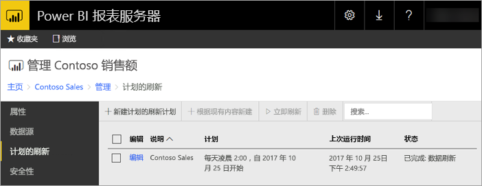
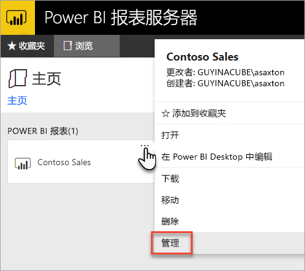
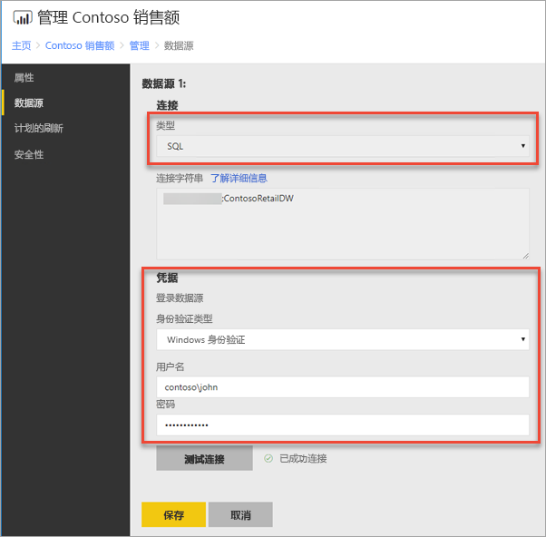
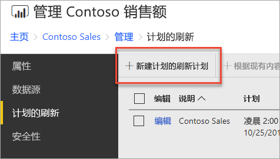
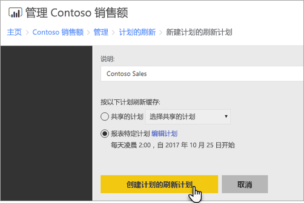
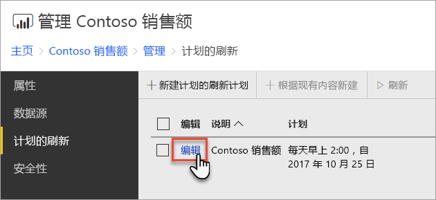

# 如何配置 Power BI 报表计划的刷新
若要刷新 Power BI 报表服务器的 Power BI 报表中的数据，必须创建计划的刷新计划。 在报表服务器上的 Power BI 报表的“管理”区域中创建此计划。

## 配置数据源凭据
你必须具有必要的权限才能创建计划的刷新。 权限在报表服务器的角色定义中定义。 有关详细信息，请参阅 SQL Server Reporting Services 文档中的[角色定义 - 预定义角色](/sql/reporting-services/security/role-definitions-predefined-roles)。

在创建计划数据刷新计划之前，需要为在 Power BI 报表中使用的“每个数据源”设置凭据。

1. 在 Web 门户中，右键单击 Power BI 报表，然后选择“管理”。
   
    
2. 在左侧菜单中，选择“数据源”选项卡。
3. 对于出现的每个数据源，请选择连接该数据源时要使用的身份验证的类型。 输入适当的凭据。
   
    

## 创建计划的刷新计划
按照以下步骤创建计划的刷新计划。

1. 在 Web 门户中，右键单击 Power BI 报表，然后选择“管理”。
   
    
2. 在左侧菜单中，选择“计划的刷新”选项卡。
3. 在“计划的刷新”页上，选择“新建计划刷新计划”。
   
    
4. 在“新建计划刷新计划”页上，输入描述并在想要刷新数据模型时设置计划。
5. 完成时选择“创建计划的刷新计划”。
   
    

## 修改计划的刷新计划
修改计划的刷新计划与创建操作类似。

1. 在 Web 门户中，右键单击 Power BI 报表，然后选择“管理”。
   
    
2. 在左侧菜单中，选择“计划的刷新”选项卡。
3. 在“计划的刷新”页上，选择想要管理的刷新计划旁边的“编辑”。
   
    
4. 在“编辑计划的刷新计划”页上，输入描述并在想要刷新数据模型时设置计划。
5. 完成时选择“应用”。
   
    

## 查看计划刷新计划的状态
在 Web 门户中，查看计划刷新计划的状态。

1. 在 Web 门户中，右键单击 Power BI 报表，然后选择“管理”。
   
    
2. 在左侧菜单中，选择“计划的刷新”选项卡。
3. 在“计划的刷新”页上，最右边的列用于显示计划状态。
   
   | **状态** | **说明** |
   | --- | --- |
   | 新建计划的刷新计划 |此计划已创建但并未运行。 |
   | 正在刷新 |刷新进程已开始。 |
   | 将模型流式传输到 Analysis Server |将报表服务器目录数据库的模型复制到托管的 Analysis Services 实例。 |
   | 正在刷新数据 |刷新模型内的数据。 |
   | 正在从模型中删除凭据 |从模型中删除用于连接到数据源的凭据 |
   | 正在将模型保存到目录 |数据刷新已完成，并且正在将刷新的模型保存回报表服务器目录数据库。 |
   | 已完成：数据刷新 |刷新完成。 |
   | 错误： |刷新期间出错并显示错误。 |

若要查看当前的状态，必须刷新网页。 该状态不会自动更改。

## 后续步骤
若要了解有关创建和修改计划的详细信息，请参阅[创建、修改和删除计划](/sql/reporting-services/subscriptions/create-modify-and-delete-schedules)。

有关如何对计划的刷新进行故障排除的信息，请参阅[对 Power BI 报表服务器中计划的刷新进行故障排除](scheduled-refresh-troubleshoot.md)。

更多问题？ [尝试咨询 Power BI 社区](https://community.powerbi.com/)