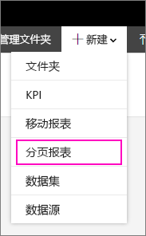
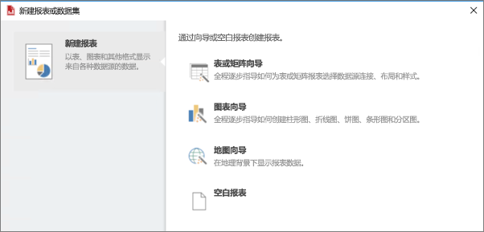

# 安装报表生成器 - Power BI 报表服务器

报表生成器是一个独立应用，由你或管理员安装到你的电脑上。 你可以从 Microsoft 下载中心或 Power BI 报表服务器安装它。  

正在查找有关为 Power BI 服务安装报表生成器的帮助吗？ 请参阅 [Power BI Report Builder](../paginated-reports/report-builder-power-bi.md)。
  
通常，由管理员安装和配置 Power BI 报表服务器、授予从 Web 门户下载报表生成器的权限，以及管理文件夹与对报表和保存到报表服务器的共享数据集的权限。 有关 Power BI 报表服务器管理的详细信息，请参阅[管理员概述：Power BI 报表服务器](admin-handbook-overview.md)。  
  
## 系统要求
  
 请参阅 Microsoft 下载中心上[报表生成器下载页](https://go.microsoft.com/fwlink/?LinkID=734968)的“系统要求”部分。
 
## 从 Web 门户安装报表生成器
  
可以从 Power BI 报表服务器 Web 门户安装报表生成器。 可能已安装报表生成器来为 SSRS 服务器创建报表。 可以使用相同版本的报表生成器来为 Power BI 报表服务器创建报表。 如果尚未安装，也不用担心，操作过程非常简单。

1. 在 Power BI 报表服务器 Web 门户中，选择“新建”   > “分页报表”  。
   
    
   
    如果尚未安装报表生成器，则会启动 Microsoft 报表生成器向导。  
  
3.  接受许可协议中的条款 > 下一步  。  
 
5.  选择“安装”以完成报表生成器的安装  。  

2. 安装后，报表生成器中会打开“新建报表或数据集”  屏幕。
   
    
 

##   从下载中心安装报表生成器  
  
1.  在 [Microsoft 下载中心的“报表生成器”页](https://go.microsoft.com/fwlink/?LinkID=734968)上，选择“下载”  。  
  
2.  报表生成器下载完成后，选择“运行”  。  
  
     将随即启动 Microsoft 报表生成器向导。  
  
3.  接受许可协议中的条款 > 下一步  。  
 
5.  选择“安装”以完成报表生成器的安装  。  
 

## 后续步骤

[什么是 Power BI 报表服务器？](get-started.md)
