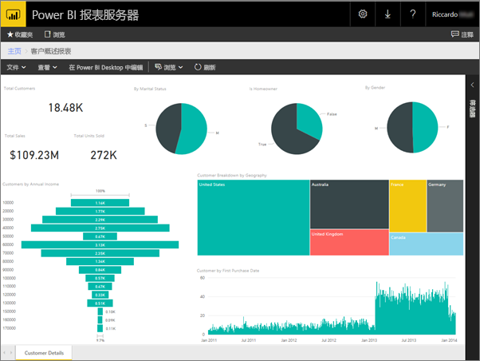
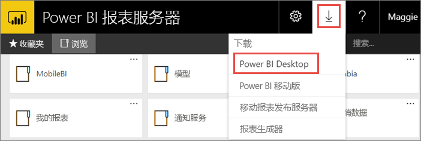
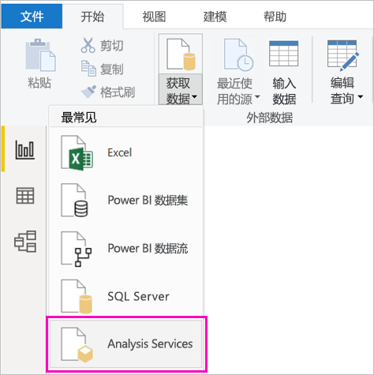
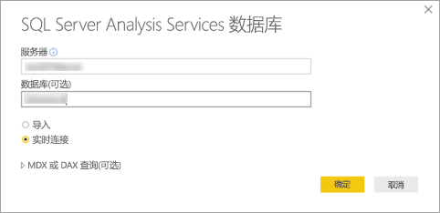
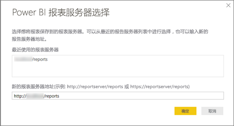
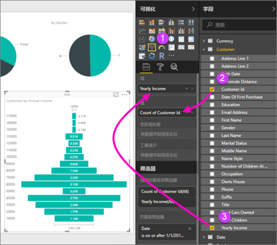
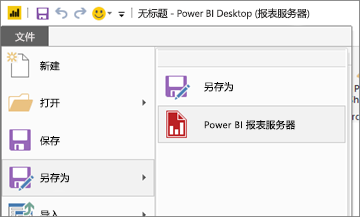

# 为 Power BI 报表服务器创建 Power BI 报表
可以在 Power BI 报表服务器 Web 门户中在本地存储和管理 Power BI 报表，就像在 Power BI 服务 (https://powerbi.com) ) 中的云中存储 Power BI 报表一样。 可以在 Power BI Desktop 中创建和编辑报表，并将其发布到 Web 门户中。 接下来，组织中的报表读取器可以在浏览器或移动设备上的 Power BI 移动应用中查看报表。

可以遵循以下四个步骤入门。

## 步骤 1：安装更适合 Power BI 报表服务器的 Power BI Desktop

如果已在 Power BI Desktop 中创建 Power BI 报表，便可以开始为 Power BI 报表服务器创建 Power BI 报表。 建议安装更适合 Power BI 报表服务器的 Power BI Desktop 版本，这样就能确定服务器和应用始终同步。可以在同一台计算机上安装两个版本的 Power BI Desktop。

1. 在报表服务器 Web 门户中，选择“下载”箭头 >“Power BI Desktop”。

    

    或转到 [Power BI 报表服务器](https://powerbi.microsoft.com/report-server/)主页，然后选择“高级下载选项”  。

2. 在“下载中心”页中，选择“下载”。

3. 根据所用的计算机选择：

    - **PBIDesktopRS.msi** （32 位版本）或

    - **PBIDesktopRS_x64.msi** （64 位版本）。

4. 下载安装程序后，运行 Power BI Desktop 安装向导。

2. 安装结束时，请选中“立即启动 Power BI Desktop”。
   
    此时，它会自动启动，可以开始使用了。 根据标题栏中显示的“Power BI Desktop (2020 年 10 月版)”，便知道使用了正确的版本。

    

3. 如果不熟悉 Power BI Desktop，请考虑观看欢迎屏幕上的视频。
   
    

## 步骤 2：选择数据源
可以连接到各种数据源。 详细了解如何[连接数据源](connect-data-sources.md)。

1. 在欢迎屏幕上，选择“获取数据”  。
   
    在“开始”  选项卡上，选择“获取数据”  。
2. 选择你的数据源 - 本例中为 Analysis Services  。
   
    
3. 填写“服务器”  ，并视需要填写“数据库”  。 务必选中“实时连接”  ，然后单击“确定”  。
   
    
4. 选择将要保存你的报表的报表服务器。
   
    

## 步骤 3：设计报表
有意思的是，可以创建视觉对象来显示数据。

例如，可以创建按年收入显示客户和组值的漏斗图。

1. 在“可视化效果”  中，选择“漏斗图”  。
2. 将要计入的字段拖到“值”  井中。 如果不是数值字段，Power BI Desktop 会自动将其转换成值计数  。
3. 将要分组的字段拖到“组”  井中。

请阅读有关[设计 Power BI 报表](../create-reports/desktop-report-view.md)的详细信息。

## 步骤 4：将报表保存到报表服务器
创建并设计完报表后，可以将其保存到步骤 2 中所选的 Power BI 报表服务器。

1. 在“文件”  菜单上，依次选择“另存为”   > “Power BI 报表服务器”  。
   
    
2. 现在可以在 Web 门户中查看报表。
   
    
    
> [!NOTE]
> 如果选择之后再编辑报表，则你在桌面上看到的报表数据将始终是自报表最初创建后缓存的数据。  要在编辑报表时查看最新数据，必须在 Power BI Desktop 应用程序中刷新数据。

## 后续步骤
### Power BI Desktop
若要了解如何在 Power BI Desktop 中创建报表，可以参阅许多有价值的资源。 此链接是一个良好的开端。

* [Power BI Desktop 入门](../fundamentals/desktop-getting-started.md)
* 引导式学习：[浏览 Power BI Desktop](/learn/modules/get-data-power-bi/2-getting-started-power-bi-desktop)

### Power BI 报表服务器
* [安装更适合 Power BI 报表服务器的 Power BI Desktop](install-powerbi-desktop.md)  
* [什么是 Power BI 报表服务器？](get-started.md)  

更多问题？ [尝试咨询 Power BI 社区](https://community.powerbi.com/)
