# <a name="embed-a-power-bi-report-server-report-using-an-iframe-in-sharepoint-server"></a>在 SharePoint Server 中使用 iFrame 嵌入“Power BI 报表服务器”报表

本文介绍如何通过在 SharePoint 页面中使用 iFrame 嵌入 Power BI 报表服务器报表。 如果使用 SharePoint Online，则必须可以公开访问 Power BI 报表服务器。 在 SharePoint Online 中，使用 Power BI 服务的 Power BI Web 部件不会使用 Power BI 报表服务器。  

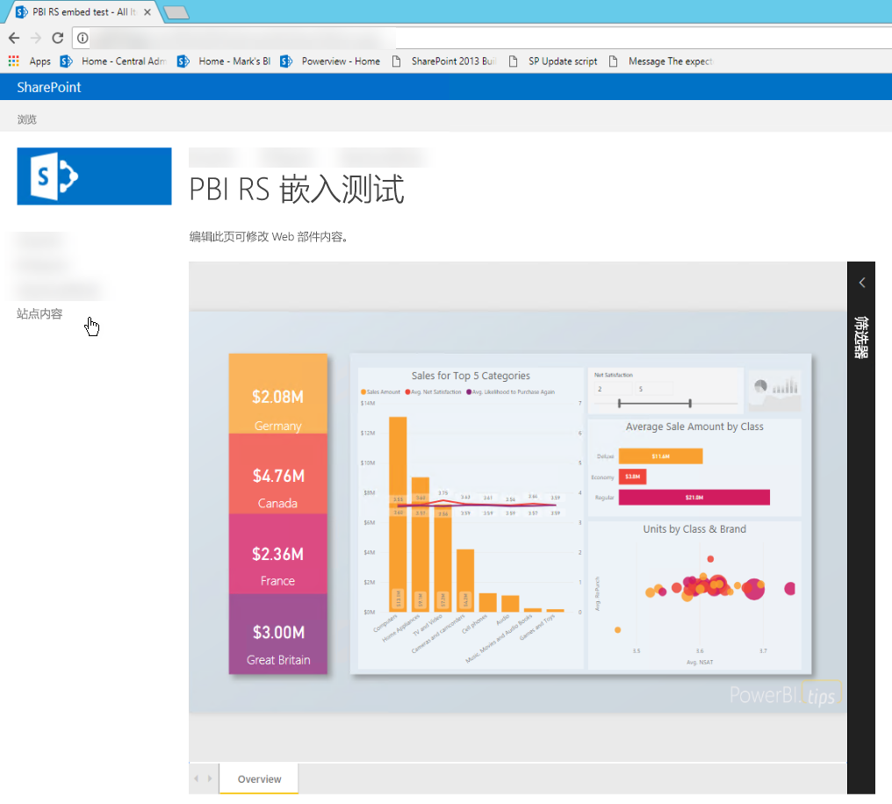

## <a name="prerequisites"></a>先决条件
* 安装和配置 [Power BI 报表服务器](https://powerbi.microsoft.com/report-server/)。
* 安装[已针对 Power BI 报表服务器进行优化的 Power BI Desktop](install-powerbi-desktop.md)。
* 安装和配置 [SharePoint](https://docs.microsoft.com/sharepoint/install/install) 环境。

## <a name="create-the-power-bi-report-url"></a>创建 Power BI 报表 URL

1. 从 GitHub 下载示例：[博客演示](https://github.com/Microsoft/powerbi-desktop-samples)。 选择“克隆或下载”，然后选择“下载 ZIP”   。

    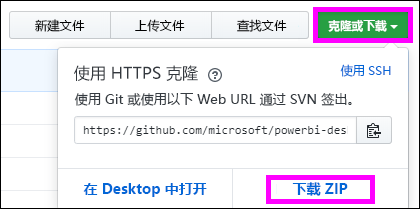

2. 解压缩文件，然后在已针对 Power BI 报表服务器进行优化的 Power BI Desktop 中打开示例 .pbix 文件。

    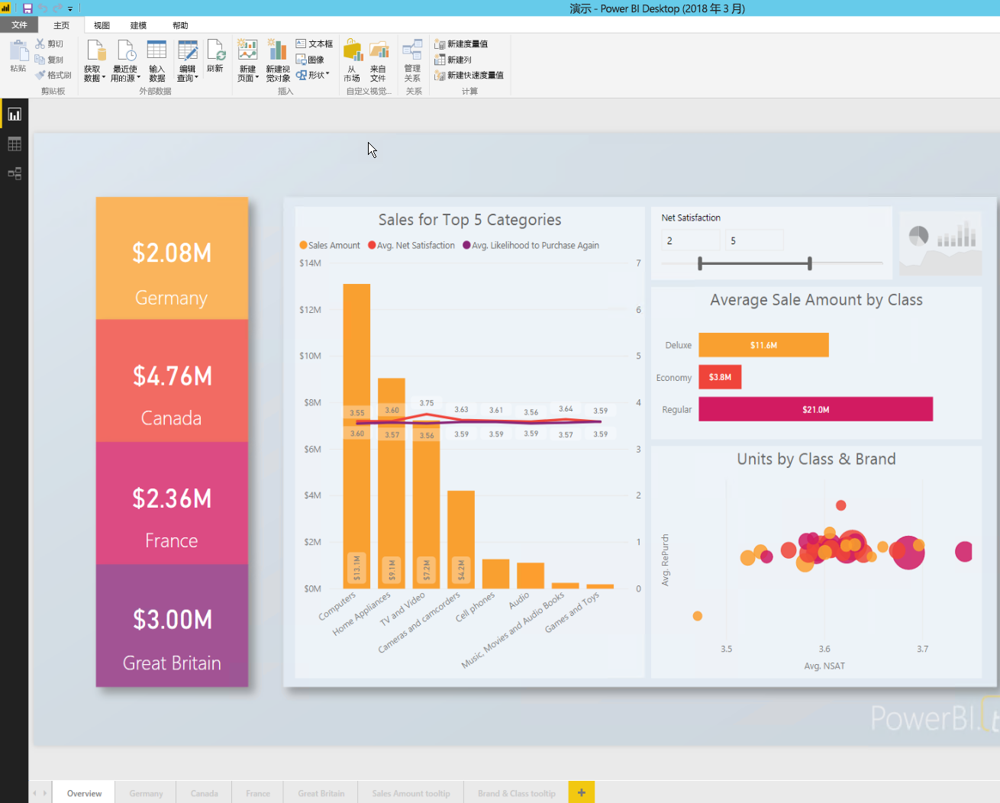

3. 将报表保存到 Power BI 报表服务器  。 

    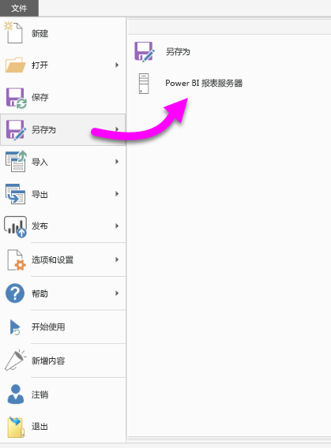

4. 在 Power BI 报表服务器 Web 门户中查看报表。

    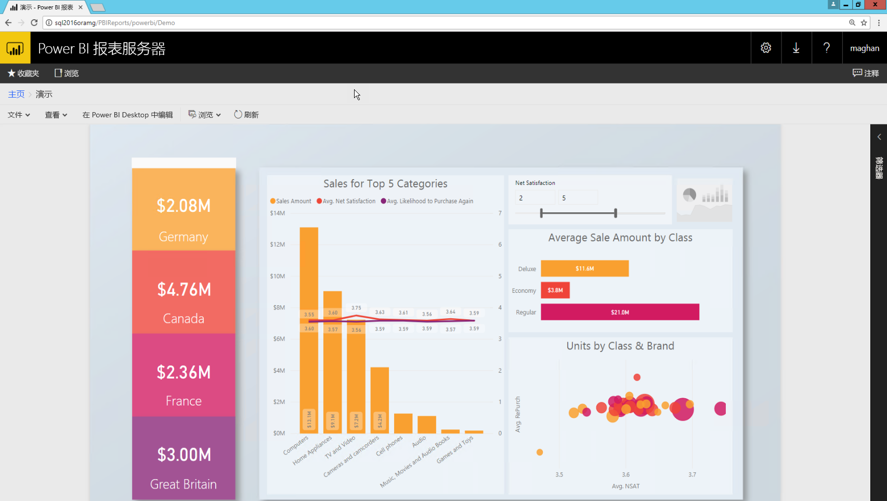

### <a name="capture-the-url-parameter"></a>捕获 URL 参数

获取 URL 后，可以在 SharePoint 页面中创建 iFrame 来托管报表。 对于任何 Power BI 报表服务器报表 URL，请添加以下查询字符串参数以将报表嵌入 SharePoint iFrame 中：`?rs:embed=true`。

   例如：
    ``` 
    https://myserver/reports/powerbi/Sales?rs:embed=true
    ```
## <a name="embed-the-report-in-a-sharepoint-iframe"></a>将报表嵌入 SharePoint iFrame 中

1. 导航到 SharePoint“网站内容”  页面。

    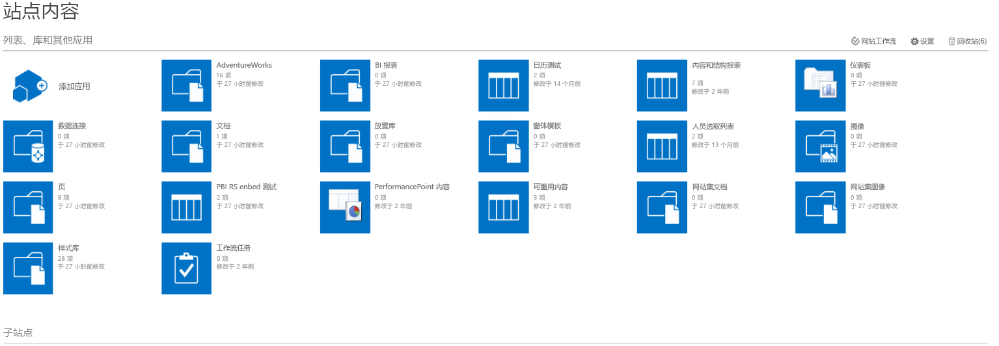

2. 选择要添加报表的页面。

    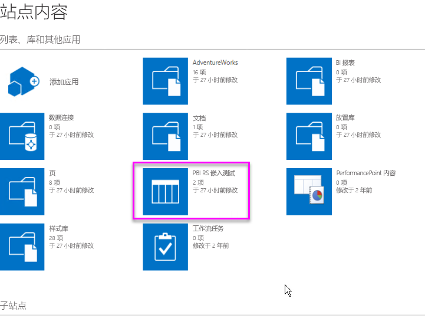

3. 选择右上角的齿轮图标，然后选择“编辑页面”  。

    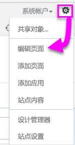

4. 选择“添加 Web 部件”  。

5. 在“类别”下，选择“媒体和内容”   。 在“部件”下，选择“内容编辑器”，然后选择“添加”    。

    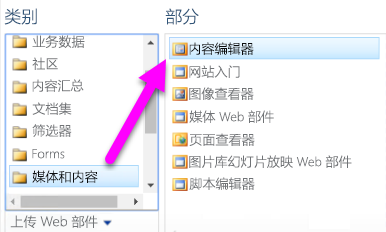

6. 选择“单击此处以添加新内容”  。

7. 从顶部菜单中，选择“文本格式”，然后选择“编辑源”   。

     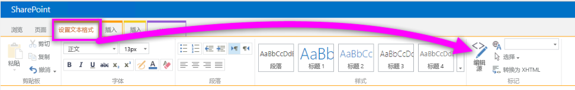

8. 在“编辑源”窗口中，将 iFrame 代码粘贴到“HTML 源”中，然后选择“确定”    。

    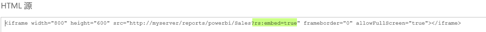

     例如：
     ```html
     <iframe width="800" height="600" src="https://myserver/reports/powerbi/Sales?rs:embed=true" frameborder="0" allowFullScreen="true"></iframe>
     ```

9. 在顶部菜单中，选择“页面”，然后选择“停止编辑”   。

    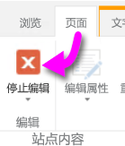

    报表将显示在该页上。

    

## <a name="next-steps"></a>后续步骤

- [为 Power BI 报表服务器创建 Power BI 报表](quickstart-create-powerbi-report.md)。  
- [为 Power BI 报表服务器创建分页报表](quickstart-create-paginated-report.md)。  

更多问题？ [尝试参与 Power BI 社区](https://community.powerbi.com/)。 