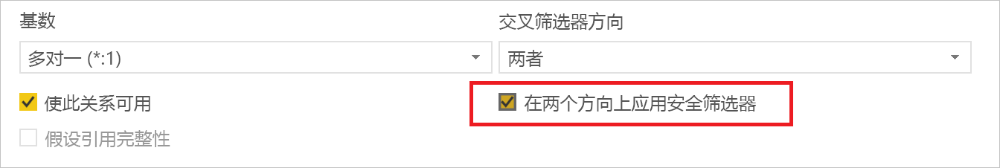
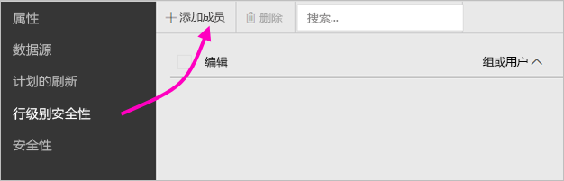
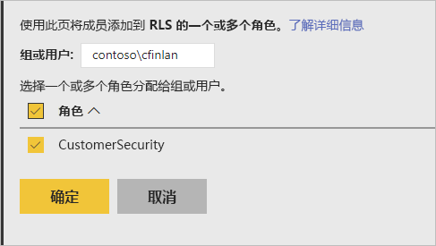
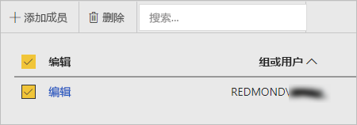

# Power BI 报表服务器中的行级别安全性 (RLS)

使用 Power BI 报表服务器设置行级别安全性 (RLS) 可以限制给定用户的数据访问。 筛选器限制行级别的数据访问，你可以定义角色中的筛选器。  如果使用的是 Power BI 报表服务器中的默认权限，则任何拥有 Power BI 报表的发布者或内容管理器权限的用户都可以为该报表的角色分配成员。    

使用 Power BI Desktop 为导入到 Power BI 的报表配置 RLS。 还可以在使用 DirectQuery（如 SQL Server）的报表上配置 RLS。  请记住，如果 DirectQuery 连接将集成身份验证用于报表阅读器，则不考虑 RLS。 对于 Analysis Services 的实时连接，可以在本地模型上配置行级别安全性。 实时连接数据集不会显示安全选项。 

[!INCLUDE [rls-desktop-define-roles](../includes/rls-desktop-define-roles.md)]

## 双向交叉筛选

默认情况下，行级别安全性筛选采用单向筛选器，无需考虑关系是设置为单向还是双向。 可以手动启用具有行级别安全性的双向交叉筛选器。

- 选择关系并选中“双向应用安全性筛选器”复选框 **** 。 

    

基于用户名或登录 ID 实现 [动态行级别安全性](https://docs.microsoft.com/sql/analysis-services/supplemental-lesson-implement-dynamic-security-by-using-row-filters)时，请选中此框。 

若要了解更多信息，请参阅[在 Power BI Desktop 中使用 DirectQuery 的双向交叉筛选](../desktop-bidirectional-filtering.md)和[保护表格 BI 语义模型](http://download.microsoft.com/download/D/2/0/D20E1C5F-72EA-4505-9F26-FEF9550EFD44/Securing%20the%20Tabular%20BI%20Semantic%20Model.docx)技术白皮书。

[!INCLUDE [rls-desktop-view-as-roles](../includes/rls-desktop-view-as-roles.md)]

## 向角色添加成员 

在 Power BI 报表服务器中保存报表后，便可在服务器上管理安全性并添加或删除成员。 只有具有报表的发布者或内容管理器权限的用户才能使用行级别安全性选项，并且该选项不会呈灰色。

 如果报表没有所需角色，则需要在 Power BI Desktop 中打开报表，添加或修改角色，然后将其保存回 Power BI 报表服务器。 

1. 在 Power BI Desktop 中，将报表保存到 Power BI 报表服务器。 需要使用更适合 Power BI 报表服务器的 Power BI Desktop 版本。
2. 在 Power BI 报表服务中，请选择报表旁边的省略号(…) 。 

3. 选择“管理” > “行级别安全性”。 

     

    在“行级别安全性”页上，将成员添加到在 Power BI Desktop 中创建的角色。

5. 若要添加成员，请选择“添加成员”。

1. 在文本框中以用户名格式（域\用户）输入用户或组，并选择要为其分配的角色。 成员需在你的组织内。   

    

    根据配置 Active Directory 的方式，在此处输入“用户主体名称”同样有效。 在此情况下，报表服务器会在列表中显示相应用户名。

1. 单击“确定”进行应用。   

8. 若要删除成员，请选择成员名称旁边的框并选择“删除”。  一次可以删除多个成员。 

    

## username() 和 userprincipalname()

可在数据集内利用 DAX 函数 username() 或 userprincipalname()。 可在 Power BI Desktop 中的表达式内使用它们。 发布模型时，Power BI 报表服务器将使用它们。

在 Power BI Desktop 中，username() 返回采用域\用户格式的用户，userprincipalname() 返回采用 user@contoso.com 格式的用户。

在 Power BI Desktop 中，username() 和 userprincipalname() 均返回用户的“用户主体名称 (UPN)”，类似于电子邮件地址。

如果在 Power BI 报表服务器中使用自定义身份验证，则会返回为用户设置的用户名格式。  

## 限制 

以下是 Power BI 模型上有关行级别安全性的当前限制。 

使用 username() DAX 函数生成报表的用户现在将注意到新的行为，该行为会返回用户主体名称 (UPN)，但配合使用 DirectQuery 和集成安全性时除外。  由于该场景中不考虑 RLS，因此该场景中的行为保持不变。

只能在使用 Power BI Desktop 创建的数据集上定义 RLS。 若要为使用 Excel 创建的数据集启用 RLS，首先必须将你的文件转换为 Power BI Desktop (PBIX) 文件。 了解关于 [Excel 文件](../desktop-import-excel-workbooks.md)的详细信息。

只支持使用已存储凭据的提取、转换、加载 (ETL) 和 DirectQuery 连接。 连接到分析服务的实时连接和使用集成身份验证的 DirectQuery 连接均在底层数据源中进行处理。 

如果配合使用集成安全性和 DirectQuery，用户可能会注意到：
- 已禁用 RLS，且已返回所有数据。
- 用户不能更新其角色分配，并且在“RLS 管理”页上收到错误。
- 对于 DAX 用户名函数，仍继续按“域\用户”接收用户名。 

在 Power BI 报表服务器中，报表作者无权查看报表数据，除非他们在上传报表后为自己分配了相应角色。 

 

## 常见问题解答 

### 我是否可以为 Analysis Services 数据源创建这些角色？ 

如果你将数据导入 Power BI Desktop 中，那么你就可以创建。 如果你正在使用实时连接，那么你无法配置 Power BI 服务中的 RLS。 RLS 是在 Analysis Services 模型本地中定义的。 

### 我能使用 RLS 限制用户可以访问的列或度量值吗？ 

否。 如果用户有权访问特定数据行，那么他们可以查看该行的所有数据列。 

### RLS 是否允许我隐藏详细的数据，但提供对在视觉对象中汇总的数据的访问权限？ 

不允许，你可以保护单个数据行，但用户始终可以查看详细信息或汇总的数据。 

### 如果我已分配有现有角色和成员，我是否可以在 Power BI Desktop 中添加新角色？ 

可以，如果已在 Power BI 报表服务器中定义了现有角色并分配成员，则可以创建其他角色并再次发布报表，且不会影响当前分配。 
 

## 后续步骤

[什么是 Power BI 报表服务器？](get-started.md) 
[管理员手册](admin-handbook-overview.md)  

更多问题？ [尝试咨询 Power BI 社区](https://community.powerbi.com/)
