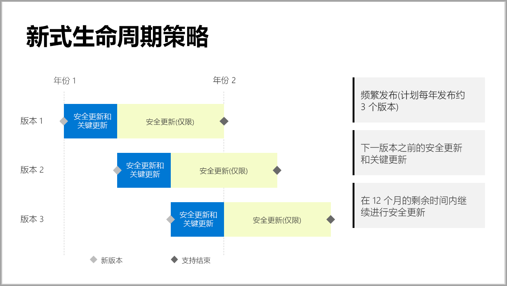

# Power BI 报表服务器的支持日程表

Power BI 报表服务器每年发布数次。 在下一版本成为正式版 (GA) 之后，安全更新和关键更新才可用。 在下次发布之后，历史版本将继续在 12 个月版本生命周期的剩余时间内接收安全更新。

借助此支持策略，我们可以向客户快速提供更新，同时保证灵活性，以便客户能够按照自己的进度来采用更新。

* 安全更新和关键更新维护阶段 - 运行 Power BI 报表服务器的最新版时，你将同时收到安全更新和关键更新。
* 仅安全更新维护阶段 - 在发布新版本后，仅在 12 个月版本生命周期的剩余时间内对旧版提供支持且仅提供安全更新（参见图 1）。

    

## 版本历史记录

| **版本** | **可用日期** | **支持结束日期** |
| --- | --- | --- |
| 2017 年 6 月 |2017 年 6 月 12 日 |不再支持 |
| 2017 年 10 月 |2017 年 10 月 31 日 | 不再支持 |
| 2018 年 3 月 | 2018 年 3 月 19 日 | 2019 年 3 月 19 日 |
| 2018 年 8 月 | 2018 年 8 月 15 日 | 2019 年 8 月 15 日 |
| 2019 年 1 月 | 2019 年 1 月 23 日 | 2020 年 1 月 23 日 |

若要下载 Power BI 报表服务器和针对 Power BI 报表服务器进行了优化的 Power BI Desktop，请转到[使用 Power BI 报表服务器进行本地报告](https://powerbi.microsoft.com/report-server/)。

## 后续步骤
[Power BI 报表服务器中的新增功能](whats-new.md)  
[什么是 Power BI 报表服务器？](get-started.md)
[管理员概述](admin-handbook-overview.md)  
[安装 Power BI 报表服务器](install-report-server.md)  

更多问题？ [尝试咨询 Power BI 社区](https://community.powerbi.com/)