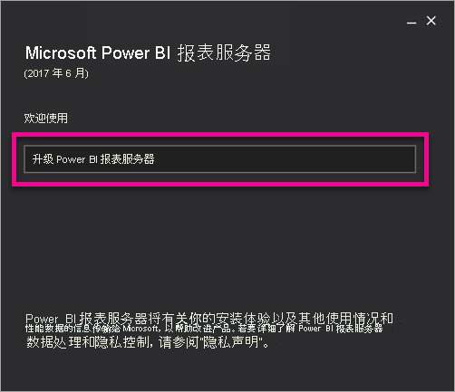
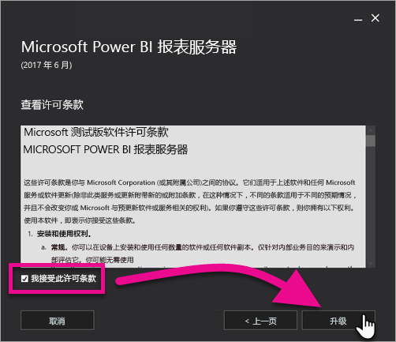
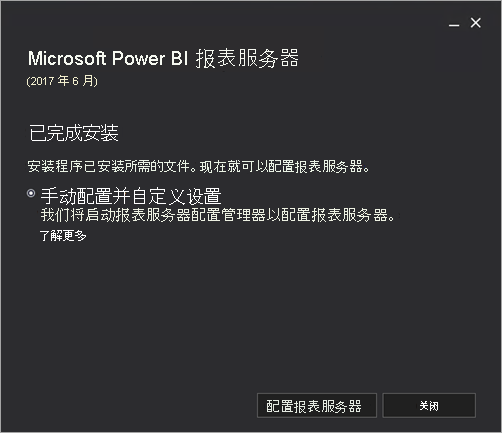

# 升级 Power BI 报表服务器

了解如何升级 Power BI 报表服务器。

 下载  

若要下载 Power BI 报表服务器和针对 Power BI 报表服务器进行了优化的 Power BI Desktop，请转到[使用 Power BI 报表服务器进行本地报告](https://powerbi.microsoft.com/report-server/)。

## 开始之前

在升级报表服务器之前，建议执行以下步骤来备份报表服务器。

### 备份加密密钥

配置报表服务器安装在第一次时，应备份加密密钥。 您还应备份密钥，只要您更改服务帐户的标识或重命名计算机。 有关详细信息，请参阅[备份和还原 Reporting Services 加密密钥](https://docs.microsoft.com/sql/reporting-services/install-windows/ssrs-encryption-keys-back-up-and-restore-encryption-keys)。

### 备份报表服务器数据库

由于报表服务器是无状态服务器，因此所有应用程序数据都存储在 SQL Server 数据库引擎实例上运行的 reportserver 和 reportservertempdb 数据库中。   可以备份**reportserver**并**reportservertempdb**使用受支持的方法之一备份 SQL Server 数据库的数据库。 特定于报表服务器数据库的建议如下所示：

* 使用完整恢复模式备份**reportserver**数据库。
* 使用简单恢复模式备份**reportservertempdb**数据库。
* 可以对每个数据库使用不同的备份计划。 若要备份的唯一原因**reportservertempdb**是为了避免发生硬件故障时重新创建它。 如果发生硬件故障，无需恢复 reportservertempdb 中的数据，但需要表结构。  如果丢失 reportservertempdb，重新获得它的唯一方法是重新创建报表服务器数据库。  如果重新创建 reportservertempdb，请务必使其名称与主报表服务器数据库名称相同。 

有关 SQL Server 关系数据库的备份和恢复的详细信息，请参阅 [SQL Server 数据库的备份和恢复](https://docs.microsoft.com/sql/relational-databases/backup-restore/back-up-and-restore-of-sql-server-databases)。

### 备份配置文件

Power BI 报表服务器使用配置文件来存储应用程序设置。 在初次配置服务器和部署任何自定义扩展插件后，应备份文件。 要备份的文件包括：

* config.json
* RSHostingService.exe.config
* Rsreportserver.config
* Rssvrpolicy.config
* Reportingservicesservice.exe.config
* 用于报表服务器 ASP.NET 应用程序的 Web.config
* 用于 ASP.NET 的 Machine.config

## 升级报表服务器

升级 Power BI 报表服务器非常简单。 只需执行几个步骤，即可安装文件。

1. 查找 PowerBIReportServer.exe，然后启动安装程序。

2. 选择“升级 Power BI 报表服务器”  。

    

3. 阅读并同意许可条款和条件，然后选择“升级”  。

    

4. 成功升级后，可选择“配置报表服务器”  以启动 Reporting Services 配置管理器，或选择“关闭”  以退出安装程序。

    

## 升级 Power BI Desktop

升级报表服务器后，需要确保所有 Power BI 报表作者升级到与此服务器匹配的针对 Power BI 报表服务器进行了优化的 Power BI Desktop 版本。

## 后续步骤

* [管理员概述](admin-handbook-overview.md)  
* [安装更适合 Power BI 报表服务器的 Power BI Desktop](install-powerbi-desktop.md)  
* [验证 Reporting Services 安装](https://docs.microsoft.com/sql/reporting-services/install-windows/verify-a-reporting-services-installation)  
* [配置报表服务器服务帐户](https://docs.microsoft.com/sql/reporting-services/install-windows/configure-the-report-server-service-account-ssrs-configuration-manager)  
* [配置报表服务器 URL](https://docs.microsoft.com/sql/reporting-services/install-windows/configure-report-server-urls-ssrs-configuration-manager)  
* [配置报表服务器数据库连接](https://docs.microsoft.com/sql/reporting-services/install-windows/configure-a-report-server-database-connection-ssrs-configuration-manager)  
* [初始化报表服务器](https://docs.microsoft.com/sql/reporting-services/install-windows/ssrs-encryption-keys-initialize-a-report-server)  
* [在报表服务器上配置 SSL 连接](https://docs.microsoft.com/sql/reporting-services/security/configure-ssl-connections-on-a-native-mode-report-server)  
* [配置 Windows 服务帐户和权限](https://docs.microsoft.com/sql/database-engine/configure-windows/configure-windows-service-accounts-and-permissions)  
* [Power BI 报表服务器的浏览器支持](browser-support.md)

更多问题？ [尝试咨询 Power BI 社区](https://community.powerbi.com/)