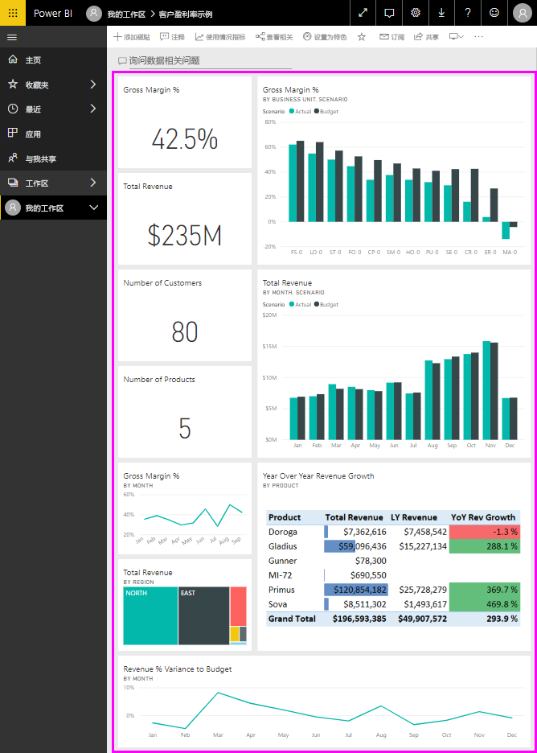
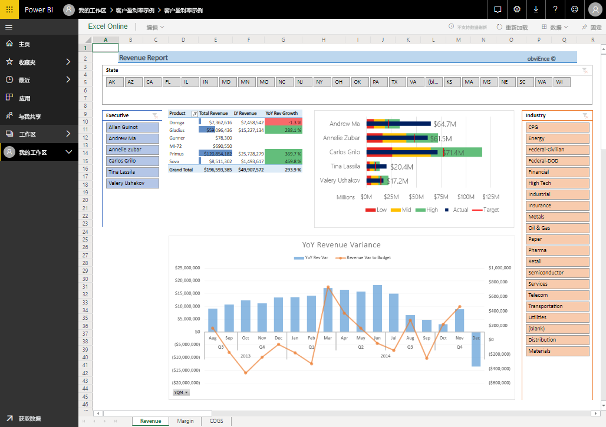
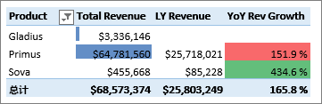
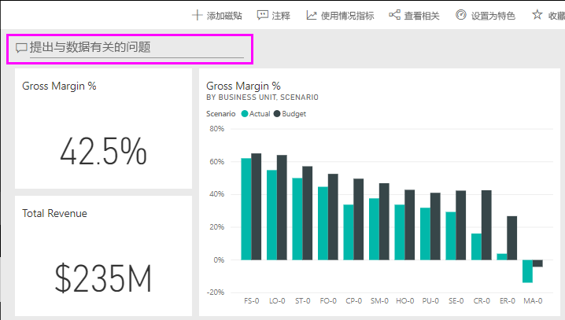
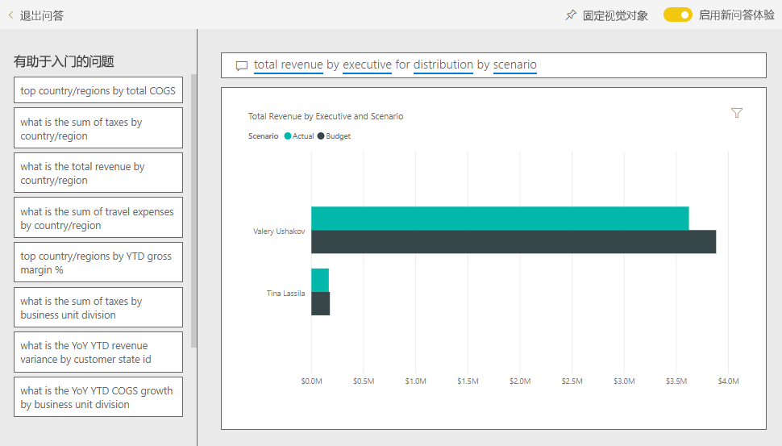

# Power BI 的客户盈利率示例：参观

“客户盈利率示例”内容包中有一家生产营销材料的公司的仪表板、报表和数据集。 此仪表板由 CFO 创建，用于查看有关他们的五名业务部门经理（管理人员）、产品、客户和毛利 (GM) 的关键指标。 他们一眼就能看出影响盈利率的因素所在。

此示例是一系列示例的一部分，展示了如何将 Power BI 与面向业务的数据、报表和仪表板结合使用。 它是使用 [obviEnce](http://www.obvience.com/) 依据真实数据（已经过匿名处理）进行创建的。 数据可采用以下几种格式：内容包、.pbix Power BI Desktop 文件或 Excel 工作簿。 请参阅[用于 Power BI 的示例](sample-datasets.md)。 

本教程探讨了 Power BI 服务中的“客户盈利率示例”内容包。 由于报表体验在 Power BI Desktop 和服务中非常相似，因此也可以使用 Power BI Desktop 中的示例 .pbix 文件跟着本教程一起操作。 

不需要 Power BI 许可证即可在 Power BI Desktop 中查看示例。 如果没有 Power BI Pro 许可证，可以将该示例保存到 Power BI 服务中的“我的工作区”。 

## 获取示例

必须先将示例下载为[内容包](#get-the-content-pack-for-this-sample)、[.pbix 文件](#get-the-pbix-file-for-this-sample)或 [Excel 工作簿](#get-the-excel-workbook-for-this-sample)，然后才能使用它。

### 获取内容包形式的此示例

1. 打开并登录 Power BI 服务 (app.powerbi.com)，然后打开要在其中保存此示例的工作区。

   如果没有 Power BI Pro 许可证，可以将该示例保存到“我的工作区”。

2. 选择左下角的“获取数据”  。

   
3. 在随即显示的“获取数据”  页上，选择“示例”  。

4. 依次选择“客户盈利率示例”和“连接”   。  

    
5. 此时，Power BI 导入内容包，然后向当前工作区添加新的仪表板、报表和数据集。

    

### 获取 .pbix 文件形式的此示例

也可将[客户盈利率示例](https://download.microsoft.com/download/6/A/9/6A93FD6E-CBA5-40BD-B42E-4DCAE8CDD059/Customer%20Profitability%20Sample%20PBIX.pbix)下载为 .pbix 文件，这是专为 Power BI Desktop 量身定制的文件格式。

### 获取 Excel 工作簿形式的此示例

若要查看此示例的数据源，还可以将它下载为 [Excel 工作簿](https://go.microsoft.com/fwlink/?LinkId=529781)。 该工作簿包含你可以查看和修改的 Power View 工作表。 若要查看原始数据，请启用“数据分析”加载项，再依次选择“Power Pivot”>“管理”  。 若要启用 Power View 和 Power Pivot 加载项，请参阅[在 Excel 中探索 Excel 示例](sample-datasets.md#explore-excel-samples-inside-excel)，以了解详细信息。

## 仪表板告诉我们什么？

在保存示例的工作区中，找到“客户盈利率”仪表板并选中它：

### 公司范围仪表板磁贴
1. 打开 Power BI 服务中的仪表板。 仪表板磁贴为 CFO 提供了对他们而言至关重要的高级别公司指标概览。 当他们看到感兴趣的内容时，可以选择磁贴以进一步分析数据。

2. 查看仪表板左侧的磁贴。

    

   请注意下列详细信息：
   - 公司的毛利为 42.5%。
   - 它有 80 个客户。
   - 它销售五种不同的产品。
   - 它在二月份收入与预算的差额百分比最小，三月份收入与预算的差额百分比最大。
   - 我们的大部分收入来自于东部和北部区域。 毛利从未超出过预算，其中 ER-0 和 MA-0 业务部门需要进一步调查。
   - 该年的总收入接近预算。

### 特定于经理的仪表板磁贴
仪表板右侧的磁贴提供团队计分卡。 CFO 需要对他们的经理进行跟踪，而这些磁贴使用 GM% 为他们提供了利润的简要概述。 如果对任一经理的 GM% 趋势在意料之外，他们就会进一步调查。

通过分析特定于经理的仪表板磁贴，我们可以观察到以下几点：

- 除 Carlos 外，所有管理人员均已超过目标销售额。 但 Carlos 的实际销售额是最高的。
- 可以看到，Annelie 的毛利率最低，但从 3 月开始稳步增长。
- 另一方面，可以看到 Valery 的 GM % 在显著下降。
- Andrew 经过了多变的一年。

## 浏览仪表板的基础数据
此仪表板含有链接到报表和 Excel 工作簿的磁贴。

### 打开 Excel Online 数据源
该仪表板上的“目标与实际”和“与去年同期相比收入增长”这两个磁贴是从 Excel 工作簿固定的   。 当选择其中一个磁贴时，Power BI 会打开数据源：本例中为 Excel Online。

1. 选择从 Excel 固定的这两个磁贴之一。 将在 Power BI 服务中打开 Excel Online。
2. 请注意，该工作簿含有三个选项卡的数据。 打开“收入”  。
3. 让我们来看看为什么 Carlos 尚未达到其目标：  

    a. 从“管理人员”滑块中选择“Carlos Grilo”   。   

    b. 第一个数据透视表告诉我们 Carlos 的热销产品 Primus 的收入增长同比去年下降了 152%。 年同比收入差额图显示 Carlos 大部分月份都低于预算  。  

    

    

4. 继续探索。 如果发现感兴趣的内容，请从右上角选择“固定”[将该内容固定到仪表板](service-dashboard-pin-tile-from-excel.md)  。

5. 使用浏览器的上一步箭头返回到仪表板。

### 打开基础 Power BI 报表
客户盈利率示例仪表板上的许多磁贴是从基础客户盈利率示例报表固定的。

1. 选择其中的一个磁贴以在阅读视图中打开报表。

   如果磁贴是在“问答”中创建的，则选择它会打开“问答”窗口。 选择“退出问答”返回到仪表板并尝试其他磁贴  。

2. 报表有三页。 报表底部的每个选项卡表示一个不同的页面。

    

    * “团队记分卡”侧重于五名经理的绩效及其业务记录  。
    * “行业利润率分析”通过比较整个行业的发展，提供了一种分析盈利率的方法  。
    * “管理人员记分卡”以自定义页面大小格式提供每位经理的视图  。

### “团队记分卡”页

让我们来仔细研究一下两名零售团队成员，看看可以得出什么见解： 

1. 在左侧的“管理人员”框中，选择 Andrew 的名字，将报表页面筛选为仅显示 Andrew 的相关数据  ：

   * 若要快速了解 KPI，看看 Andrew 的“收入状态(全年)”  ；它是绿色的，表明他的绩效不错。
   * “收入与预算差额百分比(按月和管理人员)”  图显示，除 2 月份有所下降以外，Andrew 的绩效非常不错。 Andrew 的最主要区域是东部，其中包括 49 个客户和 5 款产品（共 7 款）。 Andrew 的 GM% 既不是最高的，也不是最低的。
   * “全年总收入和按月划分的收入与预算差额百分比”图显示了一种稳定的盈亏平衡情况  。 但当通过选择区域树状图中的“中部”方块进行筛选时，你会发现 Andrew 仅在 3 月份才有收入，并且仅限于印第安纳州  。 这种趋势是有意为之还是别有隐情？

2. 现在转向 Valery。 在“主管人员”  切片器中，选择 Valery 的名字，以将报表页筛选为只显示 Valery 的相关数据。 

   

   * 请注意，“收入状态(全年)”的 KPI 为红色  。 此项肯定需要进一步调查。
   * Valery 的收入差也令人担心；Valery 没有达到设定的收入毛利率。
   * Valery 只有 9 个客户，只负责 2 款产品，合作的客户几乎全部位于北部区域。 这种特殊性可以解释指标中存在的大范围波动。
   * 如果选择树状图中的“北部”  方块，可以看到 Valery 在北部区域的毛利率与总毛利率保持一致。
   * 选择其他每个“各区域的总收入”方块出现了很有趣的现象：他们的毛利率范围为 23% 到 79%  。 Valery 在除北部区域外的所有区域中的收入数字非常具有季节性。

3. 继续探索，以确定 Valery 区域绩效不佳的原因所在。 看一看各个区域、其他业务部门以及该报表的下一页：“行业利润率分析”  。

### 行业利润率分析
此报表页提供了不同的数据片段。 通过分析细分市场，介绍了整个行业的毛利率。 CFO 利用此页将公司和业务部门指标与行业指标进行比较，以帮助他们阐释趋势和盈利性。 你可能会想“按月和管理人员划分的毛利率百分比”图为什么会出现在此页，因为它是特定于团队的  。 在此处列出可让我们按业务部门经理筛选页面。  

1. 盈利性如何随行业而变化？ 如何按行业细分产品和客户？ 若要回答这些问题，请从左上方选择一个或多个行业（从 CPG 行业开始）。 若要清除筛选器，可选择橡皮擦图标。

2. 在“按行业划分的收入与预算差额百分比、毛利率百分比和全年总收入”气泡图中，CFO 要查找最大的气泡，因为它们对收入产生的影响最大  。 若要按行业细分轻松查看各经理的影响，请在分区图中依次选择各经理的名字来筛选页面。

3. 在图表中选择每位经理时，请注意下列详细信息：
   * Andrew 受影响的区域跨度许多不同行业的细分市场，GM%（大部分是正面影响）和 Var% 变化都很大。
   * Annelie 的图表与之相似，只是 Annelie 只集中在一小部分行业细分市场，专注于“联邦”细分市场和 Gladius 产品。
   * Carlos 主要侧重于“服务”细分市场，利润很好。 Carlos 也已显著提高了“高科技”细分市场和新细分市场（工业）的差额百分比，与预算相比，表现异常出色。
   * Tina 负责少量细分市场，GM% 最高，但她的气泡大部分都是小气泡，这表示 Tina 对公司的账本底线产生的影响最小。
   * Valery 只负责一款产品，并且只负责五个行业细分市场。 虽然 Valery 的行业影响具有季节性，但总是会产生大气泡，表明对公司盈利有重大影响。 行业细分市场是否能解释他们的消极表现？

### 管理人员记分卡
此页面采用自定义页面大小格式。

## 请通过“问答”提问进一步分析数据
我们的分析可能有助于确定哪个行业为 Valery 带来的收入最多。 使用“问答”提问。

1. 选择“编辑报表”  在编辑视图中打开报表。 只有拥有报表时，编辑视图才可用。 此视图有时称为“创建者”模式  。 相反，如果你只是共享该报表，则无法在编辑视图中打开它。

2.  从仪表板的顶部，选择“提问”来打开“问答”问题框  。

    

3. 在问题框中键入“Valery 各行业总收入”  。 请注意当你键入问题时，可视化效果更新的方式。

    

   如你所见，分销行业是 Valery 最大的收入来源。

### 通过添加筛选器深入分析
我们来看一看分销行业。  

1. 打开“行业利润率分析”报表页  。
2. 不选择报表页上的任何可视化效果，在右侧展开“筛选器”窗格（如果它尚未展开）。 “筛选器”窗格应仅显示“页面级筛选器”   。  

   
3. 找到“行业”  筛选器并选择箭头以展开该列表。 让我们为分销行业添加页面筛选器。 首先，通过清除“全选”  复选框来清除所有选择。 再选择“分发”即可  。  

   
4. “按月和管理人员划分的毛利率百分比”图表明，只有 Valery 和 Tina 在这个行业有客户，而 Valery 仅在 6 月到 11 月负责了该行业  。   
5. 在“按月和管理人员划分的毛利率”图表图例中，依次选择“Tina”和“Valery”    。 我们发现，在“按产品划分的总收入”图中，Tina 的总收入比 Valery 要少得多  。
6. 要查看实际收入，请在仪表板中选择问答框，再输入“按方案划分的管理人员分销总收入”  。  

     

    我们可以采用相似的方式分析其他行业，甚至将客户加入到我们的视觉对象分析当中，以了解 Valery 的表现的原因。

## 后续步骤：连接到数据
可以在此环境中安全操作，因为能够选择不保存更改。 不过，如果确实保存了更改，可随时选择“获取数据”  来获取此示例的新副本。

我们希望本教程已经演示 Power BI 仪表板、问答和报表如何能够帮助深入了解示例数据。 现在轮到你了；立即连接到你自己的数据。 借助 Power BI，可以连接到各种数据源。 若要了解详细信息，请参阅 [Power BI 服务入门](service-get-started.md)。

