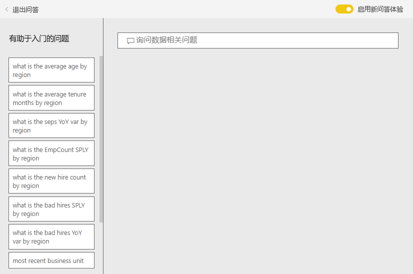
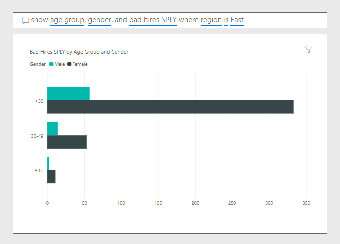

# Power BI 的人力资源示例：参观

人力资源示例内容包中有面向人力资源部门的仪表板、报表和数据集。 在此示例中，人力资源部门跨不同公司使用相同的报表模型，即使公司所处的行业或规模不同，也不例外。 此示例研究新员工数、在职员工数和离职员工数。 它力求发掘雇佣策略中的任何趋势。 我们的主要目标是要了解：

* 我们招聘的员工
* 我们招聘策略中的偏见
* 自愿离职趋势

此示例是一系列示例的一部分，展示了如何将 Power BI 与面向业务的数据、报表和仪表板结合使用。 它是使用 [obviEnce](http://www.obvience.com/) 依据真实数据（已经过匿名处理）进行创建的。 数据可采用以下几种格式：内容包、.pbix Power BI Desktop 文件或 Excel 工作簿。 请参阅[用于 Power BI 的示例](sample-datasets.md)。 

本教程探讨了 Power BI 服务中的“人力资源示例”内容包。 由于报表体验在 Power BI Desktop 和服务中非常相似，因此也可以使用 Power BI Desktop 中的示例 .pbix 文件跟着本教程一起操作。 

不需要 Power BI 许可证即可在 Power BI Desktop 中查看示例。 如果没有 Power BI Pro 许可证，可以将该示例保存到 Power BI 服务中的“我的工作区”。 

## 获取示例

必须先将示例下载为[内容包](#get-the-content-pack-for-this-sample)、[.pbix 文件](#get-the-pbix-file-for-this-sample)或 [Excel 工作簿](#get-the-excel-workbook-for-this-sample)，然后才能使用它。

### 获取内容包形式的此示例

1. 打开并登录 Power BI 服务 (app.powerbi.com)，然后打开要在其中保存此示例的工作区。

   如果没有 Power BI Pro 许可证，可以将该示例保存到“我的工作区”。

2. 选择左下角的“获取数据”  。
   
   
3. 在随即显示的“获取数据”  页上，选择“示例”  。
   
4. 依次选择“人力资源示例”  和“连接”  。  
   
   

5. 此时，Power BI 导入内容包，然后向当前工作区添加新的仪表板、报表和数据集。
   
   
  
### 获取 .pbix 文件形式的此示例

也可以将此人力资源示例下载为 [.pbix 文件](https://download.microsoft.com/download/6/9/5/69503155-05A5-483E-829A-F7B5F3DD5D27/Human%20Resources%20Sample%20PBIX.pbix)，这是专用于 Power BI Desktop 的文件格式。

### 获取 Excel 工作簿形式的此示例

若要查看此示例的数据源，还可以将它下载为 [Excel 工作簿](https://go.microsoft.com/fwlink/?LinkId=529780)。 该工作簿包含你可以查看和修改的 Power View 工作表。 若要查看原始数据，请启用“数据分析”加载项，再依次选择“Power Pivot”>“管理”  。 若要启用 Power View 和 Power Pivot 加载项，请参阅[在 Excel 中浏览 Excel 示例](sample-datasets.md#explore-excel-samples-inside-excel)，以了解详细信息。

## 新员工
首先来浏览一下新员工。

1. 在工作区中，选择“仪表板”  选项卡，并打开“人力资源示例”  仪表板。
2. 在仪表板上，选择“新员工数、去年同期新员工数和与去年同期相比的在职员工数变化率(%)(按月)”  磁贴。  

     

   将打开“人力资源示例”报表的**新员工**页。  

   

3. 研究下面这些相关项：

    * “新员工数、去年同期新员工数和与去年同期相比的在职员工数变化率(%)(按月)”  组合图显示，今年每个月雇佣的员工数都比去年多。 有几个月的雇佣员工数明显很多。
    * 从“按地区和种族划分的新员工计数和在职员工计数”  组合图可以看出，我们在“东部”  区域雇佣的员工变少了。
    * “按年龄组划分的新员工增长率变化”  瀑布图显示，我们主要雇佣的是年轻人。 这种趋势可能是因大部分工作都是兼职性质所致。
    * “新员工数(按性别)”  饼图显示，新员工数按性别大致均分。

    还能发现更多见解吗？ 例如，哪个区域的新员工数按性别不均分。 

4. 选择图表中的不同年龄组和性别，了解年龄、性别、区域和种族组之间的关系。

5. 选择顶部导航窗格中的“人力资源示例”，以返回到仪表板  。

   

## 比较当前在职员工数和离职员工数
让我们来浏览一下当前在职员工和离职员工的数据。

1. 在仪表板上，选择**按年龄组划分的在职员工计数**磁贴。

   

   将打开“人力资源示例”报表的**在职员工对比离职员工**页。  

   

 2. 研究下面这些相关项：

    * 左边的两个组合图显示了，与去年同期相比在职员工数和离职员工数的变化情况。 今年的在职员工数比去年多，这是由于快速雇佣所致，同时离职员工数也比去年多。
    * 8 月的离职员工数比其他几个月都多。 选择不同的年龄组、性别或区域，看看你是否能够找出任何其他不同。
    * 我们注意到，在饼图中，在职员工数按性别和年龄段均分。 选择不同的年龄段可以了解各个年龄段是否按性别均分。 每个年龄组中的性别划分是否都很平均？

## 离职原因
让我们来看看“编辑视图”中的报表。 可以将饼图更改为，显示离职员工数据，而不是在职员工数据。

1. 选择左上角的**编辑报表**。

2. 选择**按年龄组划分的在职员工计数**饼图。

3. 在“字段”  中，选择“员工数”  ，以展开“员工数”  表。 取消选中“在职员工数”  ，以删除此字段。

4. 选择“员工数”  表中的“离职员工数”  ，以将它添加到“字段”  区域中的“值”  框内。

5. 在报表画布上，选择“离职员工数(按离职原因)”  条形图中的“自愿离职”  条形。 

   此条形在报表的其他视觉对象中突出显示自愿离职的员工。

6. 选择“离职员工数(按年龄段)”  饼图的“50+”切片。

7. 研究右下角的折线图。 此图经过筛选以显示主动离职的员工。  

   

   请注意“50+”年龄段中的趋势。 今年下半年，越来越多超过 50 岁的员工选择自愿离职。 此趋势需要通过更多数据来进行进一步研究。

8. 也可以对“在职员工数(按性别)”  饼图执行相同步骤，将它更改为显示离职员工数，而不是在职员工数。 查看按性别划分的主动离职员工数据，看看你是否能找出更多信息。

9. 选择顶部导航窗格中的“人力资源示例”，以返回到仪表板  。 可以选择保存对报表所做的更改。

## 差员工
要探究的最后一个部分是差员工。 “坏员工”定义为，工作时间不超过 60 天的员工。 我们正在快速雇佣，但我们是否雇佣到了优秀候选员工？

1. 选择**差员工占按年龄组划分的在职员工比例**仪表板磁贴。 此时，报表打开第三个选项卡“差员工数”  。

     
2. 选中左侧“区域”  切片器中的“西北”  ，并选择“差员工数(按性别)”  环形图中的“男性”  。 研究“差员工数”  页上的其他图表。 我们注意到，男性差员工数比女性要多，并且 A 组中有很多差员工。

     

3. 如果研究“差员工数(按性别)”  环形图，并选中“区域”  切片器中的不同区域，就会注意到，东部区域是唯一一个女性差员工数比男性要多的区域。  

4. 从顶部导航窗格选择仪表板的名称以返回到该仪表板。

## 在仪表板问答框中提问
在仪表板的[问答问题框](power-bi-tutorial-q-and-a.md)中，可以使用自然语言来询问数据相关问题。 “问答”可以识别你键入的词语并指出可以在数据集的哪个位置找到答案。

1. 选择“问答”问题框。 请注意，在你开始键入前，问答会显示有助于提问的一些建议。

   

2. 可以选择其中一个建议，也可以输入“显示东部区域去年同期差员工数(按年龄段和性别)”  。  

   

   请注意，大多数女性差员工年龄都在 30 岁以下。

## 后续步骤：连接到数据
可以在此环境中安全操作，因为能够选择不保存更改。 不过，如果确实保存了更改，可随时选择“获取数据”  来获取此示例的新副本。

我们希望本教程已经演示 Power BI 仪表板、问答和报表如何能够帮助深入了解示例数据。 现在轮到你了；立即连接到你自己的数据。 借助 Power BI，可以连接到各种数据源。 若要了解详细信息，请参阅 [Power BI 服务入门](service-get-started.md)。
