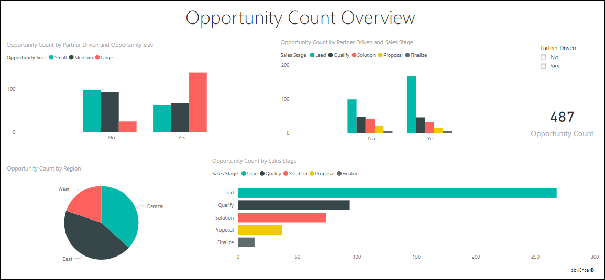

# Power BI 的机会分析示例：参观

“机会分析示例”内容包包含采用以下两种销售渠道的软件公司的仪表板、报表和数据集：直接销售  和合作伙伴销售  。 销售经理创建此仪表板以按照区域、成交额和渠道来跟踪商机和收入。

此示例依赖于两个收入度量值：

* 收入：销售人员对未来收入的预估。
* 分解的收入：按“收入 X 概率百分比”计算，被视为是对实际销售收入更为准确的预测指标。 概率由交易的当前销售阶段  决定：
  * 潜在客户：10%  
  * 意向客户：20%  
  * 解决方案：40%  
  * 提议：60%  
  * 达成：80%

此示例是一系列示例的一部分，展示了如何将 Power BI 与面向业务的数据、报表和仪表板结合使用。 它是使用 [obviEnce](http://www.obvience.com/) 提供的真实数据（已经过匿名处理）进行创建。 数据可采用以下几种格式：内容包、.pbix Power BI Desktop 文件或 Excel 工作簿。 请参阅[用于 Power BI 的示例](sample-datasets.md)。 

本教程探讨了 Power BI 服务中的机会分析示例内容包。 由于报表体验在 Power BI Desktop 和服务中非常相似，因此也可以使用 Power BI Desktop 中的示例 .pbix 文件跟着本教程一起操作。 

不需要 Power BI 许可证即可在 Power BI Desktop 中查看示例。 如果没有 Power BI Pro 许可证，可以将该示例保存到 Power BI 服务中的“我的工作区”。 

## 获取示例

必须先将示例下载为[内容包](#get-the-content-pack-for-this-sample)、[.pbix 文件](#get-the-pbix-file-for-this-sample)或 [Excel 工作簿](#get-the-excel-workbook-for-this-sample)，然后才能使用它。

### 获取内容包形式的此示例

1. 打开并登录 Power BI 服务 (app.powerbi.com)，然后打开要在其中保存此示例的工作区。 

    如果没有 Power BI Pro 许可证，可以将该示例保存到“我的工作区”。

2. 选择左下角的“获取数据”  。

    
3. 在随即显示的“获取数据”  页上，选择“示例”  。

4. 依次选择“机会分析示例”  和“连接”  。  

   
5. 此时，Power BI 导入内容包，然后向当前工作区添加新的仪表板、报表和数据集。

   

### 获取 .pbix 文件形式的此示例

也可以将此机会分析示例下载为 [.pbix 文件](http://download.microsoft.com/download/9/1/5/915ABCFA-7125-4D85-A7BD-05645BD95BD8/Opportunity%20Analysis%20Sample%20PBIX.pbix)，这是专用于 Power BI Desktop 的文件格式。

### 获取 Excel 工作簿形式的此示例

若要查看此示例的数据源，还可以将它下载为 [Excel 工作簿](http://go.microsoft.com/fwlink/?LinkId=529782)。 该工作簿包含你可以查看和修改的 Power View 工作表。 若要查看原始数据，请启用“数据分析”加载项，再依次选择“Power Pivot”>“管理”  。 若要启用 Power View 和 Power Pivot 加载项，请参阅[从 Excel 本身内查看 Excel 示例](sample-datasets.md#optional-take-a-look-at-the-excel-samples-from-inside-excel-itself)，以了解详细信息。

## 仪表板告诉我们什么？
我们的销售经理已创建了一个仪表板，用于跟踪那些对她而言至关重要的指标。 当她看到感兴趣的内容时，她可以选择磁贴以浏览数据：

- 公司收入为 20 亿美元，系数收入为 46100 万美元。
- 机会计数和收入遵循熟悉的漏斗模式，总计在每个后一阶段递减。
- 大多数机会都在东部区域。
- 大型机会比中小型机会获得的收入更多。
- 大型合作伙伴交易能带来更多收入：平均 800 万美元，而直接销售的收入为 600 万美元。

由于无论交易被划分为大型、中型还是小型，达成交易所做的工作都是一样的，因此公司应分析数据，以更多地了解大型机会。

1. 在保存示例的工作区中，打开“仪表板”  选项卡，然后找到“机会分析示例”  仪表板，并选择它。

2. 选择“按有无合作伙伴协助和销售阶段的机会计数”  磁贴以打开“机会分析示例”报表的第一页。 

    

## 浏览报表中的各页

通过选择底部的“页面”选项卡查看报表中的每一页。

### “机会计数概览”页

请注意下列详细信息：
* 就机会计数而言，东部是我们最大的区域。  
* 在“按区域的机会计数”  饼图中，依次选择每个区域，按区域筛选页面。 对于每个区域，请注意，合作伙伴都在寻找显著更多的大型机会。   
* “按有无合作伙伴协助的机会计数和机会大小”  柱形图表明，大部分大型机会都有合作伙伴协助，而大部分中小型机会则没有。
* 在“按销售阶段的机会计数”  条形图，依次选择每个“销售阶段”  以查看区域计数中的差异。 请注意，虽然东部区域具有最大的机会计数，但“解决方案”、“提议”和“达成”销售阶段中的所有三个区域的计数也不相上下。 此结果意味着我们在中部和西部区域的成交百分比更高。

### “收入分析”页
本页以类似的方式查看数据，但使用收入方面而非计数。  

请注意下列详细信息：
* 东部是我们最大的区域，这不仅体现在机会计数方面，而且还体现在收入方面。  
* 如果通过对“合作伙伴协助”  选择“是”  来筛选“按销售阶段和有无合作伙伴协助列出收入”  图表，会看到 15 亿美元的收入和 2.94 亿美元的分解收入。 相比之下，非合作伙伴协助的收入分别为 6.44 亿美元和 1.66 亿美元。 
* 如果机会有合作伙伴协助，那么针对大客户的平均收入（800 万）比非合作伙伴协助的收入（600 万）更高。  
* 对于合作伙伴协助的业务，大型机会的平均收入几乎是中型机会的两倍。  
* 但合作伙伴驱动的和非合作伙伴驱动的小型和中型这两种业务的平均收入却大致相当。   

很明显，相比非合作伙伴，合作伙伴在销售给顾客这方面表现得更好。 这样就很容易理解漏斗图中通过合作伙伴的交易更多了。

### 按区域和阶段的机会计数
此报表页查看与前一页类似的数据，但按区域和阶段对其进行细分。 

请注意下列详细信息：
* 如果选择“按区域的机会计数”  饼图中的“东部”  以按东部区域进行筛选，将看到此区域中的机会在合作伙伴协助和非合作伙伴协助之间几乎平分。
* 大型机会在中部区域最常见，小型机会在东部区域最常见，而中型机会在西部区域最常见。

### “按月划分的即将到来的机会”页
在此页，我们也会采用相似的数据，但是从日期和时间的角度来研究。 
 

我们的 CFO 使用此页来管理工作负荷。 通过查看按销售阶段和月份划分的收入机会，她可以相应地规划。

请注意下列详细信息：
* “达成”销售阶段的平均收入最高。 达成这些交易是第一优先。
* 如果按月份筛选（通过选择“月份”  扇区中的月份），你将看到在“达成”销售阶段，1 月的大型交易比例较高，系数收入为 7500 万美元。 另一方面，在“解决方案”和“提议”销售阶段，2 月大部分都是中型交易。
* 一般来说，系数收入额会基于销售阶段、机会数和交易大小而波动。 针对这些方面添加筛选器（使用右侧的“筛选器”  窗格），进一步研究这些数据。

## 后续步骤：连接到你的数据
可以在此环境中安全操作，因为能够选择不保存更改。 不过，如果确实保存了更改，可随时选择“获取数据”  来获取此示例的新副本。

我们希望本教程已经演示 Power BI 仪表板、问答和报表如何能够帮助深入了解示例数据。 现在轮到你了；立即连接到你自己的数据。 借助 Power BI，可以连接到各种数据源。 若要了解详细信息，请参阅 [Power BI 服务入门](service-get-started.md)。

