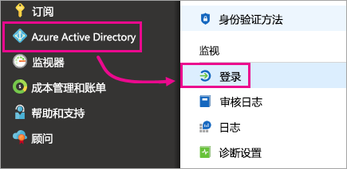
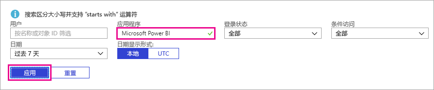

# 查找已登录的 Power BI 用户

如果你是租户管理员，并想要确定已登录 Power BI 的用户，请查看 [Azure Active Directory 访问和使用情况报告](/azure/active-directory/reports-monitoring/concept-sign-ins)了解相关信息。

<iframe width="640" height="360" src="https://www.youtube.com/embed/1AVgh9w9VM8?showinfo=0" frameborder="0" allowfullscreen></iframe>

> [!NOTE]
> 虽然此活动报告中的信息很实用，但并未识别每个用户拥有的许可证类型。 请使用 Office 365 管理中心查看许可证。

## 要求

任何用户（包括非管理员）都可以查看自己的登录活动报告，但必须符合以下要求，才能查看所有用户的报告。

* 租户必须有关联的 Azure AD Premium 许可证。

* 必须属于以下角色之一：全局管理员、安全管理员或安全读者。

## 使用 Azure 门户查看登录活动

若要查看登录活动，请按以下步骤操作。

1. 在“Azure 门户”中，选择“Azure Active Directory”。

1. 在“监视”下，选择“登录活动”。
   
    

1. 按“Microsoft Power BI”或“Power BI Gateway”筛选应用，再选择“应用”。

    “Microsoft Power BI”筛选出与服务相关的登录活动，而“Power BI Gateway”则筛选出本地数据网关专属登录活动。
   
    

## 导出数据

导出登录活动数据的方法有以下两种：下载 csv 文件或使用 PowerShell。 在登录活动报告的顶部，选择下列选项之一：

* **下载**：下载当前已筛选数据的 csv 文件。

* **脚本**：下载当前已筛选数据的 PowerShell 脚本。 可以根据需要在脚本中更新筛选器。

## 数据保留期

与登录活动相关的数据最长可保留 30 天。 有关详细信息，请参阅 [Azure Active Directory 报告保留策略](/azure/active-directory/reports-monitoring/reference-reports-data-retention)。

## 后续步骤

[在组织内使用审核](service-admin-auditing.md)

更多问题？ [尝试咨询 Power BI 社区](https://community.powerbi.com/)

