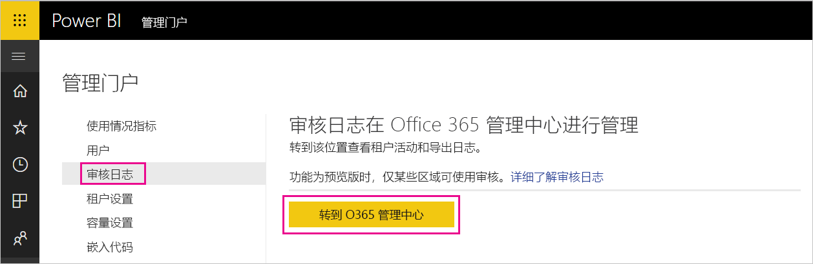
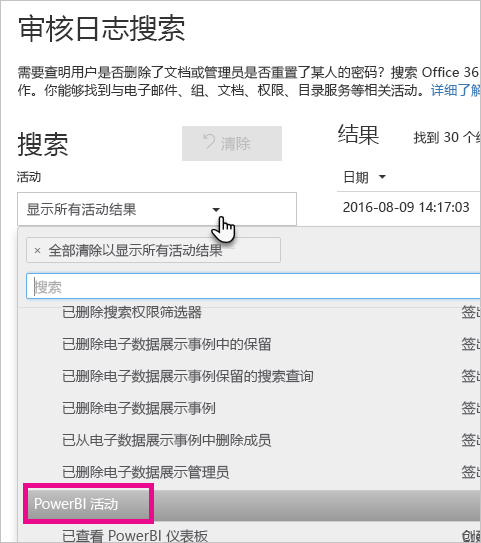
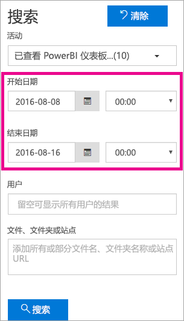
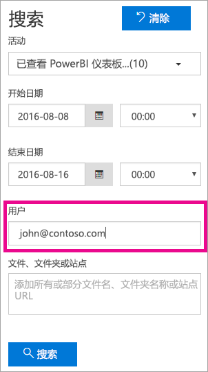

# <a name="use-auditing-within-your-organization"></a>在组织内使用审核

了解 Power BI 租户中谁正在对何项目执行何种操作对帮助组织满足其需求非常关键，如满足法规遵从性和记录管理需求。 Power BI 审核可用于审核用户执行的操作，如“查看报表”和“查看仪表板”。 无法使用审核来审核权限。

若要使用审核，请使用 Office 365 安全与合规中心或 PowerShell。 审核依赖于 Exchange Online 中的功能，该功能可自动进行预配以支持 Power BI。

可按日期范围、用户、仪表板、报表、数据集和活动类型筛选审核数据。 还可将活动下载到 CSV（逗号分隔值）文件供脱机分析。

## <a name="requirements"></a>要求

必须满足以下要求才能访问审核日志：

* 必须成为全局管理员或在 Exchange Online 中分配有“审核日志”或“仅查看审核日志”角色才能访问审核日志。 默认情况下，会在 Exchange 管理中心的  “权限”页上为“符合性管理”和“组织管理”角色组分配这些角色。

    若要为非管理员帐户提供访问审核日志的权限，必须将该用户添加为其中一个角色组的成员。 如果要以另一种方式执行此操作，可以在 Exchange 管理中心中创建自定义角色组、将“审核日志”或“仅查看审核日志”角色分配给此组，然后将非管理员帐户添加到新角色组。 有关详细信息，请参阅[在 Exchange Online 中管理角色组](/Exchange/permissions-exo/role-groups)。

    如果无法从 Microsoft 365 管理中心访问 Exchange 管理中心，请转到 https://outlook.office365.com/ecp 并使用你的凭据登录。

* 如果你有权访问审核日志但不是全局管理员或 Power BI 服务管理员，则将无法访问 Power BI 管理员门户。 在这种情况下，必须使用 [Office 365 安全与合规中心](https://sip.protection.office.com/#/unifiedauditlog)的直接链接。

## <a name="access-your-audit-logs"></a>访问审核日志

若要访问日志，请先确保在 Power BI 中启用日志记录。 有关详细信息，请参阅管理门户文档中的[审核日志](service-admin-portal.md#audit-logs)。 可以查看审核数据后，最多可能会延迟 48 小时才能启用审核。 如果无法立即查看数据，请稍后检查审核日志。 获取查看审核日志的权限和得以访问日志之间也存在类似的延迟。

可直接通过 [Office 365 安全与合规中心](https://sip.protection.office.com/#/unifiedauditlog)访问 Power BI 审核日志。 此外，Power BI 管理门户中也有对应的链接：

1. 在 Power BI 中，依次选择右上角的齿轮图标  和“管理门户”  。

   

1. 选择“审核日志”  。

1. 选择“转到 O365 管理中心”  。

   

## <a name="search-only-power-bi-activities"></a>仅搜索 Power BI 活动

若要让搜索结果中仅包含 Power BI 活动，请按以下步骤操作。 有关活动列表，请参阅本文稍后介绍的 [Power BI 审核的活动](#activities-audited-by-power-bi)列表。

1. 在“审核日志搜索”  页上，选择“搜索”  下的“活动”  下拉列表。

2. 选择“Power BI 活动”  。

   

3. 选择选框外任意位置以将其关闭。

搜索将仅返回 Power BI 活动。

## <a name="search-the-audit-logs-by-date"></a>按日期搜索审核日志

使用“开始日期”  和“结束日期”  字段，可按日期范围搜索日志。 默认选择为“过去七天”。 屏幕以协调世界时 (UTC) 格式显示日期和时间。 可以指定的最大日期范围为 90 天。 

如果所选日期范围大于 90 天，将收到错误。 如果使用最大日期范围 90 天，请选择当前时间作为“开始日期”  。 否则将收到错误，提醒开始日期早于结束日期。 如果是在过去 90 天内启用审核，日期范围的开始日期不得早于审核启用日期。



## <a name="search-the-audit-logs-by-users"></a>按用户搜索审核日志

可搜索特定用户所执行活动的审核日志条目。 请在“用户”  字段中输入一个或多个用户名。 用户名外观类似电子邮件地址。 这是用户登录 Power BI 所使用的帐户。 将此框留空以返回组织中所有用户（和服务帐户）的条目。



## <a name="view-search-results"></a>查看搜索结果

选择“搜索”  后，将加载搜索结果。 几分钟后，它们将在“结果”  下显示。 搜索完成后，屏幕将显示找到的结果数。 “审核日志搜索”  最多显示 1000 个事件。 如果符合搜索条件的事件超过 1000 个，则应用显示最新的 1000 个事件。

### <a name="view-the-main-results"></a>查看主要结果

“结果”  区域包含搜索功能返回的每个事件的以下信息。 选择“结果”  下的列标题，即可对结果进行排序。

| **列** | **定义** |
| --- | --- |
| 日期 |事件发生的日期和时间（UTC 格式）。 |
| IP 地址 |用于记录活动的设备的 IP 地址。 应用以 IPv4 或 IPv6 地址格式显示 IP 地址。 |
| 用户 |执行触发该事件的操作的用户（或服务帐户）。 |
| 活动 |用户执行的活动。 此值对应于你在“活动”  下拉列表中选择的活动。 对于来自于 Exchange 管理审核日志的事件，此列中的值为 Exchange cmdlet。 |
| 项 |因相应活动而创建或修改的对象。 例如，查看或修改过的文件，或更新的用户帐户。 并非所有活动在此列中都具有值。 |
| 详细信息 |有关活动的其他详细信息。 同样，并非所有活动都具有此值。 |

### <a name="view-the-details-for-an-event"></a>查看事件的详细信息

要查看有关该事件的更多详细信息，请在搜索结果列表中选择事件记录。 随后会显示“详细信息”  页，其中包含事件记录中的详细属性。 “详细信息”  页根据在其中发生事件的 Office 365 服务来显示属性。

若要查看这些详细信息，请选择“更多信息”  。 所有 Power BI 条目的 RecordType 属性值均为 20。 若要了解其他属性，请参阅[审核日志中的详细属性](/office365/securitycompliance/detailed-properties-in-the-office-365-audit-log/)。

   

## <a name="export-search-results"></a>导出搜索结果

若要将 Power BI 审核日志导出为 CSV 文件，请按以下步骤操作。

1. 选择“导出结果”  。

1. 选择“保存已加载结果”  或“下载所有结果”  。

    

## <a name="use-powershell-to-search-audit-logs"></a>使用 PowerShell 搜索审核日志

也可以使用 PowerShell 根据登录名来访问审核日志。 下面的示例展示了如何连接到 Exchange Online PowerShell，然后使用 [Search-UnifiedAuditLog](/powershell/module/exchange/policy-and-compliance-audit/search-unifiedauditlog?view=exchange-ps/) 命令拉取 Power BI 审核日志条目。 若要运行该脚本，管理员必须分配给你相应的权限，如[要求](#requirements)部分中所述。

```powershell
Set-ExecutionPolicy RemoteSigned

$UserCredential = Get-Credential

$Session = New-PSSession -ConfigurationName Microsoft.Exchange -ConnectionUri https://outlook.office365.com/powershell-liveid/ -Credential $UserCredential -Authentication Basic -AllowRedirection

Import-PSSession $Session
Search-UnifiedAuditLog -StartDate 9/11/2018 -EndDate 9/15/2018 -RecordType PowerBI -ResultSize 1000 | Format-Table | More
```

## <a name="use-powershell-to-export-audit-logs"></a>使用 PowerShell 导出审核日志

还可以使用 PowerShell 导出审核日志搜索的结果。 以下示例演示如何通过 [Search-UnifiedAuditLog](/powershell/module/exchange/policy-and-compliance-audit/search-unifiedauditlog?view=exchange-ps/) 命令进行发送以及如何使用 [Export-Csv](/powershell/module/microsoft.powershell.utility/export-csv) cmdlet 导出结果。 若要运行该脚本，管理员必须分配给你相应的权限，如[要求](#requirements)部分中所述。

```powershell
$UserCredential = Get-Credential

$Session = New-PSSession -ConfigurationName Microsoft.Exchange -ConnectionUri https://outlook.office365.com/powershell-liveid/ -Credential $UserCredential -Authentication Basic -AllowRedirection

Import-PSSession $Session
Search-UnifiedAuditLog -StartDate 9/11/2019 -EndDate 9/15/2019 -RecordType PowerBI -ResultSize 5000 |
Export-Csv -Path "c:\temp\PowerBIAuditLog.csv" -NoTypeInformation

Remove-PSSession $Session
```

有关连接到 Exchange Online 的详细信息，请参阅[连接到 Exchange Online PowerShell](/powershell/exchange/exchange-online/connect-to-exchange-online-powershell/connect-to-exchange-online-powershell/)。 有关展示了如何对审核日志使用 PowerShell 的其他示例，请参阅[使用 Power BI 审核日志和 PowerShell 分配 Power BI Pro 许可证](https://powerbi.microsoft.com/blog/using-power-bi-audit-log-and-powershell-to-assign-power-bi-pro-licenses/)。

## <a name="activities-audited-by-power-bi"></a>Power BI 审核的活动

Power BI 审核以下活动：

| 友好名称                                     | 操作名称                              | 备注                                  |
|---------------------------------------------------|---------------------------------------------|------------------------------------------|
| 已将数据源添加到 Power BI 网关             | AddDatasourceToGateway                      |                                          |
| 已添加 Power BI 文件夹访问权限                      | AddFolderAccess                             | 当前未使用                       |
| 已添加 Power BI 组成员                      | AddGroupMembers                             |                                          |
| 管理员已将数据流存储帐户附加到租户 | AdminAttachedDataflowStorageAccountToTenant | 当前未使用                       |
| 已分析 Power BI 数据集                         | AnalyzedByExternalApplication               |                                          |
| 已分析 Power BI 报表                          | AnalyzeInExcel                              |                                          |
| 将 Power BI 数据集绑定到网关                | BindToGateway                               |                                          |
| 已更改容量状态                            | ChangeCapacityState                         |                                          |
| 已更改容量用户分配                  | UpdateCapacityUsersAssignment               |                                          |
| 已更改 Power BI 数据集连接              | SetAllConnections                           |                                          |
| 已更改 Power BI 网关管理员                   | ChangeGatewayAdministrators                 |                                          |
| 已更改 Power BI 网关数据源用户        | ChangeGatewayDatasourceUsers                |                                          |
| 已创建组织的 Power BI 内容包      | CreateOrgApp                                |                                          |
| 已创建 Power BI 应用                              | CreateApp                                   |                                          |
| 已创建 Power BI 仪表板                        | CreateDashboard                             |                                          |
| 已创建 Power BI 数据流                         | CreateDataflow                              |                                          |
| 已创建 Power BI 数据集                          | CreateDataset                               |                                          |
| 已创建 Power BI 电子邮件订阅               | CreateEmailSubscription                     |                                          |
| 已创建 Power BI 文件夹                           | CreateFolder                                |                                          |
| 已创建 Power BI 网关                          | CreateGateway                               |                                          |
| 已创建 Power BI 组                            | CreateGroup                                 |                                          |
| 已创建 Power BI 报表                           | CreateReport                                |                                          |
| 已迁移到外部存储帐户的数据流     | DataflowMigratedToExternalStorageAccount    | 当前未使用                       |
| 已添加的数据流权限                        | DataflowPermissionsAdded                    | 当前未使用                       |
| 已删除的数据流权限                      | DataflowPermissionsRemoved                  | 当前未使用                       |
| 已删除组织的 Power BI 内容包      | DeleteOrgApp                                |                                          |
| 已删除 Power BI 注释                          | DeleteComment                               |                                          |
| 已删除 Power BI 仪表板                        | DeleteDashboard                             | 当前未使用                       |
| 已删除 Power BI 数据流                         | DeleteDataflow                              | 当前未使用                       |
| 已删除 Power BI 数据集                          | DeleteDataset                               |                                          |
| 已删除 Power BI 电子邮件订阅               | DeleteEmailSubscription                     |                                          |
| 已删除 Power BI 文件夹                           | DeleteFolder                                |                                          |
| 已删除 Power BI 文件夹访问权限                    | DeleteFolderAccess                          | 当前未使用                       |
| 已删除 Power BI 网关                          | DeleteGateway                               |                                          |
| 已删除 Power BI 组                            | DeleteGroup                                 |                                          |
| 已删除 Power BI 报表                           | DeleteReport                                |                                          |
| 已发现 Power BI 数据集数据源          | GetDatasources                              |                                          |
| 已下载 Power BI 报表                        | DownloadReport                              |                                          |
| 已编辑 Power BI 认证权限          | EditCertificationPermission                 | 当前未使用                       |
| 已编辑 Power BI 仪表板                         | EditDashboard                               | 当前未使用                       |
| 已编辑 Power BI 数据集                           | EditDataset                                 |                                          |
| 已编辑 Power BI 数据集属性                | EditDatasetProperties                       | 当前未使用                       |
| 已编辑 Power BI 报表                            | EditReport                                  |                                          |
| 已导出 Power BI 数据流                        | ExportDataflow                              |                                          |
| 已导出 Power BI 报表可视化数据              | ExportReport                                |                                          |
| 已导出 Power BI 磁贴数据                       | ExportTile                                  |                                          |
| 无法添加数据流权限                | FailedToAddDataflowPermissions              | 当前未使用                       |
| 无法删除数据流权限             | FailedToRemoveDataflowPermissions           | 当前未使用                       |
| 已生成 Power BI 数据流 SAS 令牌             | GenerateDataflowSasToken                    |                                          |
| 已生成 Power BI 嵌入令牌                    | GenerateEmbedToken                          |                                          |
| 已将文件导入到 Power BI                         | 导入                                      |                                          |
| 已安装 Power BI 应用                            | InstallApp                                  |                                          |
| 已将工作区迁移到容量                  | MigrateWorkspaceIntoCapacity                |                                          |
| 已发布 Power BI 注释                           | PostComment                                 |                                          |
| 已打印 Power BI 仪表板                        | PrintDashboard                              |                                          |
| 已打印 Power BI 报表页                      | PrintReport                                 |                                          |
| 已将 Power BI 报表发布到 Web                  | PublishToWebReport                          |                                          |
| 已从 Key Vault 接收 Power BI 数据流机密  | ReceiveDataflowSecretFromKeyVault           | 当前未使用                       |
| 已从 Power BI 网关删除数据源         | RemoveDatasourceFromGateway                 |                                          |
| 已删除 Power BI 组成员                    | DeleteGroupMembers                          |                                          |
| 已从容量中删除工作区                 | RemoveWorkspacesFromCapacity                |                                          |
| 已重命名 Power BI 仪表板                        | RenameDashboard                             |                                          |
| 已请求 Power BI 数据流刷新               | RequestDataflowRefresh                      | 当前未使用                       |
| 已请求 Power BI 数据集刷新                | RefreshDataset                              |                                          |
| 已检索 Power BI 工作区                     | GetWorkspaces                               |                                          |
| 在 Power BI 数据流上设置计划刷新        | SetScheduledRefreshOnDataflow               |                                          |
| 在 Power BI 数据集上设置计划刷新         | SetScheduledRefresh                         |                                          |
| 已共享 Power BI 仪表板                         | ShareDashboard                              |                                          |
| 已共享 Power BI 报表                            | ShareReport                                 |                                          |
| 已启动 Power BI 延期试用版                   | OptInForExtendedProTrial                    | 当前未使用                       |
| 已启动 Power BI 免费试用版                            | OptInForProTrial                            |                                          |
| 已接管 Power BI 数据源                   | TakeOverDatasource                          |                                          |
| 已接管 Power BI 数据集                        | TakeOverDataset                             |                                          |
| 未发布 Power BI 应用                          | UnpublishApp                                |                                          |
| 更新容量资源管理设置      | UpdateCapacityResourceGovernanceSettings    | 目前不在 Microsoft 365 管理中心 |
| 已更新容量管理员                            | UpdateCapacityAdmins                        |                                          |
| 已更新容量显示名称                     | UpdateCapacityDisplayName                   |                                          |
| 已更新组织的 Power BI 设置          | UpdatedAdminFeatureSwitch                   |                                          |
| 已更新 Power BI 应用                              | UpdateApp                                   |                                          |
| 已更新 Power BI 数据流                         | UpdateDataflow                              |                                          |
| 已更新 Power BI 数据集数据源             | UpdateDatasources                           |                                          |
| 已更新 Power BI 数据集参数               | UpdateDatasetParameters                     |                                          |
| 已更新 Power BI 电子邮件订阅               | UpdateEmailSubscription                     |                                          |
| 已更新 Power BI 文件夹                           | UpdateFolder                                |                                          |
| 已更新 Power BI 文件夹访问权限                    | UpdateFolderAccess                          |                                          |
| 已更新 Power BI 网关数据源凭据  | UpdateDatasourceCredentials                 |                                          |
| 已查看 Power BI 仪表板                         | ViewDashboard                               |                                          |
| 已查看 Power BI 数据流                          | ViewDataflow                                |                                          |
| 已查看 Power BI 报表                            | ViewReport                                  |                                          |
| 已查看 Power BI 磁贴                              | ViewTile                                    |                                          |
| 已查看 Power BI 使用情况指标                     | ViewUsageMetrics                            |                                          |
|                                                   |                                             |                                          |

## <a name="next-steps"></a>后续步骤

[什么是 Power BI 管理？](service-admin-administering-power-bi-in-your-organization.md)  

[Power BI 管理门户](service-admin-portal.md)  

更多问题？ [尝试咨询 Power BI 社区](http://community.powerbi.com/)
