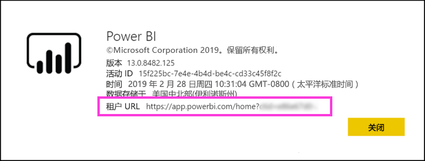

# 使用 Azure AD B2B 将 Power BI 内容分发给外部来宾用户

Power BI 与 Azure Active Directory 企业到企业 (Azure AD B2B) 集成，便于你将 Power BI 内容安全分发给组织外的来宾用户，同时仍能继续控制内部数据。  

另外，你还可以使组织外部的来宾用户能够编辑和管理组织内的内容。

## 启用访问权限

请确保启用[与外部用户共享内容](service-admin-portal.md#export-and-sharing-settings)邀请来宾用户之前在 Power BI 管理门户中的功能。

此外可以使用[允许外部来宾用户编辑和管理组织中的内容](service-admin-portal.md#allow-external-guest-users-to-edit-and-manage-content-in-the-organization)功能。 它允许您选择的来宾用户可以查看并在工作区，包括浏览组织的 Power BI 中创建内容。

## 可以邀请哪些用户？

你可以邀请来宾用户使用任何电子邮件地址，包括 gmail.com 和 outlook.com、 hotmail.com 等的个人帐户。 Azure AD B2B 调用这些地址*社交标识*。

## 邀请来宾用户

来宾用户邀请到你的组织的第一次只需要邀请。 有两种方法来邀请用户： 计划的邀请和临时邀请。

### 计划性邀请

如果确定要邀请哪些用户，请使用计划内邀请。 可使用 Azure 门户或 PowerShell 发送邀请。 只有租户管理员才能邀请用户。

若要在 Azure 门户中发送邀请，请按以下步骤操作。

1. 在[Azure 门户](https://portal.azure.com)中，选择“Azure Active Directory”  。

1. 下**管理**，选择**用户** > **的所有用户** > **新来宾用户**。

    

1. 输入“电子邮件地址”  和“个人消息”  。

    

1. 选择“邀请”  。

若要邀请多个来宾用户，请使用 PowerShell。 有关详细信息，请参阅 [Azure AD B2B 协作代码和 PowerShell 示例](/azure/active-directory/b2b/code-samples/)。

来宾用户需要在他们收到的电子邮件邀请中选择“开始”  。 然后就会将该来宾用户添加到租户。

### 临时邀请

若要在任何时候邀请外部用户，将添加到你的仪表板或报表通过共享 UI，或通过访问页对应用程序。 以下示例说明邀请外部用户使用应用时要执行的操作。

来宾用户将收到一封电子邮件，该值指示与之共享应用程序。

该来宾用户必须使用其组织电子邮件地址进行登录。 他们将收到提示接受邀请后登录。 之后的登录中，应用打开为来宾用户。 他们可以将链接设为书签，也可以保存电子邮件，以便稍后返回到应用。

## 许可

来宾用户必须具有相应的许可才能查看你共享的内容。 有三种方法，以确保用户具有适当的许可： Power BI Premium，请分配 Power BI Pro 许可证，或者使用来宾的 Power BI Pro 许可证。

使用[允许外部来宾用户编辑和管理组织中的内容](service-admin-portal.md#allow-external-guest-users-to-edit-and-manage-content-in-the-organization)功能时，向工作区提供内容或与他人共享内容的来宾用户需要具有 Power BI Pro 许可。

### 使用 Power BI Premium

分配到应用工作区[Power BI Premium 容量](service-premium-what-is.md)允许来宾用户使用应用程序而无需 Power BI Pro 许可证。 Power BI Premium 还允许应用利用的其他功能，例如加快的刷新速度、 专用的容量和大型模型大小。

### 向来宾用户分配 Power BI Pro 许可证

将 Power BI Pro 许可证分配给来宾用户，在租户中，可让该租户中的来宾用户查看内容。

### 来宾用户拥有自己的 Power BI Pro 许可证

在来宾用户的租户中已向来宾用户分配 Power BI Pro 许可证。

## 可以编辑和管理内容的来宾用户 

使用时[允许外部来宾用户编辑和管理组织中的内容](service-admin-portal.md#allow-external-guest-users-to-edit-and-manage-content-in-the-organization)功能，指定的来宾用户有权访问你组织的 Power BI。 他们可以查看他们有权限访问的任何内容。 它们可以访问主页、 浏览工作区、 安装应用、 身在何处访问列表，请参阅并参与到工作区的内容。 还可以创建或成为使用新工作区体验的工作区管理员。 有一些限制。 注意事项和限制部分列出了这些限制。
 
若要帮助这些用户登录到 Power BI，向他们提供租户 URL。 要查找租户 URL，请执行以下步骤。

1. 在 Power BI 服务的顶部菜单栏中，依次选择帮助图标 (?  )和“关于 Power BI”  。

2. 查找“租户 URL”旁的值  。 值是可以与来宾用户共享的租户 URL。

    

## 注意事项和限制

* 默认情况下，外部 Azure AD B2B 限制的内容仅消耗的来宾。 外部 Azure AD B2B 来宾可以查看应用、 仪表板、 报表，导出数据并创建仪表板和报表的电子邮件订阅。 他们无法访问工作区或发布自己的内容。 但是，这些限制不适用于那些能够通过访问来宾用户[允许外部来宾用户编辑和管理组织中的内容](service-admin-portal.md#allow-external-guest-users-to-edit-and-manage-content-in-the-organization)功能。

* 通过启用来宾用户[允许外部来宾用户编辑和管理组织中的内容](service-admin-portal.md#allow-external-guest-users-to-edit-and-manage-content-in-the-organization)功能，某些体验不提供给他们。 他们需要使用 Power BI 服务 Web UI 来更新或发布报表，包括为上传 Power BI Desktop 文件获取数据。  不支持以下体验：
    * 从 Power BI Desktop 直接向 Power BI 服务发布
    * 来宾用户不能使用 Power BI desktop 连接到 Power BI 服务中的服务数据集
    * 绑定到 Office 365 组的经典工作区：
        * 来宾用户不能创建或者是这些工作区的管理员
        * 来宾用户可以是成员
    * 发送临时邀请不受支持的工作区访问列表
    * Power BI Publisher for Excel 不支持的来宾用户
    * 来宾用户不能安装 Power BI Gateway，并将其连接到你的组织
    * 来宾用户无法安装应用程序发布到整个组织
    * 来宾用户不能使用、 创建、 更新或安装组织内容包
    * 来宾用户不能使用 Excel 中分析
    * 来宾用户不能为@mentioned中注释
    * 来宾用户不能使用的订阅
    * 使用此功能的来宾用户应具有工作或学校帐户。 使用个人帐户的来宾用户会遇到更多的限制因登录限制。

* 此功能不是目前不可用于 Power BI SharePoint Online 的报表 web 部件。

* 有外部来宾用户可以在整个组织中执行的操作可以限制的 Active Directory 设置。 也适用于 Power BI 环境。 以下文档探讨的设置为：
    * [管理外部协作设置](https://docs.microsoft.com/azure/active-directory/b2b/delegate-invitations#control-who-can-invite)
    * [允许或阻止向特定组织中的 B2B 用户发送邀请](https://docs.microsoft.com/azure/active-directory/b2b/allow-deny-list)  

## 后续步骤

有关更多详细信息，包括行级安全性的工作原理，请参阅白皮书：[使用 Azure AD B2B 将 Power BI 内容分发给外部来宾用户](https://aka.ms/powerbi-b2b-whitepaper)。

有关 Azure AD B2B 的信息，请参阅[什么是 Azure AD B2B 协作？](/azure/active-directory/active-directory-b2b-what-is-azure-ad-b2b/)。
