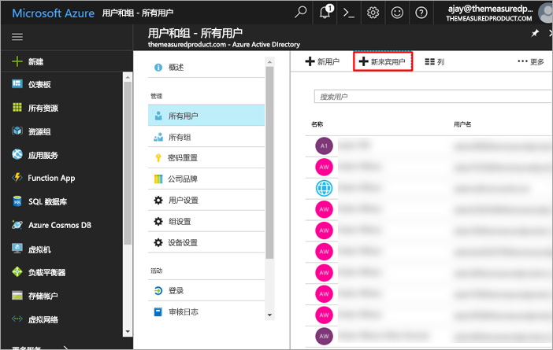

# 使用 Azure AD B2B 将 Power BI 内容分发给外部来宾用户

Power BI 与 Azure Active Directory 企业到企业 (Azure AD B2B) 集成，便于你将 Power BI 内容安全分发给组织外的来宾用户，同时仍能继续控制内部数据。  

另外，你还可以使组织外部的来宾用户能够编辑和管理组织内的内容。

## 启用访问权限

邀请来宾用户前，请务必先在 Power BI 管理门户中启用[与外部用户共享内容](service-admin-portal.md#export-and-sharing-settings)功能。

此外，通过[允许外部来宾用户编辑和管理组织中的内容](service-admin-portal.md#export-and-sharing-settings)功能还能选择可以在工作区中查看和创建内容（包括浏览组织的 Power BI）的来宾用户。

## 可以邀请哪些用户？

可邀请使用任意电子邮件地址（包括个人帐户，如 gmail.com、outlook.com 和 hotmail.com）的来宾用户。 在 Azure AD B2B 中，这些地址称为“社交标识”。

## 邀请来宾用户

只有在首次邀请外部来宾用户加入组织时，才需要发送邀请。 邀请用户的方法有两种：计划内邀请和临时邀请。

### 计划性邀请

如果确定要邀请哪些用户，请使用计划内邀请。 可使用 Azure 门户或 PowerShell 发送邀请。 只有租户管理员才能邀请用户。

若要在 Azure 门户中发送邀请，请按以下步骤操作。

1. 在 [Azure 门户](https://portal.azure.com)中，选择“Azure Active Directory”。

1. 在“管理”下，依次转到“用户” > “所有用户” > “新建来宾用户”。

    

1. 输入“电子邮件地址”和“个人消息”。

    

1. 选择“邀请”。

若要邀请多个来宾用户，请使用 PowerShell。 有关详细信息，请参阅 [Azure AD B2B 协作代码和 PowerShell 示例](/azure/active-directory/b2b/code-samples/)。

来宾用户需要在他们收到的电子邮件邀请中选择“开始”。 然后就会将该来宾用户添加到租户。

### 临时邀请

通过共享 UI 将外部用户添加到仪表板或报表，或通过访问页面添加到应用，即可随时发出邀请。 以下示例说明邀请外部用户使用应用时要执行的操作。

来宾用户会收到指明已与其共享应用的电子邮件。

该来宾用户必须使用其组织电子邮件地址进行登录。 完成登录后，将提示他们接受邀请。 登录后，系统会将来宾用户重定向到对应的应用内容。 他们可以将链接设为书签，也可以保存电子邮件，以便稍后返回到应用。

## 许可

来宾用户必须拥有正确的授权，才能查看已共享的内容。 为此，可使用以下三种方法：使用 Power BI Premium；分配 Power BI Pro 许可证；或使用来宾用户的 Power BI Pro 许可证。

使用[允许外部来宾用户编辑和管理组织中的内容](service-admin-portal.md#export-and-sharing-settings)功能时，向工作区提供内容或与他人共享内容的来宾用户需要具有 Power BI Pro 许可。

### 使用 Power BI Premium

如果你将应用工作区分配到 [Power BI Premium 容量](service-premium.md)，来宾用户无需获取 Power BI Pro 许可证，即可使用应用。 使用 Power BI Premium 时，应用还可以利用其他功能（如加快刷新速率、专用容量和大模型）。

### 向来宾用户分配 Power BI Pro 许可证

如果你在租户内向来宾用户分配 Power BI Pro 许可证，来宾用户便能查看租户内容。

### 来宾用户拥有自己的 Power BI Pro 许可证

在来宾用户的租户中已向来宾用户分配 Power BI Pro 许可证。

## 可以编辑和管理内容的来宾用户 

使用[允许外部来宾用户编辑和管理组织中的内容](service-admin-portal.md#export-and-sharing-settings)时，指定的来宾用户能访问组织的 Power BI 和查看有权查看的任何内容。 他们可以访问主页、浏览工作区、将应用安装到访问列表中相应的位置并向工作区提供内容。 还可以创建或成为使用新工作区体验的工作区管理员。 可能存在一些限制，这些限制已在“注意事项和限制”部分列出。

要帮助这些用户登录到 Power BI，请向他们提供租户 URL。 要查找租户 URL，请执行以下步骤。

1. 在 Power BI 服务的顶部菜单栏中，依次选择帮助图标 (?)和“关于 Power BI”。

2. 查找“租户 URL”旁的值。 它就是可与来宾用户共享的租户 URL。

## 注意事项和限制

* 默认情况下，外部 B2B 来宾仅限于使用内容。 外部 B2B 来宾可以查看应用、仪表板、报表，导出数据以及为仪表板和报表创建电子邮件订阅。 他们无法访问工作区或发布自己的内容。 但这些限制不适用于经[允许外部来宾用户编辑和管理组织中的内容](service-admin-portal.md#export-and-sharing-settings)租户设置允许的来宾用户。

* 对于通过[允许外部来宾用户编辑和管理组织中的内容](service-admin-portal.md#export-and-sharing-settings)租户设置启用的来宾用户，某些体验可能不可用。 他们需要使用 Power BI 服务 Web UI 来更新或发布报表，包括为上传 Power BI Desktop 文件获取数据。  不支持以下体验：
    * 从 Power BI Desktop 直接向 Power BI 服务发布
    * 来宾用户不能使用 Power BI Desktop 连接 Power BI 服务中的服务数据集
    * 绑定到 Office 365 组的经典工作区：来宾用户无法创建或成为这些工作区的管理员。 可以是成员。
    * 对于工作区访问列表，不支持发送临时邀请
    * 不支持来宾用户使用 Power BI Publisher for Excel
    * 来宾用户不能安装 Power BI Gateway，也不能将它连接到组织
    * 来宾用户不能安装发布到整个组织的应用
    * 来宾用户不能使用、创建、更新或安装组织内容包
    * 来宾用户不能使用“在 Excel 中分析”
    * 无法在评论中 @mentioned来宾用户
    * 来宾用户不能使用订阅
    * 使用此功能的来宾用户应具有工作或学校帐户。 使用个人帐户的来宾用户会因登录限制受到更多限制。

* 此功能当前不可用于 Power BI SharePoint Online 报表 Web 部件。

* 有一些 Active Directory 设置可以限制外部来宾用户在整个组织范围内可以执行的操作，同时适用于你的 Power BI 环境。 以下文档探讨的设置为：
    * [管理外部协作设置](https://docs.microsoft.com/azure/active-directory/b2b/delegate-invitations#control-who-can-invite)
    * [允许或阻止向特定组织中的 B2B 用户发送邀请](https://docs.microsoft.com/azure/active-directory/b2b/allow-deny-list)  

## 后续步骤

有关详细信息（包括行级别安全性的工作方式），请查看白皮书：[使用 Azure AD B2B 将 Power BI 内容分发给外部来宾用户](https://aka.ms/powerbi-b2b-whitepaper)。

若要了解 Azure AD B2B，请参阅[什么是 Azure AD B2B 协作？](/azure/active-directory/active-directory-b2b-what-is-azure-ad-b2b/)。
