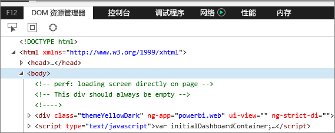
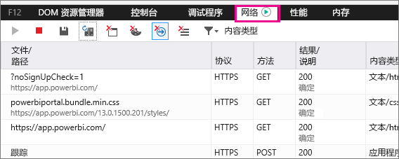
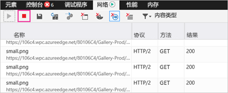
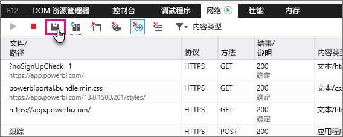

# 捕获 Power BI 的其他诊断信息

本文说明了如何手动从 Power BI Web 客户端收集其他诊断信息。

1. 通过 Microsoft Edge 或 Internet Explorer 浏览到 [Power BI](https://app.powerbi.com)。

1. 按 F12 以打开 Microsoft Edge 开发人员工具。

   

1. 选择“网络”选项卡。它将列出已捕获的流量。

   

    你可以：

    * 可以在窗口中浏览并重现任何可能会遇到的问题。

    * 可以在会话期间随时通过按 F12 来隐藏和显示开发人员工具窗口。

1. 若要停止分析会话，可以选择开发人员工具区域的“网络”选项卡上的红色方块。

   

1. 选择磁盘图标以将数据导出为 HTTP 存档 (HAR) 文件。

   

1. 提供文件名称并保存该 HAR 文件。

    HAR 文件会包含有关浏览器窗口与 Power BI 之间的网络请求的所有信息，包括：

    * 每个请求的活动 ID。

    * 每个请求的精确时间戳。

    * 返回到客户端的任何错误信息。

    此跟踪还会包含用于填充屏幕上显示的视觉对象的数据。

1. 你可以提供该 HAR 文件以支持审阅。

更多问题？ [尝试咨询 Power BI 社区](http://community.powerbi.com/)
