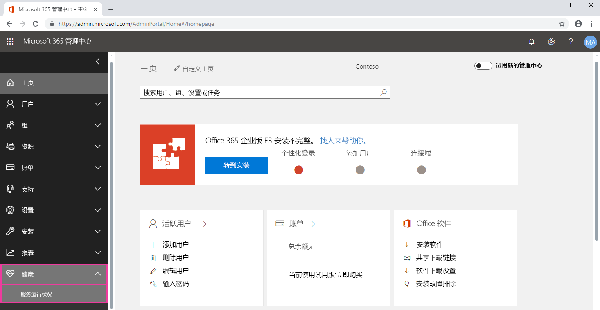

# 跟踪 Office 365 中的 Power BI 服务运行状况

Microsoft 365 管理中心内为 Power BI 管理员提供重要的工具。 这些工具包括有关服务运行状况的当前和历史信息。 若要访问服务运行状况信息，您必须是以下角色之一：

* Power BI 服务管理员

* Office 365 全局管理员

有关角色的详细信息，请参阅[Power BI 管理员角色相关](service-admin-administering-power-bi-in-your-organization.md#administrator-roles-related-to-power-bi)。

1. 登录 [MIcrosoft 365 管理中心](https://portal.office.com/adminportal)。

1. 从左侧的导航栏中，选择**显示所有** > **运行状况** > **服务运行状况**。 服务运行状况页将显示：

    

1. 从**所有服务**列表中，选择**公告**或**事件**并查看结果。 在下面的屏幕截图，可以看到三个活动的建议之一。

    

1. 若要查看详细信息，请选择项的“显示详细信息”  。 下面的屏幕截图，请参阅其他详细信息，包括最新状态更新。

    

    向下滚动以查看更多信息，完成时关闭窗格。

1. 若要查看的历史信息的右上角中的所有服务跨**服务运行状况**页上，选择**查看历史记录**。 然后，选择“过去 7 天”  或“过去 30 天”  。 

1. 若要返回到当前服务运行状况，请选择“查看当前状态”  。