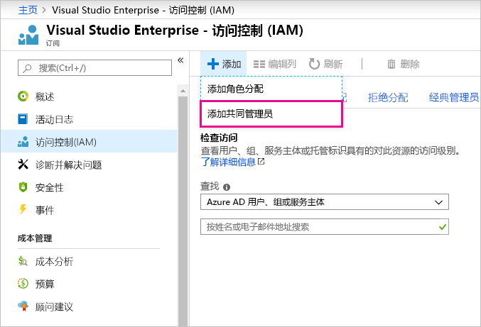

# 将相同的帐户用于 Power BI 和 Azure

如果你同时是 Power BI 和 Azure 的用户，则可能要对这两个服务使用相同的登录名，以便无需输入密码两次。

Power BI 会使用与工作或学校电子邮件地址关联的组织帐户使你登录。  Azure 会使用 Microsoft 帐户或组织帐户使你登录。

如果要同时对 Azure 和 Power BI 使用相同的登录名，请务必使用组织帐户登录到 Azure。

**如果我已使用 Microsoft 帐户登录 Azure，该怎么办？**

通过执行以下步骤可以作为协同管理员在 Azure 中添加组织帐户：

1. 登录 [Azure 门户](http://portal.azure.com/)。 如果你是多个 Azure 目录中的用户，请选择“订阅”  ，然后进行筛选以便仅查看你要编辑的目录和订阅。

1. 在导航窗格中，选择“访问控制(IAM)”，然后选择“添加”\>“添加共同管理员”    。

    

1. 输入与组织帐户关联的电子邮件地址，然后选择“添加”  。

1. 下次登录 Azure 门户时，请使用组织电子邮件地址。

更多问题？ [尝试参与 Power BI 社区](http://community.powerbi.com/)
