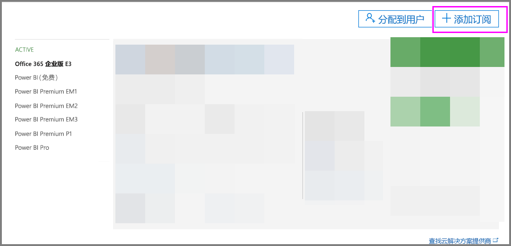
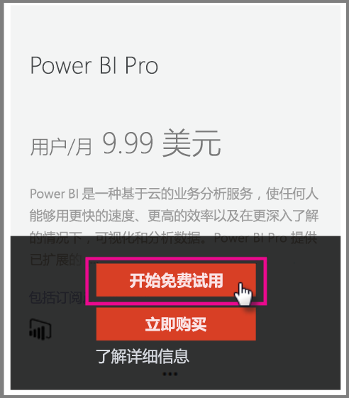
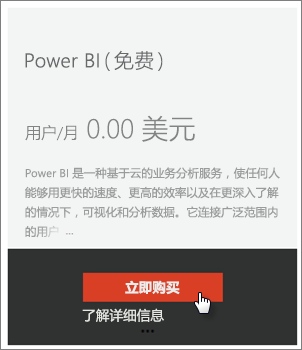
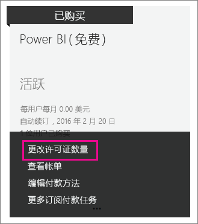
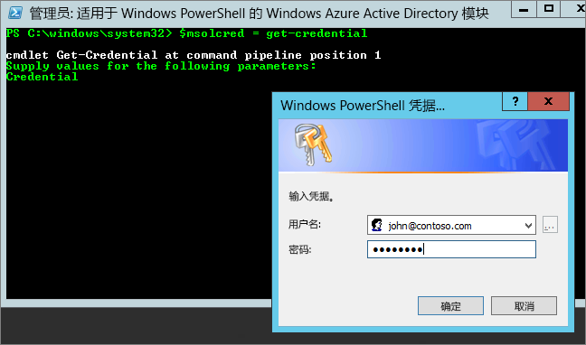

# <a name="power-bi-licensing-in-your-organization"></a>组织中的 Power BI 许可

[!INCLUDE [license-capabilities](includes/license-capabilities.md)]

本文从管理员角度重点介绍每用户许可。

## <a name="manage-power-bi-pro-licenses"></a>管理 Power BI Pro 许可证

作为管理员，你可以购买和分配 Power BI Pro 许可证；你可以为你的组织注册 Power BI Pro 试用版。 个人也可以注册 Power BI Pro 试用版。

### <a name="purchasing-power-bi-pro"></a>购买 Power BI Pro

可以通过 Microsoft Office 365 或已认证的 Microsoft 合作伙伴购买 Power BI Pro 许可证。 购买许可证后，你可以将它们分配给各个用户。 有关更多信息，请参阅[购买和分配 Power BI Pro 许可证](service-admin-purchasing-power-bi-pro.md)。

### <a name="power-bi-pro-trial-for-individuals"></a>面向个人提供的 Power BI Pro 试用版

你组织中的个人可以注册 Power BI Pro 试用版。 有关更多信息，请参阅[以个人身份注册 Power BI](service-self-service-signup-for-power-bi.md)。

利用此产品内 Power BI Pro 试用版的用户不会在 Office 365 管理门户内显示为 Power BI Pro 试用版用户（他们显示为 Power BI 免费用户）。 但是，他们会在 Power BI 中管理存储页面上显示为 Power BI Pro 试用版用户。

### <a name="power-bi-pro-trial-for-organizations"></a>面向组织提供的 Power BI Pro 试用版

如果你希望获取 Power BI 试用版许可证并部署给组织中的多个用户，而无需让单独用户分别接受试用条款，则可以为组织注册 Power BI Pro 试用版。

在执行注册步骤之前，请记住以下几点：

* 要进行注册，你必须是 Office 365 中[全局管理员或帐务管理员](https://support.office.com/article/about-office-365-admin-roles-da585eea-f576-4f55-a1e0-87090b6aaa9d?ui=en-US&rs=en-US&ad=US)角色的成员。

* 每个租户限制使用一个组织试用版。 这意味着如果有人已将 Power BI Pro 试用版应用到你的租户，则无法再次应用。 如果需要这方面的帮助，请联系 [Office 365 计费支持](https://support.office.microsoft.com/article/contact-support-for-business-products-admin-help-32a17ca7-6fa0-4870-8a8d-e25ba4ccfd4b?CorrelationId=552bbf37-214f-4202-80cb-b94240dcd671&ui=en-US&rs=en-US&ad=US)。

1. 导航到 [Office 365 管理中心](https://portal.office.com/adminportal/home#/homepage)。

1. 在左侧导航窗格中，依次选择“计费”和“订阅”。

   

1. 选择右侧的“添加订阅”。

   

1. 在“其他计划”下，将鼠标悬停在 Power BI Pro 的省略号 (...) 上方，然后选择“开始免费试用”。

    

1. 在订单确认屏幕上，选择“立即试用”。

1. 在订单签收上选择“继续”。

现在，可以[在 Office 365 中分配许可证](https://support.office.com/article/assign-licenses-to-users-in-office-365-for-business-997596b5-4173-4627-b915-36abac6786dc)。

## <a name="manage-power-bi-free-licenses"></a>管理 Power BI 免费许可证

组织中的用户可以通过两种不同方式获取对 Power BI 免费许可证的访问权限：

* 可在 Office 365 管理门户内为其分配 Power BI 许可证。

* 如果用户[注册 Power BI Pro 试用版](service-self-service-signup-for-power-bi.md)且试用版到期，则会为其分配免费许可证。

### <a name="requesting-and-assigning-free-licenses"></a>请求和分配免费许可证

如果你计划集中管理许可证请求和分配，请首先检查你是否已拥有无限制的 Power BI（免费）许可证块。

此许可证块会在某人首次以个人身份注册 Power BI 之后可用。 在该过程中，此许可证块会附加到你的组织，一个许可证会分配给进行注册的用户。

1. 在 Office 365 管理中心的“计费” > “许可证”下，检查“无限制”。

    

1. 如果此块可用，你现在可以[在 Office 365 中分配许可证](https://support.office.com/article/assign-licenses-to-users-in-office-365-for-business-997596b5-4173-4627-b915-36abac6786dc)。 如果此块不可用，你有两种选择：

    * 让你的组织成员单独注册，这会触发无限制块的创建。

    * 转到下一个过程，你可以在其中注册固定数量的许可证。

如果无限制的 Power BI（免费）许可证块不可用且你不想单独注册，请按照此过程操作。

1. 导航到 [Office 365 管理中心](https://portal.office.com/admin/default.aspx)。

1. 在左侧导航窗格中，选择**计帐**  >  **订阅**。

1. 选择右侧的“添加订阅 +”。

1. 在“其他计划”下，将鼠标悬停在 Power BI（免费）的省略号 (...) 上方，然后选择“立即购买”。

    

1. 输入要添加的许可证数，并选择“立即结帐”或“添加到购物车”。

1. 输入结帐流程中的所需信息。

    使用此方法时不会进行任何购买，不过你需要输入信用卡信息以进行计帐或选择开票。

1. 现在，你可以[在 Office 365 中分配许可证](https://support.office.com/article/assign-licenses-to-users-in-office-365-for-business-997596b5-4173-4627-b915-36abac6786dc)。

1. 如果你以后决定要添加更多许可证，则可以返回到**添加订阅**，然后对 Power BI（免费）选择**更改许可证数量**。

    

### <a name="enable-or-disable-individual-user-sign-up-in-azure-active-directory"></a>在 Azure Active Directory 中启用或禁用个人用户注册

作为管理员，你可以通过 Azure Active Directory (AAD) 选择启用或禁用个人用户注册。 本文的这一部分内容向你展示了如何使用 PowerShell 命令管理注册过程。 有关 Azure PowerShell 的详细信息，请参阅 [ Azure PowerShell 概述](/powershell/azure/overview)。

控制注册的 AAD 设置是 AllowAdHocSubscriptions。 在大多数租户中，会将此设置设置为 true，这意味着它处于启用状态。 如果你是通过合作伙伴获取 Power BI，则这可能会设置为 false，这意味着它处于禁用状态。 如果你将该设置从 true 更改为 false，则会阻止组织中的新用户以个人身份注册。 在设置更改之前注册 Power BI 的用户将保留其许可证。

1. 使用 Office 365 凭据登录 Azure Active Directory。 以下 PowerShell 脚本的第一行会提示你输入凭据。 第二行连接到 Azure Active Directory。

    ```powershell
     $msolcred = get-credential
     connect-msolservice -credential $msolcred
    ```

   

1. 登录之后，运行以下命令以查看当前是如何配置租户的。

    ```powershell
     Get-MsolCompanyInformation | fl AllowAdHocSubscriptions
    ```
1. 运行以下命令启用 ($true) 或禁用 ($false) AllowAdHocSubscriptions。

    ```powershell
     Set-MsolCompanySettings -AllowAdHocSubscriptions $true
    ```

> [!NOTE]
> AllowAdHocSubscriptions 标记用于控制组织中的若干用户功能，其中包括用户注册 Azure 权限管理服务的功能。 更改此标志会影响所有这些功能。

## <a name="next-steps"></a>后续步骤

[自助注册 Power BI](service-self-service-signup-for-power-bi.md)  

[购买和分配 Power BI Pro 许可证](service-admin-purchasing-power-bi-pro.md)

更多问题？ [尝试咨询 Power BI 社区](http://community.powerbi.com/)