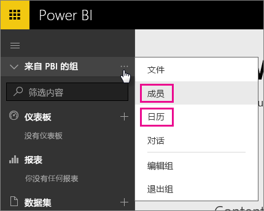
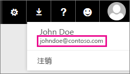

# Office 365 专用客户 - 已知问题
现在针对 Office 365 专用客户支持 Power BI。  如果你是 O365 专用客户，则可以使用来自该租户的帐户进行登录，并使用 Power BI。 当前有两个已知问题。

## 组
在组上下文菜单中选择**成员**或**日历**时，你会改为重定向到邮件应用。  **文件**和**对话**按预期方式工作。

## iPhone 应用 - 使用虚域登录会导致错误
使用具有虚域的登录名在 iPhone 应用中登录时，可能会遇到错误。

*登录错误*  
*发生意外内部错误。请重试。*

若要解决此问题，请使用在 Power BI 服务内单击用户图标时列出的电子邮件地址（而不是使用虚域）进行登录。

更多问题？ [尝试参与 Power BI 社区](http://community.powerbi.com/)

