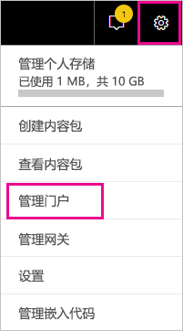
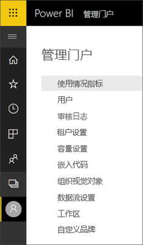
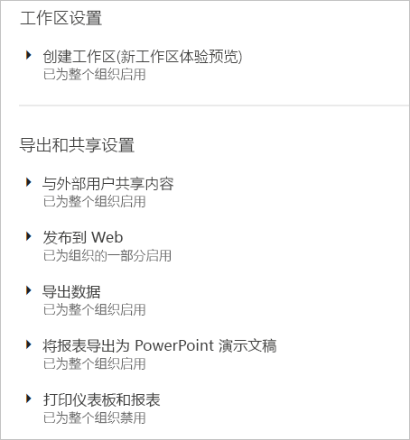
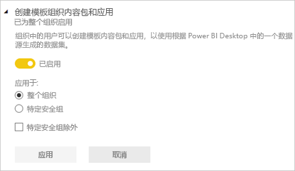
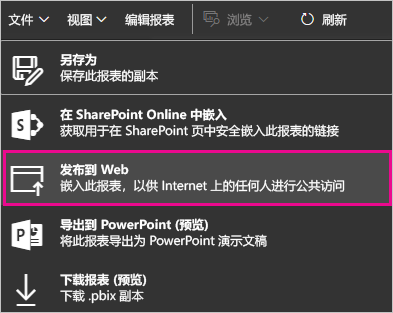
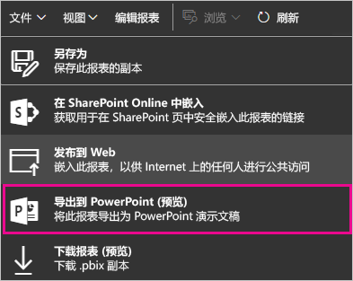
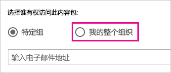
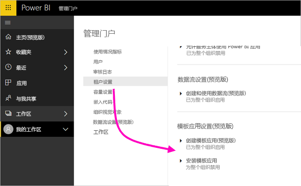

# 在管理门户中管理 Power BI

借助管理门户，用户可以管理组织中的 Power BI 租户。 门户包括诸如使用情况指标、对 Office 365 管理中心的访问以及设置这类项目。

Office 365 中的全局管理员或分配有 Power BI 服务管理员角色的用户都可以访问完整的管理门户。 如果你不是这些角色之一，则只能在门户中看到“容量设置”。 若要详细了解 Power BI 服务管理员角色，请参阅[了解 Power BI 管理员角色](service-admin-role.md)。

## 如何访问管理门户

帐户必须标记为 Office 365 或 Azure Active Directory 中的 **全局管理员** ，或者已分配到 Power BI 服务管理员角色，才能获取对 Power BI 管理门户的访问权限。 若要详细了解 Power BI 服务管理员角色，请参阅[了解 Power BI 管理员角色](service-admin-role.md)。 若要访问 Power BI 管理门户，请执行以下操作。

1. 在 Power BI 服务右上角选择设置齿轮。

1. 选择“管理门户”。

    

门户中有七个选项卡。 本文的其余部分提供了有关每个选项卡的信息。

* [使用情况指标](#usage-metrics)
* [用户](#users)
* [审核日志](#audit-logs)
* [租户设置](#tenant-settings)
* [容量设置](#capacity-settings)
* [嵌入代码](#embed-codes)
* [组织视觉对象](#organizational-visuals)

## 使用情况指标

通过“使用情况指标”，你可以监视组织的使用情况。 通过它还可以查看对于组织，哪些用户和组在 Power BI 中最活跃。

> [!NOTE]
> 首次访问仪表板时，或在长时间未查看仪表板后再次进行访问之后，你可能会在我们加载仪表板时看到加载屏幕。

仪表板加载之后，你会看到两个部分的磁贴。 第一个部分包含单个用户的使用情况数据，第二个部分包含有关组织中的组的类似信息。

下面是每个磁贴中显示的内容的细分：

* 用户工作区中的所有仪表板、报表和数据集的非重复计数
  
    

* 按可以进行访问的用户数划分的使用量最大的仪表板。 例如，如果你将 1 个仪表板与 3 个用户共享，并且还将它添加到 2 个不同用户连接到的内容包，则其计数会是 6 (1 + 3 + 2)
  
    

* 用户连接到的最受欢迎内容。 这是用户可以通过“获取数据”过程访问的任何内容，如 SaaS 内容包、组织内容包、文件或数据库。
  
    

* 基于用户具有的仪表板数（他们自己创建的仪表板以及与他们共享的仪表板）的排名靠前用户视图。
  
    

* 基于用户具有的报表数的排名靠前用户视图
  
    

第二个部分显示相同类型的信息，不过是基于组。 这样，就可以查看组织中最活跃的组以及它们所使用的内容种类。

借助此信息，你可以真正地深入了解用户在组织中如何使用 Power BI，并能够识别在组织中非常活跃的用户和组。

## 用户数

可以在 Office 365 管理中心中管理 Power BI 用户、组和管理员。 “用户”选项卡为租户提供指向管理中心的链接。

## 审核日志

可以在 Office 365 安全与合规中心中管理 Power BI 审核日志。 “审核日志”选项卡为租户提供指向安全与合规中心的链接。 [了解详细信息](service-admin-auditing.md)

若要使用审核日志，请确保[**创建内部活动审核和合规性的审核日志**](#create-audit-logs-for-internal-activity-auditing-and-compliance)设置已启用。

## 租户设置

“租户设置”选项卡可以对组织可用的功能进行细粒度控制。 如果你担心敏感数据、我们的某些功能可能不适合你的组织，或者你只需要为特定组提供特定的功能。

下图显示了“租户设置”选项卡的前两部分。

> [!NOTE]
> 可能需要 10 分钟才会使设置更改对租户中的每个人生效。

设置可以有三种状态：

* **已为整个组织禁用**：组织中无人可以使用此功能。

    

* **已为整个组织启用**：组织中每个人均可以使用此功能。

    

* **针对组织的子集启用**：组织中特定子集的用户或组可以使用此功能。

    可以为除特定用户组之外的整个组织启用此功能。

    

    还可以仅为特定用户组启用功能，也可以为某个用户组禁用功能。 使用此方法确保即使某些用户属于允许的组，但仍没有访问该功能的权限。

    

接下来的几节概述了不同类型的租户设置。

## 工作区设置

### 创建工作区（预览）

组织中的用户可创建应用工作区，以在仪表板、报表和其他内容上进行协作。 [了解详细信息](service-create-the-new-workspaces.md)

## 导出和共享设置

### 向外部用户共享内容

组织中的用户可以与组织外部的用户共享仪表板。 [了解详细信息](service-share-dashboards.md#share-a-dashboard-or-report-with-people-outside-your-organization)

下图显示了与外部用户共享时会显示的消息。

### 发布到 Web

组织中的用户可以将报表发布到 Web。 [了解详细信息](service-publish-to-web.md)

下图显示了启用“发布到 Web”设置时报表的“文件”菜单。

根据“发布到 Web”设置的内容，用户会在 UI 中看到不同的选项。

|功能 |为整个组织启用 |为整个组织禁用 |特定的安全组   |
|---------|---------|---------|---------|
|报表“文件”菜单下的“发布到 Web”。|为所有对象启用|向所有对象隐藏|仅向已授权的用户或组显示。|
|“设置”下的“管理嵌入代码”|为所有对象启用|为所有对象启用|为所有对象启用  仅向已授权的用户或组显示“删除”选项。*  为所有对象启用“获取代码”。* |
|管理门户中的“嵌入代码”|“状态”反映以下状态之一： * 活动 * 不支持 * 已阻止|状态显示“已禁用”|“状态”反映以下状态之一： * 活动 * 不支持 * 已阻止  如果未根据租户设置为某个用户授权，状态将显示为“侵权”。|
|现有的已发布报表|全部已启用|全部已禁用|继续向所有对象呈现报表。|

### 导出数据

组织中的用户可以从磁贴或可视化效果导出数据。 [了解详细信息](visuals/power-bi-visualization-export-data.md)

下图显示了从磁贴导出数据的选项。

> [!NOTE]
> 禁用“导出数据”还会阻止用户使用“在 Excel 中分析”功能，同时也会阻止用户使用 Power BI 服务实时连接。

### 将报表导出为 PowerPoint 演示文稿或 PDF 文档

组织中的用户可以将 Power BI 报表导出为 PowerPoint 文件或 PDF 文档。 [了解详细信息](consumer/end-user-powerpoint.md)

下图显示了在启用“将报表导出为 PowerPoint 演示文稿或 PDF 文档”设置时报表的“文件”菜单。

### 打印仪表板和报表

组织中的用户可以打印仪表板和报表。 [了解详细信息](consumer/end-user-print.md)

下图展示了“打印仪表板”选项。

下图展示了在“打印仪表板和报表”设置已启用时报表的“文件”菜单。

### 允许外部来宾用户编辑和管理组织中的内容
Azure B2B 来宾用户可以编辑和管理组织中的内容。 [了解详细信息](service-admin-azure-ad-b2b.md)

下图显示用于允许外部来宾用户编辑和管理组织中内容的选项。

## 内容包和应用设置

### 向整个组织发布内容包和应用

组织中的用户可以向整个组织（而不仅仅是特定组）发布内容包和应用。 [了解详细信息](service-organizational-content-pack-manage-update-delete.md)

下图展示了创建内容包时可用的“我的整个组织”选项。

### 创建模板应用

组织中的用户可以创建使用 Power BI Desktop 内置数据集的模板应用。 详细了解[模板应用](template-content-pack-authoring.md)

### 将应用推送给最终用户

用户可以直接与最终用户共享应用，而无需从 AppSource 安装。 [了解详细信息](service-create-distribute-apps.md)

## 集成设置

### 使用 Cortana 询问有关数据的问题

组织中的用户可以使用 Cortana 询问有关其数据的问题。 [了解详细信息](service-cortana-enable.md)

> [!NOTE]
> 此设置应用于整个组织，并且不能限制为特定组。

### 结合使用“在 Excel 中分析”功能和本地数据集

组织中的用户可以使用 Excel 查看本地 Power BI 数据集，并与其进行交互。 [了解详细信息](service-analyze-in-excel.md)

> [!NOTE]
> 禁用“导出数据”还会阻止用户使用“在 Excel 中分析”功能。

### 使用 ArcGIS Maps for Power BI

组织中的用户可以使用 Esri 提供的 ArcGIS Maps for Power BI 可视化效果。 [了解详细信息](visuals/power-bi-visualization-arcgis.md)

### 使用 Power BI（预览版）的全局搜索

组织中的用户可以使用依赖于 Azure 搜索的的外部搜索功能。 例如，用户可以使用 Cortana 直接从 Power BI 仪表板和报表检索关键信息。 [了解详细信息](service-cortana-intro.md)

## 自定义视觉对象设置

### 添加和使用自定义视觉对象

组织中的用户可以与自定义视觉对象进行交互并共享。 [了解详细信息](power-bi-custom-visuals.md)

> [!NOTE]
> 此设置可以应用于整个组织，也可以限制为特定组。

Power BI Desktop（2019 年 3 月版及更高版本）支持通过“组策略”禁止在组织部署的计算机上使用自定义视觉对象。

<table>
<tr><th>属性</th><th>值</th>
</tr>
<td>键</td>
    <td>Software\Policies\Microsoft\Power BI Desktop\</td>
<tr>
<td>值名称</td>
<td>EnableCustomVisuals</td>
</tr>
</table>

十进制值 1 允许在 Power BI 中使用自定义视觉对象（这是默认值）。

十进制值 0 禁止在 Power BI 中使用自定义视觉对象。

### 仅允许已认证的视觉对象

组织中已获得添加和使用自定义视觉对象权限的用户（由“添加和使用自定义视觉对象”设置表示）将只能够使用[已认证的自定义视觉对象](https://go.microsoft.com/fwlink/?linkid=2002010)（未经认证的视觉对象将受阻，并在使用时显示错误消息）。 

Power BI Desktop（2019 年 3 月版及更高版本）支持通过“组策略”禁止在组织部署的计算机上使用未经认证的自定义视觉对象。

<table>
<tr><th>属性</th><th>值</th>
</tr>
<td>键</td>
    <td>Software\Policies\Microsoft\Power BI Desktop\</td>
<tr>
<td>值名称</td>
<td>EnableUncertifiedVisuals</td>
</tr>
</table>

十进制值 1 允许在 Power BI 中使用未经认证的自定义视觉对象（这是默认值）。

十进制值 0 禁止在 Power BI 中使用未经认证的自定义视觉对象（该选项只允许使用[认证的自定义视觉对象](https://go.microsoft.com/fwlink/?linkid=2002010)）。

## R 视觉对象设置

### 与 R 视觉对象进行交互并共享

组织中的用户可以与使用 R 脚本创建的视觉对象进行交互并共享。 [了解详细信息](visuals/service-r-visuals.md)

> [!NOTE]
> 此设置应用于整个组织，并且不能限制为特定组。

## 审核和使用情况设置

### 为实现内部活动审核和符合性而创建审核日志

组织中的用户可以使用审核来监视组织中的其他用户在 Power BI 中执行的操作。 [了解详细信息](service-admin-auditing.md)

必须启用此设置，才能记录审核日志条目。 启用审核后，最多可能会延迟 48 小时才能查看审核数据。 如果无法立即查看数据，请稍后检查审核日志。 获取查看审核日志的权限和得以访问日志之间也存在类似的延迟。

> [!NOTE]
> 此设置应用于整个组织，并且不能限制为特定组。

### 内容创建者的使用指标

组织中的用户可以查看自己创建的仪表板和报表的使用情况指标。 [了解详细信息](service-usage-metrics.md)

### 内容创建者的使用情况指标中的每用户数据

内容创建者的使用情况指标将公开正在访问内容的用户的显示名称和电子邮件地址。 [了解详细信息](service-usage-metrics.md)

默认情况下，每个用户的数据都启用了使用指标并在指标报表中包含内容创建者帐户信息。 如果不希望某些或所有用户包含此信息，请为特定安全组或整个组织禁用此功能。 帐户信息随后会在报表中显示为“未命名”。

## 仪表板设置

### 仪表板的数据分类

组织中的用户可以为仪表板标记指明仪表板安全级别的分类。 [了解详细信息](service-data-classification.md)

> [!NOTE]
> 此设置应用于整个组织，并且不能限制为特定组。

## 开发人员设置

### 在应用中嵌入内容

组织中的用户可以在软件即服务 (SaaS) 应用程序中嵌入 Power BI 仪表板和报表。 禁用此设置会阻止用户使用 REST API 将 Power BI 内容嵌入到其应用程序中。 [了解详细信息](developer/embedding.md)

## 数据流设置(预览版)

### 创建和使用数据流（预览）

组织中的用户可以创建和使用数据流。 有关数据流的概述信息，请参阅 [Power BI 中的自助服务数据准备（预览）](service-dataflows-overview.md)。 若要启用高级容量中的数据流，请参阅[配置工作负载](service-admin-premium-workloads.md)。

> [!NOTE]
> 此设置应用于整个组织，并且不能限制为特定组。

## 模板应用设置（预览版）

两个设置控制模板应用。 

第一个设置“创建模板应用”，控制组织中的哪些人可以创建模板应用。 然后，模板应用创建者可以通过 AppSource 或其他分发方法将它们分发给组织外部的客户端。

使用第二个设置“安装模板应用”，可以控制组织中的哪些人可以从 AppSource 或其他源下载和安装模板应用

## 容量设置

### Power BI Premium

使用“Power BI Premium”选项卡，可以管理已为组织购买的任何 Power BI Premium 容量（EM 或 P SKU）。 组织中的所有用户都可以看到“Power BI Premium”选项卡；但如果用户被分配为容量管理员或拥有分配权限，则只能看到其中的内容。 如果用户没有任何权限，则显示以下消息。

### Power BI Embedded

使用“Power BI Embedded”选项卡，可以查看已为客户购买的 Power BI Embedded (A SKU) 容量。 由于只能从 Azure 购买 A SKU，因此是在 Azure 门户中[管理 Azure 中的嵌入容量](developer/azure-pbie-create-capacity.md)。

有关如何管理 Power BI Embedded (A SKU) 设置的详细信息，请参阅[什么是 Power BI Embedded](developer/azure-pbie-what-is-power-bi-embedded.md)。

## 嵌入代码

管理员可以查看针对其租户生成的嵌入代码。 此外，还可以撤消或删除代码。 [了解详细信息](service-publish-to-web.md)

## 组织视觉对象

使用“组织视觉对象”选项卡，可以部署和管理组织内的自定义视觉对象。 使用组织视觉对象，可以在组织中轻松部署专有的视觉对象，以便报表作者能够从 Power BI Desktop 中发现这些视觉对象，并将它们导入自己的报表中。 [了解详细信息](power-bi-custom-visuals-organization.md)

> [!WARNING]
> 自定义视觉对象可能包含存在安全或隐私风险的代码；请务必先信任自定义视觉对象的作者和来源，再将它们部署到组织存储库。

下图展示了目前在组织存储库中部署的所有自定义视觉对象。

### 添加新的自定义视觉对象

若要向列表添加新的自定义视觉对象，请按以下步骤操作。 

1. 在右窗格中，选择“添加自定义视觉对象”。

    

1. 填写“添加自定义视觉对象”表单：

    * **选择 .pbiviz 文件**（必填）：选择要上传的自定义视觉对象文件。 仅支持经版本控制的 API 自定义视觉对象（阅读此处内容了解其含义）。

    在上传自定义视觉对象之前，应查看有关视觉对象的安全和隐私，确保它符合组织的标准。

    * **命名自定义视觉对象**（必填）：为视觉对象命名简短标题，以便 Power BI Desktop 用户能够轻松理解它的用途

    * **图标**：显示在 Power BI Desktop UI 中的图标文件。

    * **说明**：视觉对象的简短说明，用于向用户提供更多上下文和说明

1. 选择“添加”，以发起上传请求。 如果成功，可以在列表中看到新项目。 如果失败，会收到相应的错误消息

### 从列表中删除自定义视觉对象

若要永久删除视觉对象，请选择存储库中视觉对象的回收站图标。

> [!IMPORTANT]
> 删除操作无法撤消。 一旦删除，此视觉对象会立即停止在现有报表中呈现。 即使重新上传同一个视觉对象，它也不会替换之前删除的视觉对象。 不过，用户可以重新导入新视觉对象，并替换报表中的现有实例。

### 在列表中禁用自定义视觉对象

若要禁用组织存储区中的视觉对象，请选择齿轮图标。 在“访问”部分中，禁用自定义视觉对象。

禁用视觉对象后，视觉对象将不会在现有报表中呈现，并显示下面的错误消息。

此自定义视觉对象不再可用。有关详细信息，请联系租户管理员。

但是，设为书签的视觉对象仍正常工作。

进行任何更新或管理员更改后，Power BI Desktop 用户应重新启动应用程序或刷新 Power BI 服务中的浏览器以查看更新。

### 更新视觉对象

若要更新组织存储中的视觉对象，请选择齿轮图标。 浏览并上传新版视觉对象。

确保视觉对象 ID 保持不变。 新文件将替换整个组织中所有报表的旧文件。 但是，如果新版本的视觉对象可能会破坏以前版本的视觉对象的任何使用情况或数据结构，则它们不会取代以前的版本。 相反，应创建新版本视觉对象的新列表。 例如，向新列出的视觉对象的标题添加新版本号（版本 X.X）。 通过这种方式，很明显可以看到，它还是相同的版本，只不过更新了版本号，因此现有报表不会破坏它们的功能。 同样，确保视觉对象 ID 保持不变。 然后，下一次用户从 Power BI Desktop 进入组织存储库时，他们就可以导入新版本，系统会提示他们替换报表中存在的当前版本。

有关详细信息，请访问[关于组织的自定义视觉对象的常见问题解答](https://docs.microsoft.com/power-bi/power-bi-custom-visuals-faq#organizational-custom-visuals)

## 数据流存储(预览版)

默认情况下，Power BI 中使用的数据存储在由 Power BI 提供的内部存储中。 通过数据流与 Azure Data Lake Storage Gen2 (ADLS Gen2) 的集成，可将数据流存储在组织的 Azure Data Lake Storage Gen2 帐户中。 有关详细信息，请参阅[数据流和 Azure Data Lake 集成（预览）](service-dataflows-azure-data-lake-integration.md)。

## 工作区（预览）

作为管理员，可以查看租户中存在的工作区。 可以对列表中的工作区进行排序和筛选并显示每个工作区的详细信息。 请注意，表列对应于由 [Power BI 管理员 Rest API](/rest/api/power-bi/admin) 为工作区返回的属性。 个人工作区的类型是 PersonalGroup，旧版工作区的类型是 Group，新式工作区的类型是 Workspace。 有关详细信息，请参阅[在 Power BI 中创建新工作区（预览）](service-create-the-new-workspaces.md)。

## 后续步骤

[在组织中管理 Power BI](service-admin-administering-power-bi-in-your-organization.md)、[了解 Power BI 管理员角色](service-admin-role.md)  
[在组织中审核 Power BI](service-admin-auditing.md)  

更多问题？ [尝试咨询 Power BI 社区](http://community.powerbi.com/)
