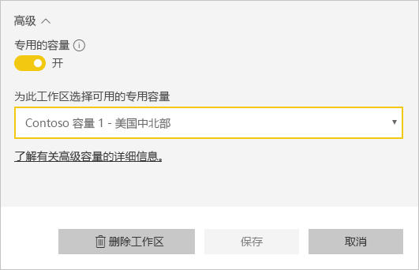

# 配置和管理 Power BI Premium 容量

管理 Power BI Premium 涉及创建、管理和监视 Premium 容量。 本文提供分步说明，有关功能的概述，请参阅[配置 Premium 容量](service-premium-capacity-manage.md)。

了解如何管理提供专用内容资源的 Power BI Premium 和 Power BI Embedded 容量。

容量是 Power BI Premium 和 Power BI Embedded 产品/服务的核心所在  。 它是保留以供组织专门使用的资源集。 拥有专用容量后，可向整个组织内的用户发布仪表板、报表和数据集，而无需为他们购买每用户许可证。 还可使容量中的内容具有稳定可靠的性能。 有关详细信息，请参阅[什么是 Power BI Premium？](service-premium.md)。

## 管理容量

在 Office 365 中购买容量节点后，可在 Power BI 管理员门户中设置容量。 你可在门户的“容量设置”部分管理 Power BI Premium 容量  。

可通过选择一个容量名称来管理该容量。 此操作将使你转到容量管理屏幕。

如果没有给该容量分配工作区，将看到一条[向容量分配工作区](#assign-a-workspace-to-a-capacity)的消息。

### 设置新容量 (Power BI Premium)

管理员门户将显示已使用及尚可用的虚拟核心 (vCore) 的数量  。 虚拟核心总数基于已购买的高级 SKU。 例如，购买 P3 和 P2 将获得 48 个可用核心，其中 32 个核心来自 P3，16 个核心来自 P2。

如果有可用的 V 核心，可通过执行以下步骤设置新容量。

1. 选择“设置新容量”  。

1. 为容量命名。

1. 定义此容量的管理员。

1. 选择容量大小。 可用选项取决于拥有的可用 V 核心数。 无法选择大于拥有的可用核心数的选项。

    

1. 选择“设置”  。

    

容量管理员以及 Power BI 管理员和 Office 365 全局管理员随后将看到该容量在管理门户中列出。

### 容量设置

1. 在高级容量管理屏幕的“操作”下，选择“齿轮图标”以查看及更新设置   。 

    

1. 可看到服务管理员名单、容量的 SKU/大小以及该容量所在的区域。

    

1. 还可重命名或删除容量。

    

> [!NOTE]
> 在 Microsoft Azure 门户中管理 Power BI Embedded 容量设置。

### 更改容量大小

Power BI 管理员和 Office 365 全局管理员可以更改 Power BI Premium 容量。 如果容量管理员不是 Power BI 管理员或 Office 365 全局管理员，则无法使用此选项。

1. 选择“更改容量大小”  。

    

1. 根据需要在“更改容量大小”屏幕对容量进行升级或降级  。

    

    只要管理员具有必需的 V 核心数，他们就可以创建节点、调整节点大小和删除节点。

    无法将 P SKU 降级至 EM SKU。 可将鼠标悬停在任何已禁用的选项上以查看说明。

> [!IMPORTANT]
> 如果 Power BI Premium 容量遇到资源使用量过高的情况，从而导致性能或可靠性问题，可通过接收通知电子邮件来识别和解决问题。 有关详细信息，请参阅[容量和可靠性通知](service-interruption-notifications.md#capacity-and-reliability-notifications)。

### 管理用户权限

可分配其他容量管理员，并分配具有“容量分配”权限的用户  。 如果具有分配权限的用户是某个工作区的管理员，那么他们可以将该工作区分配给容量。 还可以将个人的“我的工作区”  分配给容量。 具有分配权限的用户不能访问管理门户。

> [!NOTE]
> 对于 Power BI Embedded，在 Microsoft Azure 门户中定义容量管理员。

在“用户权限”下，展开“具有分配权限的用户”，然后根据需要添加用户或组   。

## 将工作区分配到容量

将工作区分配给容量有两种途径：在管理员门户中分配；从工作区分配。

### 从管理员门户中分配

容量管理员以及 Power BI 管理员和 Office 365 全局管理员可以在管理门户的高级容量管理部分批量分配工作区。 管理容量时，可看到“工作区”部分，可在此进行工作区分配  。

1. 选择“分配工作区”  。 多个位置均提供此选项。

1. 选择“应用到”选项  。

    

   | 选择 | 说明 |
   | --- | --- |
   | 按用户分配工作区  | 按用户或按组分配工作区时，这些用户拥有的所有工作区都将被分配到高级容量，包括用户的个人工作区。 所述的用户自动获得工作区分配权限。 包括已分配到不同容量的工作区。 |
   | 特定工作区  | 输入要分配给所选容量的特定工作区的名称。 |
   | 整个组织的工作区  | 将整个组织的工作区分配到高级容量，会把组织中的所有“工作区”和“我的工作区”分配到这个高级容量。 此外，当前和未来的所有用户都将有权向此容量重新分配个别工作区。 |
   | | |

1. 选择**应用**。

### 从工作区设置分配

还可以从某个工作区的设置中将该工作区分配到高级容量。 若要将工作区移入容量，必须具备该工作区的管理员权限以及该容量的容量分配权限。 请注意，工作区管理员始终可以从高级容量中删除工作区。

1. 通过选择省略号 (…) 和“编辑工作区”，对工作区进行编辑   。

    

1. 在“编辑工作区”下展开“高级”   。

1. 选择希望将此工作区分配到哪个容量。

    

1. 选择“保存”。 

保存后，工作区及其所有内容都会被迁移到高级容量，这不会影响最终用户的任何体验。

## Power BI 报表服务器产品密钥

在 Power BI 管理门户中的“容量设置”选项卡中，可以访问 Power BI 报表服务器产品密钥  。 这将仅适用于全局管理员或分配有 Power BI 服务管理员角色的用户，且前提是购买了 Power BI Premium SKU。

选择“Power BI 报表服务器密钥”  将显示包含产品密钥的对话框。 可以复制该密钥并用来进行安装。

有关详细信息，请参阅[安装 Power BI 报表服务器](report-server/install-report-server.md)。

## 后续步骤

[管理 Premium 容量](service-premium-capacity-manage.md)

更多问题？ [尝试咨询 Power BI 社区](https://community.powerbi.com/)
