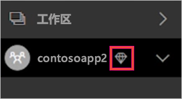
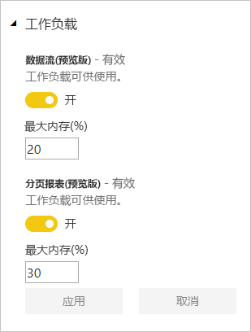

# 管理 Power BI Premium 和 Power BI Embedded 中的容量

了解如何管理提供专用内容资源的 Power BI Premium 和 Power BI Embedded 容量。

## 什么是容量？

容量是 Power BI Premium 和 Power BI Embedded 产品/服务的核心所在。 是为组织专用而保留的资源集。 拥有专用容量后，可向整个组织内的用户发布仪表板、报表和数据集，而无需为他们购买每用户许可证。 还可使容量中的内容具有稳定可靠的性能。 有关详细信息，请参阅[什么是 Power BI Premium？](service-premium.md)。

### 容量管理员

被指定为容量的容量管理员时，可以完全控制容量及其管理功能。 可以从 Power BI 管理门户添加更多的容量管理员或为用户授予容量分配权限。 可以为容量批量分配工作区，还可以查看容量的使用情况指标。

> [!NOTE]
> 对于 Power BI Embedded，在 Microsoft Azure 门户中定义容量管理员。

每个容量都有自己的管理员。 分配一个容量的容量管理员并不意味着授予他们访问你组织中所有容量的权限。 默认情况下，容量管理员无权访问 Power BI 管理员权限范围内的所有内容，如使用情况指标、审核日志或租户设置。 同样，容量管理员也无权设置新的容量或更改现有容量的 SKU。 只有 Office 365 全局管理员或 Power BI 服务管理员有权访问这些项。

所有 Office 365 全局管理员和 Power BI 服务管理员都会自动成为 Power BI Premium 容量和 Power BI Embedded 容量的容量管理员。

## 购买容量

若要利用专用容量，必须在 Office 365 管理中心购买 Power BI Premium，或在 Microsoft Azure 门户中创建 Power BI Embedded 资源。 有关详细信息，请参阅以下文章：

* Power BI Premium：[如何购买 Power BI Premium](service-admin-premium-purchase.md)

* **Power BI Embedded：**[在 Azure 门户中创建 Power BI Embedded 容量](https://docs.microsoft.com/azure/power-bi-embedded/create-capacity)

在购买 Power BI Premium 或嵌入 SKU 后，租户将收到相应数量的 V 核心，用于运行容量。 例如，购买 Power BI Premium P3 SKU 会为租户提供 32 个 V 核心。 有关 SKU 的详细信息，请参阅[高级容量节点](service-premium.md#premium-capacity-nodes)。

## 高级容量的用户体验

大多数情况下，用户不需要知道他们处于高级容量中。 其仪表板和报表会正常工作。 作为一个可视化提示，高级容量中的工作区旁有一个的菱形图标。

## 配置工作负载

默认情况下，Power BI Premium 和 Power BI Embedded 的容量仅支持与在云中运行 Power BI 查询相关联的工作负载。 我们现在为两个额外的工作负载提供预览支持：分页报表和数据流。 有关详细信息，请参阅[高级容量中的工作负载](service-premium.md#workloads-in-premium-capacity)。

要在 Power BI 管理门户中启用工作负载，请执行以下步骤。

1. 在“容量设置”下，选择一个容量。

1. 在“更多选项”下，展开“工作负载”。

1. 启用一个或多个工作负载，并设置“最大内存”的值。

    

1. 选择**应用**。

## 监视容量使用情况

Power BI 提供用于监视容量使用情况的应用。 有关详细信息，请参阅[监视组织中的 Power BI Premium 容量](service-admin-premium-monitor-capacity.md)。

## 管理容量

在 Office 365 中购买容量节点后，可在 Power BI 管理员门户中设置容量。 你可在门户的“容量设置”部分管理 Power BI Premium 容量。

可通过选择一个容量名称来管理该容量。 此操作将使你转到容量管理屏幕。

如果没有给该容量分配工作区，将看到一条[向容量分配工作区](#assign-a-workspace-to-a-capacity)的消息。

### 设置新容量 (Power BI Premium)

管理员门户将显示已使用及尚可用的虚拟核心 (vCore) 的数量。 虚拟核心总数基于已购买的高级 SKU。 例如，购买 P3 和 P2 将获得 48 个可用核心，其中 32 个核心来自 P3，16 个核心来自 P2。

如果有可用的 V 核心，可通过执行以下步骤设置新容量。

1. 选择“设置新容量”。

1. 为容量命名。

1. 定义此容量的管理员。

1. 选择容量大小。 可用选项取决于拥有的可用 V 核心数。 无法选择大于拥有的可用核心数的选项。

    

1. 选择“设置”。

    

容量管理员以及 Power BI 管理员和 Office 365 全局管理员随后将看到该容量在管理门户中列出。

### 容量设置

1. 在高级容量管理屏幕的“操作”下，选择“齿轮图标”以查看及更新设置。 

    

1. 可看到服务管理员名单、容量的 SKU/大小以及该容量所在的区域。

    

1. 还可重命名或删除容量。

    

> [!NOTE]
> 在 Microsoft Azure 门户中管理 Power BI Embedded 容量设置。

### 更改容量大小

Power BI 管理员和 Office 365 全局管理员可以更改 Power BI Premium 容量。 如果容量管理员不是 Power BI 管理员或 Office 365 全局管理员，则无法使用此选项。

1. 选择“更改容量大小”。

    

1. 根据需要在“更改容量大小”屏幕对容量进行升级或降级。

    

    只要管理员具有必需的 V 核心数，他们就可以创建节点、调整节点大小和删除节点。

    无法将 P SKU 降级至 EM SKU。 可将鼠标悬停在任何已禁用的选项上以查看说明。

### 管理用户权限

可分配其他容量管理员，并分配具有“容量分配”权限的用户。 如果具有分配权限的用户是某个应用工作区的管理员，那么他们可以将该工作区分配给容量。 还可以将个人的“我的工作区”分配给容量。 具有分配权限的用户不能访问管理门户。

> [!NOTE]
> 对于 Power BI Embedded，在 Microsoft Azure 门户中定义容量管理员。

在“用户权限”下，展开“具有分配权限的用户”，然后根据需要添加用户或组。

## 将工作区分配到容量

将工作区分配给容量有两种途径：在管理门户中分配；从应用工作区分配。

### 从管理员门户中分配

容量管理员以及 Power BI 管理员和 Office 365 全局管理员可以在管理门户的高级容量管理部分批量分配工作区。 管理容量时，可看到“工作区”部分，可在此进行工作区分配。

1. 选择“分配工作区”。 多个位置均提供此选项。

1. 选择“应用到”选项。

    

   | 所选内容 | 说明 |
   | --- | --- |
   | 按用户分配工作区 | 按用户或按组分配工作区时，这些用户拥有的所有工作区都将被分配到高级容量，包括用户的个人工作区。 所述的用户自动获得工作区分配权限。 包括已分配到不同容量的工作区。 |
   | 特定工作区 | 输入要分配给所选容量的特定工作区的名称。 |
   | 整个组织的工作区 | 将整个组织的工作区分配到高级容量，会把组织中的所有“应用工作区”和“我的工作区”分配到这个高级容量。 此外，当前和未来的所有用户都将有权向此容量重新分配个别工作区。 |
   | | |

1. 选择**应用**。

### 从应用工作区设置分配

还可以从某个应用工作区的设置中将该应用工作区分配到高级容量。 若要将工作区移入容量，必须具备该工作区的管理员权限以及该容量的容量分配权限。 请注意，工作区管理员始终可以从高级容量中删除工作区。

1. 通过选择省略号 (. . .) 和“编辑工作区”，编辑应用工作区。

    

1. 在“编辑工作区”下展开“高级”。

1. 选择希望将此应用工作区分配到哪个容量。

    

1. 选择**保存**。

保存后，工作区及其所有内容都会被迁移到高级容量，这不会影响最终用户的任何体验。

## Power BI 报表服务器产品密钥

在 Power BI 管理门户中的“容量设置”选项卡中，可以访问 Power BI 报表服务器产品密钥。 这将仅适用于全局管理员或分配有 Power BI 服务管理员角色的用户，且前提是购买了 Power BI Premium SKU。

选择“Power BI 报表服务器密钥”将显示包含产品密钥的对话框。 可以复制该密钥并用来进行安装。

有关详细信息，请参阅[安装 Power BI 报表服务器](report-server/install-report-server.md)。

## 后续步骤

与用户共享已发布的应用。 有关详细信息，请参阅[在 Power BI 中创建和分发应用](service-create-distribute-apps.md)。

更多问题？ [尝试咨询 Power BI 社区](http://community.powerbi.com/)
