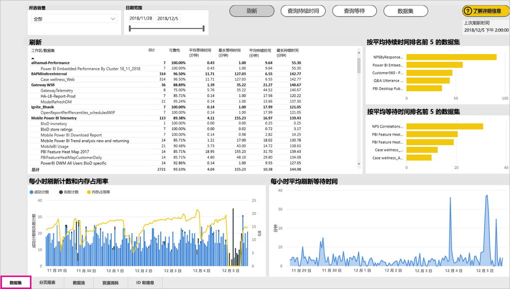
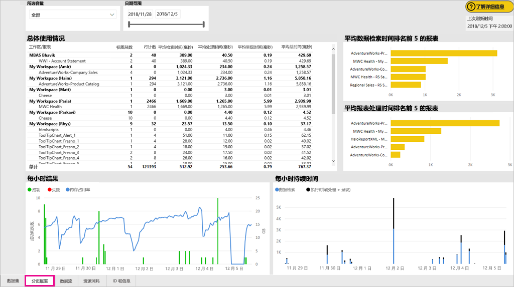
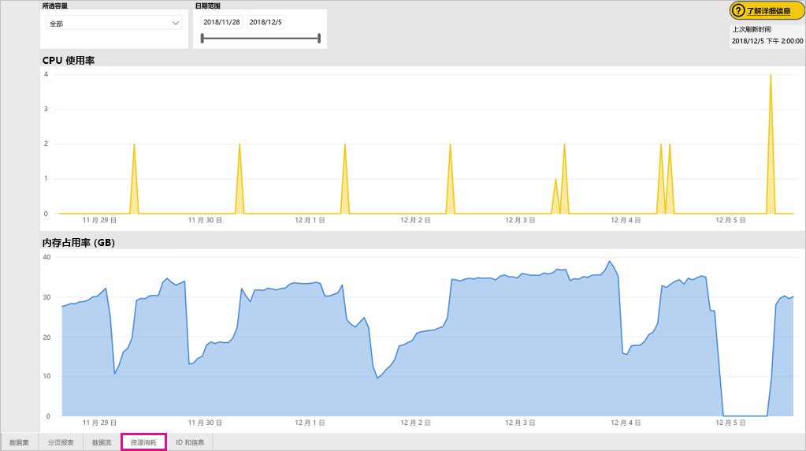
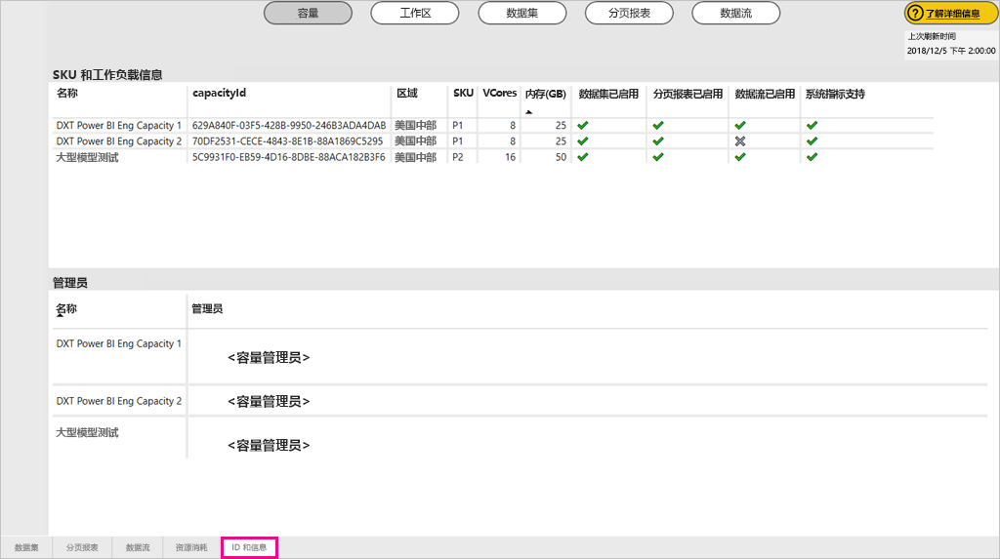
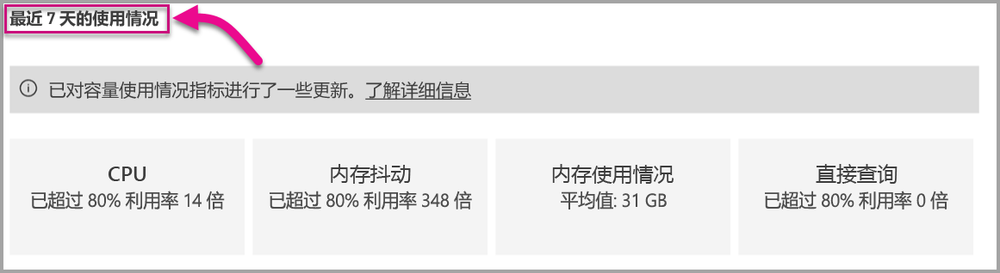

# 监视 Power BI Premium 和 Power BI Embedded 容量

本文概述了监视 Power BI Premium 容量的指标。 监控容量使用情况使你能够采取明智的方法来管理容量。

可以使用 Power BI Premium Capacity Metrics 应用或在管理门户中监视容量。 建议使用应用来监视容量，因为它可以提供了更多详细信息，但本文涵盖了这两个选项。

此应用的当前版本是 1.10（2018 年 12 月 13 日发布）。

。

<iframe width="560" height="315" src="https://www.youtube.com/embed/UgsjMbhi_Bk?rel=0&amp;showinfo=0" frameborder="0" allowfullscreen></iframe>

## 安装 Premium Capacity Metrics 应用

可以直接转到 [Premium Capacity Metrics 应用](https://app.powerbi.com/groups/me/getapps/services/capacitymetrics)，也可以像在 Power BI 中操作其他应用一样安装它。

1. 在 Power BI 中，单击“应用”。

    

1. 在右侧，单击“获取应用”。

1. 在“应用”类别中，搜索“Power BI Premium Capacity Metrics 应用”。

1. 订阅以安装应用。

现在你已经安装了应用，可以查看有关组织容量的指标。 我们来看看一些可用的关键指标。

## 使用指标应用

### 指标仪表板

打开应用时，它首先会显示一个仪表板，其中包含你拥有管理员权限的所有容量的摘要。

仪表板包含以下指标。

| **报表区域** | **指标** |
| --- | --- |
| **系统摘要** | * 应用程序版本  * 你作为管理员所管理的容量数  * 报告了指标的容量中的工作区数  * 过去七天内的平均内存消耗量 (GB)  * 过去七天内的最大内存消耗量 (GB)  * 发生最大内存消耗量时的当地时间  * 过去七天内 CPU 超过阈值的 80% 的次数（按三分钟的时间段划分）  * 过去七天内 CPU 超过阈值的 80% 的最多次数（按一小时的时间段划分）  * CPU 在一小时内超过 80% 的次数最多的时候的当地时间 |
| **数据集摘要** | * 所管理的容量中所有工作区的数据集总量  * 过去七天内直接查询/实时连接数超过阈值的 80% 的次数（按三分钟的时间段划分）  * 过去七天内直接查询/实时连接数超过阈值的 80% 的最多次数（按一小时的时间段划分）  * 直接查询/实时连接在一小时内超过 80% 的次数最多的时候的当地时间  * 过去七天内的刷新总次数  * 平均刷新等待时间 - 计划时间与刷新开始时间之间的平均延迟（以分钟为单位）  * 平均刷新持续时间 - 完成刷新所需的时间（以分钟为单位）  * 过去七天内查询运行的总次数  * 平均查询等待时间 - 一个查询在开始执行之前等待系统资源的时间（以毫秒为单位）  * 平均查询持续时间 - 完成查询所需的时间（以毫秒为单位）  * 由于内存压力导致模型收回的总次数  * 数据集的平均大小   * 加载到内存中的数据集的平均计数 |
| **数据流摘要** | * 容量中所有工作区的数据流总量  * 过去七天内的刷新总次数  * 平均刷新等待时间 - 计划时间与刷新开始时间之间的平均延迟（以分钟为单位）  * 平均刷新持续时间 - 完成刷新所需的时间（以分钟为单位） |
| **分页报表摘要** | * 容量中所有工作区的分页报表总量  * 所有报表被用户查看的总次数  * 所有报表中数据的总行数  * 所有报表的所有阶段（数据检索、处理和呈现）花费的总时间（以毫秒为单位） |
|  |  |

### 指标报表

单击仪表板，转到基础报表。 该报表具有五个选项卡，我们将在以下各部分中详细介绍。

* 数据集：提供容量内有关 Power BI 数据集运行状况的详细指标。

* 分页报表：提供容量中分页报表运行状况的详细指标。

* 数据流：容量中数据流的刷新详细指标。

* 资源消耗量：提供整体容量指标，包括内存和 CPU 高使用率。

* ID 和信息：容量、工作区和工作负载的名称、ID 和所有者。

在每个选项卡上，可以按容量和日期范围进行筛选。 如果未选择任何筛选器，则报表会默认显示报告了指标的所有容量过去一周的指标。

#### “数据集”选项卡

可使用“数据集”选项卡顶部的按钮导航到各不同区域：“摘要”、“刷新”、“查询持续时间”、“查询等待”和“数据集”。

##### “刷新”区域

“刷新”区域包含以下指标。

| **报表区域** | **指标** |
| --- | --- |
| **刷新可靠性** | * 总计数：每个数据集的总刷新次数  * 可靠性：针对每个数据集完成的刷新百分比  * 平均等待时间：计划时间与刷新数据集开始时间之间的平均延迟（以分钟为单位）  * 最长等待时间：数据集的最长等待时间（以分钟为单位）   * 平均持续时间：刷新数据集的平均持续时间（以分钟为单位）  * 最长持续时间：数据集运行时间最长的刷新持续时间（以分钟为单位） |
| **按平均刷新持续时间排列的前 5 个数据集** | * 具有最长平均刷新持续时间的五个数据集（以分钟为单位） |
| **按平均等待时间排列的前 5 个数据集** | * 具有最长平均刷新等待时间的五个数据集（以分钟为单位） |
| **每小时平均刷新等待时间** | * 平均刷新等待时间，按一小时的时间段划分，以本地时间报告。 多个高刷新等待时间峰值表示容量过度运行。 |
| **每小时刷新计数和内存占用率** | * 成功、失败和内存占用率，按一小时的时间段划分，以本地时间报告 |
|  |  |

##### “查询持续时间”区域

“查询持续时间”区域包含以下指标。

| **报表区域** | **指标** |
| --- | --- |
| **查询持续时间** | * 此区域中的数据在过去七天内由数据集、工作区和每小时 Bucket 数进行划分  * 总计：为数据集运行的查询的总数  * 平均值：数据集的平均查询持续时间（以毫秒为单位）  * 最大值：数据集中运行时间最长的查询的持续时间（以毫秒为单位）|
| **查询持续时间分布** | * 查询持续时间直方图由查询持续时间（以毫秒为单位）的 Bucket 数划分为以下类别：<= 30 毫秒、30-100 毫秒、100-300 毫秒、300 毫秒-1 秒、1 秒-3 秒、3 秒-10 秒、10 秒-30 秒和 > 30 秒时间间隔。 较长的查询持续时间和较长的等待时间表示容量过于繁忙。 这也可能意味着，单个数据集会导致问题，需要进一步调查。 |
| **按平均持续时间排列的前 5 个数据集** | * 具有最长平均查询持续时间的五个数据集（以毫秒为单位） |
| **直接查询/实时连接（> 80% 利用率）** | * 直接查询或实时连接超过 CPU 利用率的 80% 的次数，按一小时的时间段划分，以本地时间报告 |
| **每小时查询持续时间分布** | * 按一小时的时间段划分的查询计数和平均持续时间（以毫秒为单位）与内存占用率（以 GB 为单位），以本地时间报告。 |
|  |  |

##### 查询等待区域

“查询等待”区域包含以下指标。

| **报表区域** | **指标** |
| --- | --- |
| **查询等待次数** | * 此区域中的数据在过去七天内由数据集、工作区和每小时 Bucket 数进行划分  * 总计：为数据集运行的查询的总数  * 等待计数：在开始执行之前在系统资源上等待的数据集中的查询数   * 平均值：数据集的平均查询等待时间（以毫秒为单位）  * 最大值：数据集中等待时间最长的查询的持续时间（以毫秒为单位）|
| **等待时间分布** | * 查询持续时间直方图由查询持续时间（以毫秒为单位）的 Bucket 数划分为以下类别：<= 50 毫秒、50-100 毫秒、100-200 毫秒、200-400 毫秒、400 毫秒-1 秒、1 秒-5 秒和 > 5 秒时间间隔 |
| **按平均等待时间排列的前 5 个数据集** | * 要开始执行查询的具有最长平均等待时间的五个数据集（以毫秒为单位） |
| **每小时查询等待计数和时间** | * 按一小时的时间段划分的查询等待计数和平均等待时间（以毫秒为单位）与内存占用率（以 GB 为单位），以本地时间报告 |
|  |  |

##### “数据集”区域

“数据集”区域包含以下指标。

| **报表区域** | **指标** |
| --- | --- |
| **数据集逐出计数** | * 总计：为每个容量执行数据集逐出的总数。 容量面临内存压力时，节点从内存中逐出一个或多个数据集。 首先逐出处于非活动状态（当前没有执行查询/刷新操作）的数据集。 然后按“最近最少使用的项”(LRU) 这一顺序依次逐出。|
| **每小时数据集逐出和内存占用率** | * 数据集逐出与内存占用率（以 GB 为单位），按一小时的时间段划分，以本地时间报告 |
| **每小时加载的数据集计数** | * 加载到内存中的数据集数与内存占用率（以 GB 为单位），按一小时的时间段划分，以本地时间报告 |
| **数据大小**  | * 最大大小：显示的时间段内数据集的最大大小（以 MB 为单位） |
|  |  |

#### “分页报表”选项卡

“分页报表”选项卡显示容量中分页报表运行状况的详细指标。

“分页报表”选项卡包含以下指标。

| **报表区域** | **指标** |
| --- | --- |
| **总体使用情况** | * 总查看次数：用户查看报表的次数  * 行计数：报表中数据的行数  * 检索（平均值）：检索报表数据所需的平均时间（以毫秒为单位）。 较长的持续时间可能表示查询速度缓慢或其他数据源问题。   * 处理（平均值）：处理报表数据所需的平均时间（以毫秒为单位） * 呈现（平均值）：在浏览器中呈现报表所需的平均时间（以毫秒为单位）  * 总时间：报表所有阶段所需的时间（以毫秒为单位）|
| **按平均数据检索时间排列的前 5 个报表** | * 具有最长平均数据检索时间的五个报表（以毫秒为单位） |
| **按平均报表处理时间排列的前 5 个报表** | * 具有最长的平均报表处理时间的五个报表（以毫秒为单位） |
| **每小时持续时间** | * 数据检索与处理和呈现时间，按一小时的时间段划分，以本地时间报告 |
| **每小时的结果** | * 成功、失败和内存占用率，按一小时的时间段划分，以本地时间报告 |
|  |  |

#### “数据流”选项卡

“数据流”选项卡显示容量中数据流的刷新详细指标。

“数据流”选项卡包含以下指标。

| **报表区域** | **指标** |
| --- | --- |
| **刷新** | * 总计数：每个数据流的总刷新次数  * 可靠性：针对每个数据流完成的刷新百分比  * 平均等待时间：计划时间与刷新数据流开始时间之间的平均延迟（以分钟为单位）  * 最长等待时间：数据流的最长等待时间（以分钟为单位）   * 平均持续时间：刷新数据流的平均持续时间（以分钟为单位）  * 最长持续时间：数据流运行时间最长的刷新持续时间（以分钟为单位） |
| **按平均刷新持续时间排列的前 5 个数据流** | * 具有最长平均刷新持续时间的五个数据流（以分钟为单位） |
| **按平均等待时间排列的前 5 个数据流** | * 具有最长平均刷新等待时间的五个数据流（以分钟为单位） |
| **每小时平均刷新等待时间** | * 平均刷新等待时间，按一小时的时间段划分，以本地时间报告。 多个高刷新等待时间峰值表示容量过度运行。 |
| **每小时刷新计数和内存占用率** | * 成功、失败和内存占用率，按一小时的时间段划分，以本地时间报告 |
|  |  |

#### “资源消耗”选项卡

“资源消耗”选项卡显示所有容量和工作负载的 CPU 和内存占用率。

“资源消耗”选项卡包含以下指标。

| **报表区域** | **指标** |
| --- | --- |
| **CPU 使用率** | * 过去七天内 CPU 超过阈值的 80% 的次数（按三分钟的时间段划分） |
| **内存占用率** | * 过去七天按三分钟的时间段划分的内存占用率 |
|  |  |

#### “ID 和信息”选项卡

“ID 和信息”选项卡包含容量、工作区和工作负载的名称、ID 和所有者。

## 监视 Power BI Embedded 容量

还可以使用 Power BI Premium Capacity Metrics 应用监视 Power BI Embedded 中的 A SKU 容量。 只要你是容量管理员，这些容量就会显示在报告中。 但是，除非你在 A SKU 上向 Power BI 授予某些权限，否则报告刷新将失败：

1. 在 Azure 门户中打开你的容量。

1. 单击“访问控制 (IAM)”，并将“Power BI Premium”应用添加到读取者角色。 如果无法按名称找到该应用，也可以通过其客户端 ID 来添加它：cb4dc29f-0bf4-402a-8b30-7511498ed654。

    

> [!NOTE]
> 可以在应用或 Azure门户中监视 Power BI Embedded 容量使用情况，但无法在 Power BI 管理门户中监视。

## 管理门户中的基本监视

管理门户的“容量设置”区域提供了四个仪表，用于指示过去七天的负载和容量所使用的资源。 这四个磁贴以小时为频率工作，指示过去七天内相应指标超过 80% 的小时数。 此指标表明最终用户体验可能会降级。

| **指标** | **说明** |
| --- | --- |
| CPU |CPU 使用率超过 80% 的次数。 |
| 内存抖动 |表示后端核心的内存压力。 具体而言，这一指标指示因使用多个数据集产生的内存压力，而从内存清除数据集的次数。 |
| 内存使用情况 |平均内存使用量，以千兆字节 (GB) 表示。 |
| DQ/秒 | 直接查询和实时连接数超过限制的 80% 的次数。   * 我们限制 DirectQuery 的总数和每秒实时连接查询数。* 限制如下：P1 为 30/s，P2 为 60/s，P3 为 120/s。 * 直接查询和实时连接查询数计入上述限额。 例如，如果一秒内有 15 个 DirectQueries 和 15 次实时连接，则达到限制 * 这同样适用于本地连接和云连接。 |
|  |  |

指标反映的是过去一周的利用率。  如果想要查看更详尽的指标视图，可单击任意摘要磁贴进行查看。  此操作将调出详细图表，显示高级容量的每个指标。 下图显示了 CPU 指标的详细信息。

这些图表过去一周内每小时汇总一次，有助于在高级容量可能出现特定的性能相关事件时进行隔离。

也可将指标的基础数据随意导出到 csv 文件。  导出后，过去一周每天每隔三分钟即显示一次详细信息。

## 后续步骤

你现已了解如何监视 Power BI Premium 容量，可以了解有关优化容量的更多信息。

> [!div class="nextstepaction"]
> [Power BI Premium 容量资源管理和优化](service-premium-understand-how-it-works.md)
