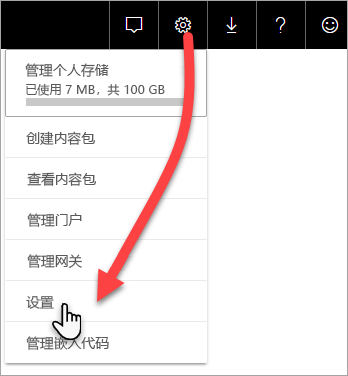
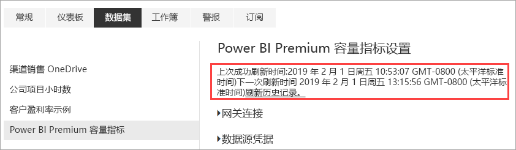
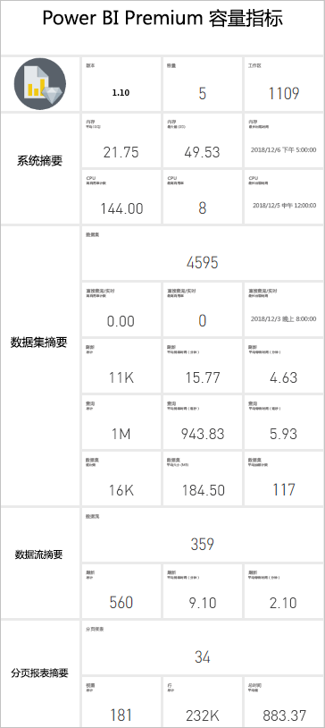
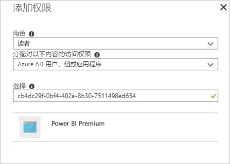

# 使用应用监视高级容量

监视容量对于正确决定如何充分利用高级容量资源至关重要。 可以在管理门户中或使用 Power BI Premium Capacity Metrics 应用监视容量  。 本文介绍如何使用 Premium Capacity Metrics 应用。 应用提供有关容量性能的深度信息。 有关过去七天内平均使用量指标的更高级别概述，可以使用管理门户。 要了解在门户中监视的详细信息，请参阅[在管理门户中监视高级容量](service-admin-premium-monitor-portal.md)。

应用定期更新新特性和新功能。 请确保你运行的最新版本。 如果已安装上个版本，则最好将其从应用中删除，然后按 Ctrl+F5 进行刷新。 

## 安装应用

可以直接转到 [Premium Capacity Metrics 应用](https://app.powerbi.com/groups/me/getapps/services/capacitymetrics)，也可以像在 Power BI 中操作其他应用一样安装它。

1. 在 Power BI 中，单击“应用”  。   
    

2. 在右侧，单击“获取应用”  。
3. 在“应用”  类别中，搜索“Power BI Premium Capacity Metrics 应用”  。
4. 订阅以安装应用。

请耐心等待。 安装和刷新指标需要几分钟。 如果应用显示空白指标，请按 F5 刷新浏览器。

## 获取应用刷新历史记录

要查看上一次刷新 Premium Capacity Metrics 应用的时间，请单击“设置” > “数据集” > “Power BI Premium Capacity Metrics” > “刷新历史记录”     。 

随即显示上次刷新时间，或单击“刷新历史记录”查看计划或按需刷新  。

## 使用应用监视容量

现在你已经安装了应用，可以查看有关组织容量的指标。 应用程序提供仪表板使用指标摘要和详细的指标报告。

### 仪表板

若要查看汇总了你作为管理员的主要容量指标的仪表板，请在“仪表板”  中单击“Power BI Premium 容量指标”  。 随即将出现仪表板。

仪表板包含以下指标：

#### 前

| 指标 | 说明 |
| --- | --- |
| 版本 | 应用版本。 | 
| 容量 | 你作为管理员所管理的容量数。 | 
| 工作区 | 报告了指标的容量中的工作区数。|
|||

#### 系统摘要

| 指标 | 说明 |
| --- | --- |
| CPU 最高利用率容量 | 过去七天内 CPU 超过阈值的 80% 的最大次数的容量。 |
| CPU 最高利用率计数 | 过去七天内 CPU 命名容量超过阈值的 80% 的次数。 | 
| 内存最大利用率容量 | 过去七天内达到最大内存限制的最大次数的容量（按三分钟的时间段划分）。  |
| 内存最大利用率计数| 过去七天内命名容量达到最大内存限制的次数（按三分钟的时间段划分）。 |
|||

#### 数据集摘要

| 指标 | 说明 |
| --- | --- |
| 数据集 | 容量中所有工作区的数据集总量。|
| 数据集的平均大小 (MB) | 容量中所有工作区的数据集的平均大小。|  
| 数据集平均加载计数 | 加载到内存中的数据集的平均计数。 |  
| 数据集 - 平均活动数据集 (%)| 过去七天内的平均活动数据集。 如果用户在过去三分钟内与视觉对象进行了交互，则将数据集定义为活动状态。 |
| CPU - 数据集最大消耗量 (%)| 过去七天内数据集工作负载的最大 CPU 消耗量。 |
| CPU - 数据集平均消耗量 (%)| 过去七天内数据集工作负载的平均 CPU 消耗量。 |
| 内存 - 数据集平均消耗量 (GB) | 过去七天内数据集工作负载的平均内存消耗。 |
| 内存 - 数据集最大消耗量 (GB) | 过去七天内数据集工作负载的最大内存消耗。|
| 数据集逐出数 | 由于内存压力导致数据集逐出的总次数。 |
| DirectQuery/实时高利用率计数| 过去七天内 DirectQuery/实时连接数超过阈值的 80% 的次数（按三分钟的时间段划分）。 |
| DirectQuery/实时最大利用率计数| 过去七天内 DirectQuery/实时连接数超过阈值的 80% 的最多次数（按一小时的时间段划分）。 |
| DirectQuery/实时最高利用率 | 过去七天内 DirectQuery/实时连接数超过阈值的 80% 的最大次数（按三分钟的时间段划分）。|
| DirectQuery/实时最长发生时间 | DirectQuery/实时连接在一小时内超过 80% 达最多次数时的 UTC 时间。 |
| 刷新总计 | 过去七天内的刷新总次数。 |
| 刷新可靠性 (%) | 过去七天内成功刷新的次数除以刷新总次数。 |
| 刷新平均持续时间（分钟） | 完成刷新的平均时间量。 |
| 刷新平均等待时间（分钟）| 启动刷新之前的平均时间量。 |
| 查询总计 |  过去七天内查询运行的总次数。 |
| 查询总等待计数 | 在执行前必须等待的查询总数。 |
| 查询平均持续时间（毫秒） | 完成查询所花的平均时间。 |
| 查询平均等待时间（毫秒） | 在执行之前，在系统资源上等待的查询的平均时间。 |
|||

#### 数据流摘要

| 指标 | 说明 |
| --- | --- |
| 数据流 |  容量中所有工作区的数据流总量。|
| 刷新总计 | 过去七天内的刷新总次数。|  
| 刷新平均持续时间（分钟） | 完成刷新所花的时间。 |
| 刷新平均等待时间（分钟） | 计划时间与刷新实际开始时间之间的延迟。|
| CPU - 数据流最大消耗量 (%) | 过去七天内数据流工作负载的最大 CPU 消耗量。 |
| CPU - 数据流平均消耗量 (%) | 过去七天内数据流工作负载的平均 CPU 消耗量。 |
| 内存 - 数据流最大消耗量 (GB) | 过去七天内数据流工作负载的最大内存消耗。 |
| 内存 - 数据流平均消耗量 (GB) | 过去七天内数据流工作负载的平均内存消耗。 |
|||

#### 分页报表摘要

| 指标 | 说明 |
| --- | --- |
| 分页报表 |  容量中所有工作区的分页报表总量。 |
| 查看总计 | 用户查看所有报表的总次数。 | 
| 行数总计 | 所有报表中数据的总行数。|
| 总时间 | 所有报表的所有阶段（数据检索、处理和呈现）花费的总时间（以毫秒为单位）。 |
| CPU - 分页报表最大消耗量 (%) | 过去七天内分页报表工作负载的最大 CPU 消耗量。 |
| CPU - 分页报表平均消耗量 (%) | 过去七天内分页报表工作负载的平均 CPU 消耗量。 |
| 内存 - 分页报表最大消耗量 (GB) | 过去七天内分页报表工作负载的最大内存消耗。 |
| 内存 - 分页报表平均消耗量 (GB) | 过去七天内分页报表工作负载的平均内存消耗。 |
|||

#### AI 摘要

| 指标 | 说明 |
| --- | --- |
| 刷新总计 | 过去七天内的刷新总次数。 |
| 刷新可靠性 (%) | 过去七天内成功刷新的次数除以刷新总次数。 |
| CPU 最大值 （%）| 在过去七天中最大 CPU 消耗量的 AI 工作负荷。 |
| 最大内存 (GB) | 最大的内存使用情况的 AI 工作负荷中过去七天。|
| 刷新最大等待时间 （毫秒） | 最大开始刷新之前的时间量。 |
| 刷新平均等待时间 （毫秒）| 启动刷新之前的平均时间量。 |
| 刷新最长持续时间 （毫秒） | 最大到完成刷新的时间量。 |
| 刷新平均持续时间 （毫秒）| 完成刷新的平均时间量。 |
| | |

### 报表

报表提供了更详细的指标。 若要查看你作为管理员的容量的报表，在“报表”  中单击“Power BI Premium 容量指标”  。 或者，从仪表板单击指标单元格，转到基础报表。 

在报表底部，有五个选项卡  ：

[**数据集**](#datasets) - 提供容量内有关 Power BI 数据集运行状况的详细指标。
[**分页报表**](#paginated-reports) - 提供容量中分页报表运行状况的详细指标。
[**数据流**](#dataflows) - 提供容量中数据流的刷新详细指标。
[**AI** ](#ai) -用容量中的 AI 函数的运行状况提供详细的指标。
[**资源消耗量**](#resource-consumption) - 提供详细资源指标，包括内存和 CPU 高使用率。
[ID 和 Info](#ids-and-info) - 容量、工作区和工作负荷的名称、ID 和所有者  。

每个选项卡打开一个页面，可以按容量和日期范围筛选指标。 如果未选择任何筛选器，则报表会默认显示报告了指标的所有容量过去一周的指标。 

### 数据集

“数据集”页上包含各种区域  ，其中包括“刷新”  、“查询持续时间”  、“查询等待”  和“数据集”  。 可使用页面顶部的按钮导航到各不同区域。

#### “刷新”区域

| 报表区域 | 指标 |
| --- | --- |
| 刷新 |  总计：每个数据集的总刷新次数。   可靠性：完成每个数据集的刷新的百分比。   平均等待时间：计划时间与刷新数据集开始时间之间的平均延迟（以分钟为单位）。   最长等待时间：数据集的最长等待时间（以分钟为单位）。   平均持续时间：刷新数据集的平均持续时间（以分钟为单位）。   最长持续时间：数据集运行时间最长的刷新持续时间（以分钟为单位）。 |
| 平均持续时间（分钟）排名前 5 的数据集 |  具有最长平均刷新持续时间的五个数据集（以分钟为单位）。 |
| 平均等待时间（分钟）排名前 5 的数据集 |  具有最长平均刷新等待时间的五个数据集（以分钟为单位）。 |
| 每小时刷新计数和内存消耗(GB) |  成功、失败和内存占用率，按一小时的时间段划分，以 UTC 时间报告。 |
| 每小时平均刷新等待时间(分钟) |  平均刷新等待时间，按一小时的时间段划分，以 UTC 时间报告。 多个高刷新等待时间峰值表示容量过度运行。 |
|  |  |

#### “查询持续时间”区域

| 报表区域 | 指标 |
| --- | --- |
| 查询持续时间 |  此区域中的数据在过去七天内按数据集、工作区和每小时时间段进行划分。   总计:为数据集运行的查询的总数。   平均值:数据集的平均查询持续时间（以毫秒为单位）   最大值：数据集中运行时间最长的查询的持续时间（以毫秒为单位）。|
| 查询持续时间分布 |  查询持续时间直方图由查询持续时间（以毫秒为单位）的 Bucket 数划分为以下类别：<= 30 毫秒、30-100 毫秒、100-300 毫秒、300 毫秒-1 秒、1 秒-3 秒、3 秒-10 秒、10 秒-30 秒和 > 30 秒时间间隔。 较长的查询持续时间和较长的等待时间表示容量过于繁忙。 这也可能意味着，单个数据集会导致问题，需要进一步调查。 |
| 按平均持续时间排名前 5 的数据集 |  具有最长平均查询持续时间的五个数据集（以毫秒为单位）。 |
| 每小时查询持续时间分布 |  按一小时的时间段划分的查询计数和平均持续时间（以毫秒为单位）与内存占用率（以 GB 为单位），以 UTC 时间报告。 |
| DirectQuery/实时连接（> 80% 利用率） |  DirectQuery 或实时连接超过 CPU 利用率的 80% 的次数，按一小时的时间段划分，以 UTC 时间报告。 |
|  |  |

#### 查询等待区域

| 报表区域 | 指标 |
| --- | --- |
| 查询等待次数 |  此区域中的数据在过去七天内按数据集、工作区和每小时时间段进行划分。   总计:为数据集运行的查询的总数。   等待计数：开始执行之前在系统资源上等待的数据集中的查询数。   平均值:数据集的平均查询等待时间（以毫秒为单位）。   最大值：数据集中等待时间最长的查询的持续时间（以毫秒为单位）。|
| 按平均等待时间排名前 5 的数据集 |  要开始执行查询的具有最长平均等待时间的五个数据集（以毫秒为单位）。 |
| 等待时间分布 |  查询持续时间直方图由查询持续时间（以毫秒为单位）的 Bucket 数划分为以下类别：<= 50 毫秒、50-100 毫秒、100-200 毫秒、200-400 毫秒、400 毫秒-1 秒、1 秒-5 秒和 > 5 秒时间间隔。 |
| 每小时查询等待时间分布 |  按一小时的时间段划分的查询等待计数和平均等待时间（以毫秒为单位）与内存占用率（以 GB 为单位），以 UTC 时间报告。 |
|  |  |

#### “数据集”区域

| **报表区域** | **指标** |
| --- | --- |
| 数据集大小  |  最大大小：显示的时间段内数据集的最大大小（以 MB 为单位）。 |
| 数据集逐出计数 |  总计:为每个容量执行数据集逐出的总数  。 容量面临内存压力时，节点从内存中逐出一个或多个数据集。 首先逐出处于非活动状态（当前没有执行查询/刷新操作）的数据集。 然后按“最近最少使用的项”(LRU) 这一顺序依次逐出。|
| 每小时加载的数据集计数 |  加载到内存中的数据集数与内存占用率（以 GB 为单位），按一小时的时间段划分，以 UTC 时间报告。 |
| 每小时数据集逐出和内存占用率 |  数据集逐出与内存占用率（以 GB 为单位），按一小时的时间段划分，以 UTC 时间报告。 |
| 占用内存百分比 |  内存中活动的总数据集（总内存的百分比）。 活动数据集和可以逐出的所有定义数据集之间的增量。 过去七天按小时显示。 |
|  |  |

### 分页报表

| **报表区域** | **指标** |
| --- | --- |
| 总体使用情况 |  视图总数：用户查看报表的次数。   行计数：报表中数据的行数。   检索（平均值）：检索报表数据所需的平均时间（以毫秒为单位）。 较长的持续时间可能表示查询速度缓慢或其他数据源问题。    处理（平均值）：处理报表数据所需的平均时间（以毫秒为单位）。  呈现（平均值）：在浏览器中呈现报表所需的平均时间（以毫秒为单位）。   总时间：报表所有阶段所需的时间（以毫秒为单位）。 |
| 平均数据检索时间排名前 5 的报表 |  具有最长平均数据检索时间的五个报表（以毫秒为单位）。 |
| 平均报表处理时间排名前 5 的报表 |  具有最长平均报表处理时间的五个报表（以毫秒为单位）。 |
| 每小时结果 |  成功、失败和内存占用率，按一小时的时间段划分，以 UTC 时间报告。 |
| 每小时持续时间 |  数据检索与处理和呈现时间，按一小时的时间段划分，以 UTC 时间报告。 |
|  |  |

### 数据流

| **报表区域** | **指标** |
| --- | --- |
| 刷新 |  总计:每个数据流的总刷新次数。   可靠性：刷新的每个数据流完成的百分比。   平均等待时间：计划时间与刷新数据流开始时间之间的平均延迟（以分钟为单位）。   最长等待时间：数据流的最长等待时间（以分钟为单位）。   平均持续时间：刷新数据流的平均持续时间（以分钟为单位）。   最长持续时间：数据流运行时间最长的刷新持续时间（以分钟为单位）。 |
| 按平均刷新持续时间排列的前 5 个数据流 |  具有最长平均刷新持续时间的五个数据流（以分钟为单位）。 |
| 按平均等待时间排列的前 5 个数据流 |  具有最长平均刷新等待时间的五个数据流（以分钟为单位）。 |
| 每小时平均刷新等待时间 |  平均刷新等待时间，按一小时的时间段划分，以 UTC 时间报告。 多个高刷新等待时间峰值表示容量过度运行。 |
| 每小时刷新计数和内存占用率 |  成功、失败和内存占用率，按一小时的时间段划分，以 UTC 时间报告。 |
|  |  |

### AI

| **报表区域** | **指标** |
| --- | --- |
| 总体使用情况 | 总数：工作区或数据流中的 AI 函数数目。   可靠性：刷新已完成的百分比。  平均值等待时间：计划的时间与开始刷新，以毫秒为单位之间的平均延迟。  最长等待时间：最长等待时间，以毫秒为单位。  平均值持续时间：刷新，以毫秒为单位的平均持续时间。  最长持续时间：最长运行刷新，以毫秒为单位的持续时间。  平均输入大小：平均输入的大小，以字节为单位，AI 函数执行的数据流刷新。  Avg 输出大小：平均输出的大小，以字节为单位，AI 函数执行的数据流刷新。 |
| 按平均持续时间的前 5 个 AI 函数 | 这五个函数具有最长平均刷新持续时间，以毫秒为单位。 |
| 按平均输入大小的前 5 个 AI 函数 | 这五个函数的最大的平均数据输入大小 （字节）。 |
| 每小时刷新计数和内存占用率 | 成功、失败和内存占用率，按一小时的时间段划分，以 UTC 时间报告。 |
| 每小时的平均持续时间 | 以 UTC 时间报告，刷新，拆分为一小时存储桶的平均持续时间。 |
| | |

### 资源消耗

| **报表区域** | **指标** |
| --- | --- |
| CPU 使用率 |  工作负荷消耗（CPU 总容量的百分比）。 过去七天按小时显示。 |
| 内存占用率 |  工作负荷的内存使用量 (GB)（实线）与工作负荷限制（虚线）重叠。 过去七天按小时显示。 |
|  |  |

### ID 和信息

“ID 和信息”  选项卡包含以下区域：“容量”  、“工作区”  、“数据集”  、“分页报表”  和“数据流”  。

#### 容量区域

| 报表区域 | 指标 |
| --- | --- |
| SKU 和工作负载信息 | 容量的 SKU 和工作负载设置。 |
| 管理员 | 容量的管理员名称。 |
|||

#### 工作区区域

| 报表区域 | 指标 |
| --- | --- |
| 工作区 | 所有工作区的名称和 ID。 |
|||

#### “数据集”区域

| 报表区域 | 指标 |
| --- | --- |
| 数据集 | 所有数据集的工作区名称和 ID。 |
|||

#### 分页报表区域

| 报表区域 | 指标 |
| --- | --- |
| 分页报表 | 所有分页报表的名称、工作区名称和 ID。 |
|||

#### 数据流区域

| 报表区域 | 指标 |
| --- | --- |
| 数据流 | 所有数据流的数据流名称、工作区名称和 ID。 |
|||

## 监视 Power BI Embedded 容量

可以使用 Power BI Premium Capacity Metrics 应用监视 Power BI Embedded 中的 A SKU 容量  。 只要你是容量管理员，这些容量就会显示在报告中。 但是，除非你在 A SKU 上向 Power BI 授予某些权限，否则报告刷新将失败：

1. 在 Azure 门户中打开你的容量。

1. 单击“访问控制 (IAM)”  ，然后将“Power BI Premium”  应用添加到读取者角色。 如果您不能按名称查找该应用程序，您还可以添加它由客户端标识符： `cb4dc29f-0bf4-402a-8b30-7511498ed654`。

    

> [!NOTE]
> 可以在应用或 Azure门户中监视 Power BI Embedded 容量使用情况，但无法在 Power BI 管理门户中监视。

## 后续步骤

> [!div class="nextstepaction"]
> [优化 Power BI Premium 容量](service-premium-capacity-optimize.md)
