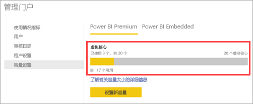

# 如何购买 Power BI Premium

本文介绍如何为你的组织购买 Power BI 高级容量。 本文介绍了两种方案：

- 对于典型的生产方案，使用 P SKU。 P SKU 需要按月或按年承诺，按月计费。

- 对于测试方案，以及无权购买 P SKU（Microsoft 365 全局管理员角色或计费管理员角色）的情况，使用 A SKU。 A SKU 无需时间承诺，按小时计费。 在 [Azure 门户](https://portal.azure.com)中购买 A SKU。

有关 Power BI Premium 的详细信息，请参阅[什么是 Power BI Premium？](service-premium-what-is.md)。 有关当前定价和计划的信息，请参阅 [Power BI 定价页](https://powerbi.microsoft.com/pricing/)和 [Power BI Premium 计算器](https://powerbi.microsoft.com/calculator/)。 即使你的组织使用 Power BI Premium，内容创建者还是需要一个 [Power BI Pro 许可证](service-admin-purchasing-power-bi-pro.md)。 请确保为组织购买至少一个 Power BI Pro 许可证。 使用 A SKU，使用内容的所有用户还需要 Pro 许可证  。

> [!NOTE]
> 如果 Premium 订阅到期，将有 30 天的容量完全访问权限。 之后，内容将恢复为共享容量。 共享容量不支持大于 1 GB 的模型。

## 购买适用于典型生产方案的 P SKU

可以创建新的租户并配置 Power BI Premium P1 SKU，也可以为现有组织购买 Power BI Premium 容量。 在这两种情况下，都可在以后根据需要添加容量。

### 使用 Power BI Premium P1 新建租户

如果尚无租户并且想要创建一个，可以同时购买 Power BI Premium。 单击以下链接后，可了解创建新租户的过程，并可购买 Power BI Premium：[Power BI Premium P1 套餐](https://signup.microsoft.com/Signup?OfferId=b3ec5615-cc11-48de-967d-8d79f7cb0af1)。 创建租户时，将自动为该租户分配 Microsoft 365 全局管理员角色。

购买容量后，请了解如何[管理容量](service-admin-premium-manage.md#manage-capacity)以及向容量[分配工作区](service-admin-premium-manage.md#assign-a-workspace-to-a-capacity)。

### 为现有组织购买 Power BI Premium 容量

若有现有组织（租户），则必须具有 Microsoft 365 全局管理员角色或帐务管理员角色才能购买订阅和许可证。 有关详细信息，请参阅[关于 Microsoft 365 管理员角色](https://support.office.com/article/About-Office-365-admin-roles-da585eea-f576-4f55-a1e0-87090b6aaa9d)。

要购买高级容量，请按照下列步骤操作。

1. 在 Power BI 服务中，选择“Microsoft 365 应用选取器”，然后选择“管理员”  。

    

    或者，可以浏览到 Microsoft 365 管理中心。

1. 选择“计费”   > “购买服务”  。

1. 在“其他计划”  下查找 Power BI Premium 优惠。 这将会列出 P1 至 P3、EM3 和 P1（按月）。

1. 将鼠标悬停在省略号 (...) 上，然后选择“立即购买”   。

    

1. 按照以下步骤完成购买。

完成购买后，“购买服务”页将显示该项目已购买且处于活动状态  。

购买容量后，请了解如何[管理容量](service-admin-premium-manage.md#manage-capacity)以及向容量[分配工作区](service-admin-premium-manage.md#assign-a-workspace-to-a-capacity)。

### 购买额外容量

现在已有容量，可随着需求的增长添加更多容量。 可以在组织中使用任何高级容量 SKU（P1 到 P3）组合。 不同的 SKU 提供不同的资源容量。

1. 在 Microsoft 365 管理中心内，选择“账单” > “购买服务”   。

1. 在“其他计划”  下找到需额外购买的 Power BI Premium 项目。

1. 将鼠标悬停在“更多选项”(…)上，然后选择“更改许可证数量”   。

    

1. 更改此项目需要具有的实例数。 完成后，选择“提交”  。

   > [!IMPORTANT]
   > 选择“提交”将对记录的信用卡收取费用  。

然后“购买服务”  页面上将显示你拥有的实例数。 在 Power BI 管理门户的“容量设置”  下，可用的 V 核心反映购买的新容量。

### 取消订阅

可以在 Microsoft 365 管理中心内取消订阅。 若要取消 Premium 订阅，请执行以下操作。

1. 浏览到 Microsoft 365 管理中心。

1. 依次选择“计费”   > “订阅”  。

1. 从列表中选择 Power BI Premium 订阅。

1. 选择“更多操作” > “取消订阅”   。

1. “取消订阅”  页会指明是否需要支付[提前终止费](https://support.office.com/article/early-termination-fees-6487d4de-401a-466f-8bc3-c0beb5cc40d3)。 此页还会指明何时删除订阅数据。

1. 请仔细阅读这些信息。若要继续，请选择“取消订阅”  。

#### 取消订阅或许可证到期时

取消高级订阅或容量许可证到期时，可以在取消或许可证到期之日起的 30 天内继续访问高级容量。 30 天后，将无法再访问高级容量或其中的工作区。

## 购买适用于测试和其他方案的 A SKU

A SKU 通过 Azure Power BI Embedded 服务提供。 可按以下方式使用 A SKU：

- 在第三方应用程序中启用 Power BI 嵌入。 有关详细信息，请参阅 [Power BI Embedded](developer/azure-pbie-what-is-power-bi-embedded.md)。

- 在购买 P SKU 之前，请测试 Premium 功能。

- 与使用 P SKU 的生产环境一起，创建开发和测试环境。

- 即使不是 Microsoft 365 全局管理员角色或计费管理员角色，也可以购买 Power BI Premium。

> [!NOTE]
> 如果购买 A4 或更高的 SKU，可以利用除无限共享内容之外的所有 Premium 功能。 使用 A SKU，使用内容的所有用户都需要 Pro 许可证  。

请按照下列步骤在 Azure 门户中购买 A SKU：

1. 使用至少具有 Power BI 容量管理员权限的帐户登录 [Azure 门户](https://portal.azure.com)。

1. 搜索 Power BI Embedded，然后在搜索结果中选择该服务  。

    

1. 选择“创建 Power BI Embedded”  。

    

1. 在“Power BI Embedded”创建屏幕上，指定下列信息  ：

    - 要在其中创建 Power BI Embedded 服务的订阅  。

    - 要在其中创建包含服务的资源组的物理位置  。 为了获得更好的性能，此位置应靠近 Power BI 的 Azure Active Directory 租户的位置。

    - 要使用的现有资源组，或者创建一个新资源组，如示例中所示  。

    - Power BI 容量管理员  。 容量管理员必须是 Azure AD 租户中的成员用户或服务主体。

    

1. 如果要使用 Power BI Premium 的所有功能（无限共享除外），则至少需要一个 A4 SKU。 选择“更改大小”  。

    

1. 选择与 P1、P2 和 P3 对应的 A4、A5 或 A6 容量大小。

    

1. 选择“查看 + 创建”，检查选择的选项，然后选择“创建”   。

    

1. 完成部署可能需要几分钟时间。 准备就绪后，请选择“转到资源”  。

    

1. 在管理屏幕上，查看用于管理服务的选项，包括用于在不使用服务时暂停该服务的选项。

    

购买容量后，请了解如何[管理容量](service-admin-premium-manage.md#manage-capacity)以及向容量[分配工作区](service-admin-premium-manage.md#assign-a-workspace-to-a-capacity)。

## 后续步骤

[配置和管理 Power BI Premium 容量](service-admin-premium-manage.md)\
[Power BI 定价页](https://powerbi.microsoft.com/pricing/)\
[Power BI Pemium 计算器](https://powerbi.microsoft.com/calculator/)\
[Power BI Premium 常见问题解答](service-premium-faq.md)\
[规划 Power BI Enterprise 部署白皮书](https://aka.ms/pbienterprisedeploy)

更多问题？ [尝试咨询 Power BI 社区](https://community.powerbi.com/)
