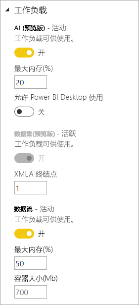

# 在高级容量中配置工作负载

本文介绍如何为 Power BI 高级容量启用和配置工作负载。 默认情况下，容量仅支持与正在运行的 Power BI 查询关联的工作负载。 查询工作负载针对由高级容量 SKU 确定的资源进行优化并受到这些资源的限制。 高级容量还支持可以使用容量资源的其他工作负载。

## 配置工作负载

可以为 AI、[数据流](service-dataflows-overview.md#dataflow-capabilities-on-power-bi-premium)和[分页报表](paginated-reports-save-to-power-bi-service.md)启用和配置其他工作负载。 这些工作负载的默认内存值基于 SKU 可用的容量节点。 最大内存设置不是累计计算的。 为 AI 和数据流动态分配并为分页报表静态分配相当于最大指定值的内存。 

### 在 Power BI 管理门户中配置工作负载

1. 在“容量设置” > “高级容量”中，选择一个容量。

1. 在“更多选项”下，展开“工作负载”。

1. 启用一个或多个工作负载，并设置“最大内存”的值。   

    
    

1. 单击“**应用**”。

> [!NOTE]
> 如果启用的是分页报表工作负载，分页报表可便于在呈现报表时运行你自己的代码（如根据内容动态更改文本颜色）。 Power BI Premium 在容量所含的空间中运行分页报表。 使用你为此空间指定的最大内存，无论工作负载是否处于活动状态都是如此。 如果使用相同容量的 Power BI 报表或数据流，请务必为分页报表设置足够低的内存，使其不会对其他工作负载产生负面影响。 在极少数情况下，分页报表工作负载可能变得不可用。 在这种情况下，工作负载在管理门户中显示错误状态，并且用户会看到报表呈现的超时。 要缓解此问题，请禁用工作负载，然后再次启用它。

### REST API

可以使用[容量](https://docs.microsoft.com/rest/api/power-bi/capacities) REST API 启用工作负载并将其分配给容量。

## 后续步骤

[Power BI Premium 容量资源管理和优化](service-premium-understand-how-it-works.md)   
[Power BI 中通过数据流自助进行数据准备](service-dataflows-overview.md)   
[Power BI Premium 中的分页报表是什么？](paginated-reports-report-builder-power-bi.md)   

更多问题？ [在 Power BI 社区提问](http://community.powerbi.com/)