# 购买和分配 Power BI Pro 许可证

Power BI Pro 是单个许可证，允许访问 Power BI 服务中的所有内容和功能，包括共享内容以及与其他 Pro 用户协作的功能。 只有 Pro 用户可以将内容发布到应用工作区，使用这些内容，共享仪表板并订阅仪表板及报表。 有关详细信息，请参阅[按许可证类型划分的 Power BI 功能](service-features-license-type.md)。

本文首先介绍了如何在 Office 365 中购买 Power BI Pro 许可证。 接着说明了可用于将这些许可证分配给各个用户的两个选项：Office 365 和 Azure（选择一个选项）。

## 先决条件

你必须是 Office 365 中[全局管理员或帐务管理员](https://support.office.com/article/about-office-365-admin-roles-da585eea-f576-4f55-a1e0-87090b6aaa9d)角色的成员。

要在 Azure 中分配许可证，则必须是 Power BI 用于 Active Directory 查找的 Azure 订阅的所有者。

## 在 Office 365 中购买许可

按照以下步骤购买 Power BI Pro 许可证：

1. 打开 [MIcrosoft 365 管理中心](https://portal.office.com/adminportal/home#/homepage)。

2. 在左侧导航窗格中，选择**计帐**  >  **订阅**。

    

3. 在“订阅”页面的右上角，选择“添加订阅”。

    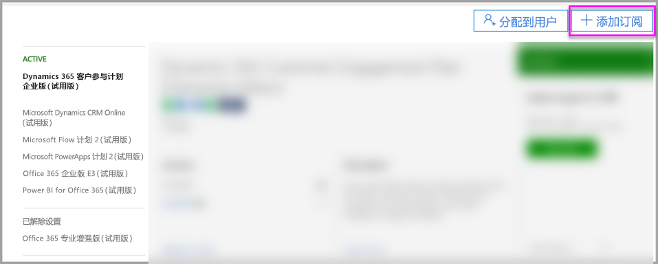

4. 找到所需的订阅套餐：

    在“企业套件”下选择“Office 365 企业版 E5”。

    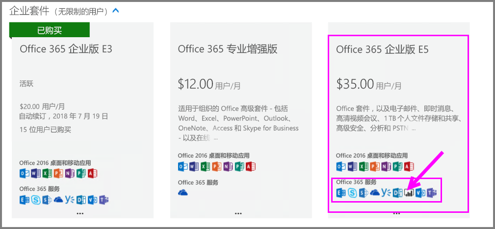

    在“其他计划”下选择“Power BI Pro”。

    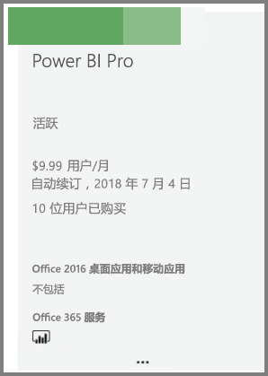

5. 将鼠标悬停在所需订阅的省略号 (**. . .**) 处，选择“立即购买”。

    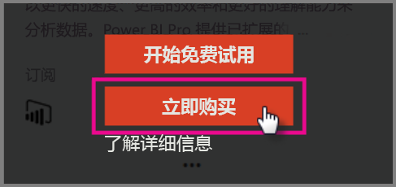

6. 根据你的计费偏好，选择“按月付费”或“按年付费”。

7. 在“需要多少个用户?”下，输入所需的许可证数量，然后选择“立即签出”完成此交易。

8. 验证获取的订阅是否已在“订阅”页面上列出。

   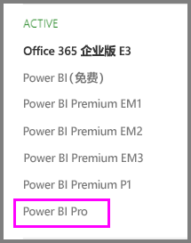

9. 若要在最初购买后添加更多许可证，请从“订阅”页面中选择“Power BI Pro”，然后选择“添加/删除许可证”。

## 在 Office 365 中分配许可

按照以下步骤将 Power BI Pro 许可证分配给个人用户帐户：

1. 打开 [MIcrosoft 365 管理中心](https://portal.office.com/adminportal/home#/homepage)。

2. 在左侧导航窗格中，展开“用户”，然后选择“活动用户”。

    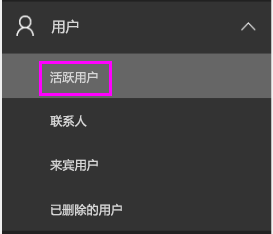

3. 选择一个用户，然后在“产品许可证”下选择“编辑”。

    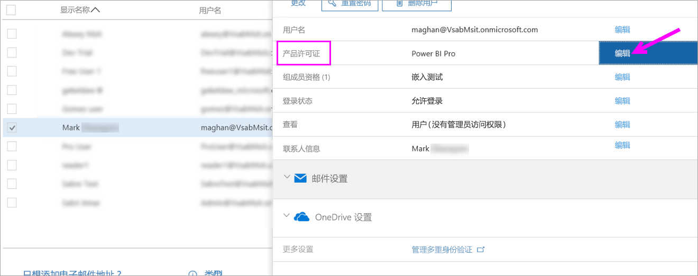

4. 在“Power BI Pro”下将设置切换为“开”，然后选择“保存”。

    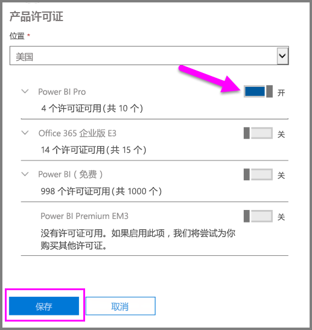

5. 根据所选帐户的**状态**，验证 Power BI Pro 许可证是否成功分配。

    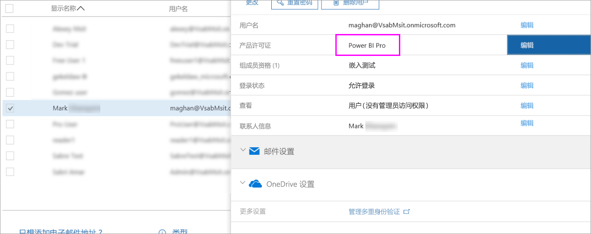

## 在 Azure 中分配许可证

按照以下步骤将 Power BI Pro 许可证分配给个人用户帐户：

1. 打开 [Azure 门户](https://ms.portal.azure.com/#@microsoft.onmicrosoft.com/dashboard/private/39bc3cf7-31a4-43f6-954c-f2d69ca2f0)。

2. 在左侧导航栏中，选择“Azure Active Directory”。

    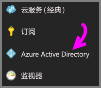

3. 在“Azure Active Directory”下，选择“许可证”。

    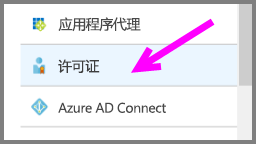

4. 在“许可证”下，选择“所有产品”，然后选择“Power BI Pro”以显示许可用户列表。

    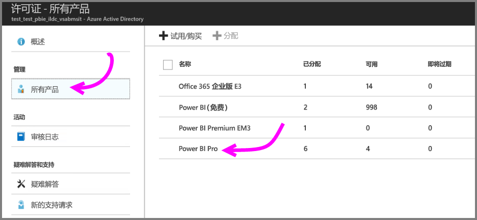

5. 选择“分配”将 Power BI Pro 许可证添加到其他用户帐户。

    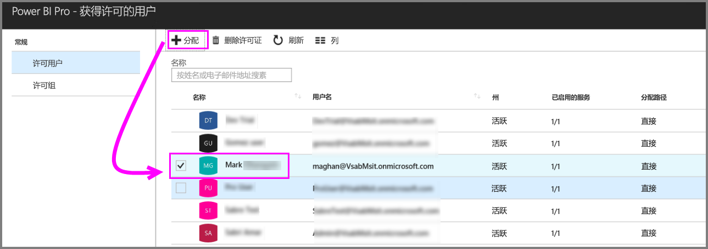

## 后续步骤

现已分配许可证，可以了解有关 Power BI Pro 的详细信息。

[组织中的 Power BI 许可](service-admin-licensing-organization.md)

[查找已登录的 Power BI 用户](service-admin-access-usage.md)

更多问题？ [尝试咨询 Power BI 社区](https://community.powerbi.com/)
