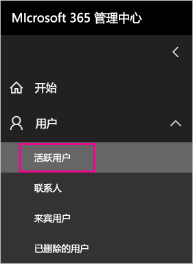

# <a name="understanding-the-power-bi-service-administrator-role"></a>了解 Power BI 服务管理员角色

了解如何在组织中使用 Power BI 服务管理员角色。 拥有此角色的用户可以完全控制 Power BI 租户及其管理功能（授权除外）。

<iframe width="640" height="360" src="https://www.youtube.com/embed/PQRbdJgEm3k?showinfo=0" frameborder="0" allowfullscreen></iframe>

可以向需要 Power BI 管理门户访问权限的用户分配 Power BI 服务管理员角色，而不向这些用户授予完整 Office 365 管理员权限。

Office 365 用户管理管理员可以在 Office 365 管理中心内或使用 PowerShell 脚本向用户分配 Power BI 服务管理员角色。 分配有此角色后，用户便可以访问 [Power BI 管理门户](service-admin-portal.md)。 在管理门户中，用户可以访问整个租户范围内的使用情况指标，并能控制整个租户范围内的 Power BI 功能使用。

## <a name="limitations-and-considerations"></a>限制和注意事项

拥有 Power BI 服务管理员角色的用户无法执行以下操作：

* 在 Office 365 管理中心内修改用户和许可证；

* 访问审核日志的功能。 有关详细信息，请参阅[在组织内使用审核](service-admin-auditing.md)。

## <a name="assign-users-to-the-admin-role-in-office-365"></a>在 Office 365 中向用户分配管理员角色

若要在 Office 365 管理中心内向用户分配 Power BI 管理员角色，请按以下步骤操作。

1. 在 Office 365 管理中心内，依次选择“用户” > “有效用户”。

    

1. 选择要向其分配角色的用户。

1. 在“角色”下，选择“编辑”。

    

1. 依次选中“自定义管理员” > “Power BI 服务管理员”。

    

1. 依次选择“保存”和“关闭”。

此时，系统应该会列出相应用户拥有的“**Power BI 服务管理员**”角色。


## <a name="assign-users-to-the-admin-role-with-powershell"></a>使用 PowerShell 向用户分配管理员角色

也可以使用 PowerShell 向用户分配角色。 用户托管在 Azure Active Directory (Azure AD) 中。 如果还没有 Azure AD PowerShell 模块，请[下载并安装最新版本](https://www.powershellgallery.com/packages/AzureAD/)。

1. 首先，获取 Power BI 服务管理员角色的 ObjectId。 可以运行 [Get-AzureADDirectoryRole](/powershell/module/azuread/get-azureaddirectoryrole) 获取 **ObjectId**

    ```
    PS C:\Windows\system32> Get-AzureADDirectoryRole

    ObjectId                             DisplayName                        Description
    --------                             -----------                        -----------
    00f79122-c45d-436d-8d4a-2c0c6ca246bf Power BI Service Administrator     Full access in the Power BI Service.
    250d1222-4bc0-4b4b-8466-5d5765d14af9 Helpdesk Administrator             Helpdesk Administrator has access to perform..
    3ddec257-efdc-423d-9d24-b7cf29e0c86b Directory Synchronization Accounts Directory Synchronization Accounts
    50daa576-896c-4bf3-a84e-1d9d1875c7a7 Company Administrator              Company Administrator role has full access t..
    6a452384-6eb9-4793-8782-f4e7313b4dfd Device Administrators              Device Administrators
    9900b7db-35d9-4e56-a8e3-c5026cac3a11 AdHoc License Administrator        Allows access manage AdHoc license.
    a3631cce-16ce-47a3-bbe1-79b9774a0570 Directory Readers                  Allows access to various read only tasks in ..
    f727e2f3-0829-41a7-8c5c-5af83c37f57b Email Verified User Creator        Allows creation of new email verified users.
    ```

    在此示例中，角色的 ObjectId 为 00f79122-c45d-436d-8d4a-2c0c6ca246bf。

1. 接下来，获取用户的 ObjectId。 为此，可以运行 [Get-AzureADUser](/powershell/module/azuread/get-azureaduser)。

    ```
    PS C:\Windows\system32> Get-AzureADUser -SearchString 'tim@contoso.com'

    ObjectId                             DisplayName UserPrincipalName      UserType
    --------                             ----------- -----------------      --------
    6a2bfca2-98ba-413a-be61-6e4bbb8b8a4c Tim         tim@contoso.com        Member
    ```

1. 若要向成员添加角色，请运行 [Add-AzureADDirectoryRoleMember](/powershell/module/azuread/add-azureaddirectoryrolemember)。

    | 参数 | 说明 |
    | --- | --- |
    | ObjectId |角色 ObjectId。 |
    | RefObjectId |成员 ObjectId。 |

    ```powershell
    Add-AzureADDirectoryRoleMember -ObjectId 00f79122-c45d-436d-8d4a-2c0c6ca246bf -RefObjectId 6a2bfca2-98ba-413a-be61-6e4bbb8b8a4c
    ```

## <a name="next-steps"></a>后续步骤

[在组织中管理 Power BI](service-admin-administering-power-bi-in-your-organization.md)  
[Power BI 管理门户](service-admin-portal.md)  

更多问题？ [尝试咨询 Power BI 社区](http://community.powerbi.com/)