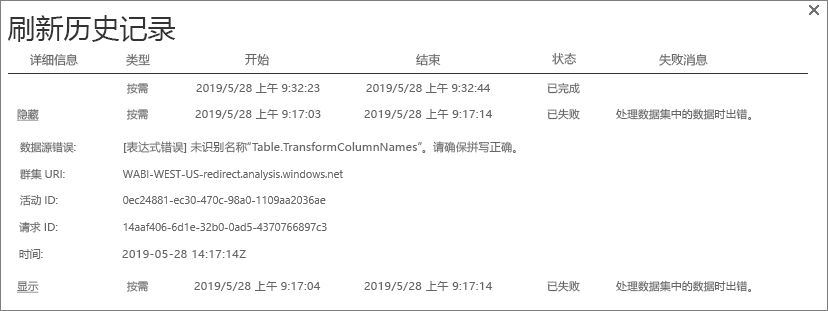
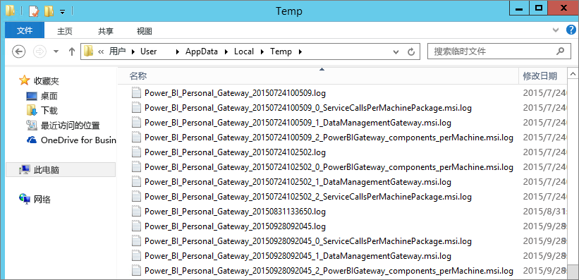

# Power BI 网关故障排除 - 个人
以下各节介绍了使用 Power BI Gateway-Personal 时可能遇到的一些常见问题。

> [!NOTE]
> 最新版本的个人用网关为**本地数据网关（个人版）**。 请更新安装以使用该版本。
> 
> 

## 更新到最新版本
网关版本过期时，可能会出现许多问题。  它是良好的常规做法，以确保您的最新版本。 如果有一个月或更长时间未更新网关，请考虑安装最新版本的网关。 然后，了解是否可以重现此问题。

## 安装
**个人网关为 64 位**-如果您的计算机是 32 位，则不能安装个人网关。 你的操作系统必须是 64 位版本。 安装 64 位版本的 Windows 或 64 位计算机上安装个人网关。

**个人网关无法作为服务安装，即使是在计算机的本地管理员**-如果用户是本地管理员组中的计算机，但组策略不允许该用户名以身份登录，安装可能会失败服务。 目前，请确保组策略，以服务身份登录的用户。 我们正在努力修复此问题。 [了解详细信息](https://technet.microsoft.com/library/cc739424.aspx)

**操作已超时**-此消息很常见，如果要在其安装个人网关的计算机 （物理计算机或 VM） 具有单核处理器。 关闭所有应用程序和任何不必要的进程并再次尝试安装。

**不能与个人网关的同一计算机上安装数据管理网关或 Analysis Services Connector** -如果已有 Analysis Services 连接器或安装数据管理网关，必须先卸载该连接器或网关。 然后，尝试安装个人网关。

> [!NOTE]
> 如果在安装过程中遇到问题，安装程序日志可以提供信息来帮助你解决此问题。 有关详细信息，请参阅[安装程序日志](#SetupLogs)。
> 
> 

 **代理配置**可能会看到与配置个人网关，如果你的环境需要使用代理的问题。 若要了解有关如何配置代理服务器信息的详细信息，请参阅[配置 Power BI 网关的代理服务器设置](service-gateway-proxy.md)

## 计划刷新
**错误:云中存储的凭据丢失。**

中的设置可能会收到此错误\<数据集\>如果您已计划的刷新，然后卸载并重新安装个人网关。 当你卸载个人网关后时，从 Power BI 服务中删除已配置为进行刷新的数据集的数据源凭据。

解决方案：在 Power BI 中，转到数据集的刷新设置。 在管理数据源，出现一个错误，任何数据源选择**编辑凭据**并再次登录到数据源。

**错误:为数据集提供的凭据无效。请通过刷新更新凭据或在“数据源设置”对话框中更新凭据以继续执行操作。**

**解决方案**：如果收到凭据消息，这可能意味着：

* 请确保用户名和密码登录到数据源处于最新状态。 在 Power BI 中，转到数据集的刷新设置。 在管理数据源，选择**编辑凭据**来更新数据源的凭据。
* 云源中的单个查询的本地源之间的混合应用程序刷新中的个人网关，如果其中一个源正在使用 OAuth 进行身份验证失败。 此问题的一个示例是 CRM Online 和本地 SQL Server 之间的混合应用程序。 混合应用程序失败，因为 CRM Online 需要 OAuth。
  
  此错误的已知的问题，并且它正查看。 若要解决此问题，具有单独的云源和本地源的查询。 然后，使用合并或追加查询以将它们合并。

**错误:数据源不受支持。**

解决方案：如果在“计划刷新”设置中出现数据源不受支持的消息，这可能意味着： 

* Power BI 中刷新当前不支持数据源。 
* Excel 工作簿不包含数据模型中，只有工作表数据。 如果已上载的 Excel 工作簿包含数据模型，Power BI 当前只支持刷新。 当在 Excel 中使用 Power Query 导入数据时，请务必选择此选项将数据加载到数据模型。 此选项可确保数据导入到数据模型。 

**错误: [无法合并数据]&lt;查询部分&gt;/&lt;...&gt; / &lt;...&gt;正在访问的数据源具有无法一起使用的隐私级别。请重新生成此数据组合。**

**解决方案**：此错误是由于隐私级别限制和正在使用的数据源的类型。

**错误:数据源错误:无法将值“\[Table\]”转换为 Table 类型。**

**解决方案**：此错误是由于隐私级别限制和正在使用的数据源的类型。

**错误:对于此行没有足够的空间。**

如果您有大于 4 MB 的单个行的大小，将发生此错误。 查找来自您的数据源的行，并尝试筛选出或减少该行的大小。

## 数据源
**缺失的数据提供程序**– 个人网关是仅限 64 位版本。 它需要在已安装个人网关的同一台计算机上安装 64 位版本数据提供程序。 例如，如果数据集中的数据源是 Microsoft Access，必须在已安装个人网关的同一台计算机上安装 64 位 ACE 提供程序。  

>[!NOTE]
>如果有 32 位版本 Excel，不能在同一台计算机上安装 64 位 ACE 提供程序。

**Access 数据库不支持 Windows 身份验证** - 对于 Access 数据库，Power BI 当前仅支持匿名访问。 我们正致力于启用 Windows 身份验证访问数据库。

**为数据源输入凭据时出现登录错误**-如果为数据源输入 Windows 凭据时遇到此类错误，你可能仍会在较旧版本的个人网关。 [安装最新版本的 Power BI 网关 - 个人](https://powerbi.microsoft.com/gateway/)。

  

**错误:为使用 ACE OLEDB 的数据源选择 Windows 身份验证时出现登录错误** - 如果为使用 ACE OLEDB 提供程序的数据源输入数据源凭据时出现以下错误：

对于使用 ACE OLEDB 提供程序的数据源中，power BI 当前不支持 Windows 身份验证。

解决方案：若要解决此错误，可以选择**匿名身份验证**。 对于旧式 ACE OLEDB 提供程序，匿名凭据均为 Windows 凭据。

## 磁贴刷新
如果你收到与仪表板磁贴刷新错误，请参阅以下文章。

[磁贴错误故障排除](refresh-troubleshooting-tile-errors.md)

## 用于故障排除的工具
### 刷新历史记录
**刷新历史记录**可帮助你查看发生了什么错误，并提供有用的数据，如果您需要创建支持请求。 可以查看计划和按需刷新。 下面是如何转到**刷新历史记录**。

1. 在 Power BI 导航窗格中的**数据集**中，选择一个数据集&gt;打开菜单&gt;**计划刷新**。
   
1. 在**设置...**，选择**刷新历史记录**。  
   
   
   

### 事件日志
几个事件日志可以提供信息。 前两个**数据管理网关**并**PowerBIGateway**，如果你是管理员在计算机上的不会显示。  如果你不是管理员，并使用个人网关，会看到日志条目**应用程序**日志。

**数据管理网关**和 **PowerBIGateway** 日志显示在**应用程序和服务日志**下方。

### Fiddler 跟踪
[Fiddler](http://www.telerik.com/fiddler) 是 Telerik 提供的一款用于监视 HTTP 流量的免费工具。 您可以看到与 Power BI 服务在客户端计算机的通信。 此通信可能会显示错误和其他相关的信息。

### 安装程序日志
如果**个人网关**，无法安装，您将看到一个链接以显示安装程序日志。 安装程序日志可以显示与失败有关的详细信息。 这些日志是 Windows 安装的日志，也称作 MSI 日志。 它们可能非常复杂且难以阅读。 通常情况下，所生成的错误是在底部，但确定错误的原因并不容易。 它可能是不同日志中错误的结果，或是较高的日志中错误的结果。

或者，可以转到您**Temp 文件夹**（%temp%)和查找文件的开头**电源\_BI\_**。

> [!NOTE]
> 转到 %temp% 可能将你带到 temp 的子文件夹。**电源\_BI\_** 文件是临时目录的根目录中。  可能需要转到上一个或上两个级别。
> 
> 

## 后续步骤
[为 Power BI Gateway 配置代理设置](service-gateway-proxy.md)  
[数据刷新](refresh-data.md)  
[Power BI Gateway - Personal](service-gateway-personal-mode.md)  
[磁贴错误故障排除](refresh-troubleshooting-tile-errors.md)  
[本地数据网关故障排除](service-gateway-onprem-tshoot.md)  
更多问题？ [尝试参与 Power BI 社区](http://community.powerbi.com/)

