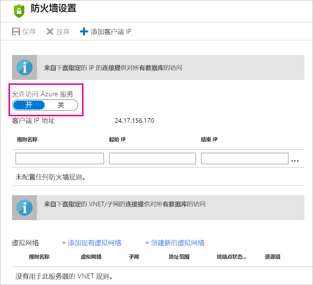

# Power BI 的 Azure SQL 数据库计划刷新中的故障排除
有关设置计划刷新的详细步骤，请务必参阅[刷新 Power BI 中的数据](refresh-data.md)。

设置 Azure SQL 数据库的计划刷新时，若在编辑凭据时收到含错误代码 400 的错误消息，尝试按照以下步骤设置正确的防火墙规则：

1. 登录到 Azure 管理门户
2. 转到正在为其配置刷新的 Azure SQL 服务器
3. 在允许的服务区域中开启“Windows Azure 服务”

  

更多问题？ [尝试参与 Power BI 社区](http://community.powerbi.com/)

