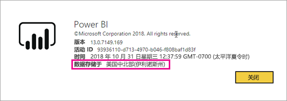

# 我的 Power BI 租户位于何处？

<iframe width="560" height="315" src="https://www.youtube.com/embed/0fOxaHJPvdM?showinfo=0" frameborder="0" allowfullscreen></iframe>

了解 Power BI 租户所处的位置及选择该位置的操作过程。 学习位置很重要，因为它可能会影响交互您与该服务。

## 如何确定 Power BI 租户所处的位置

若要查找租户所在的区域，请按以下步骤操作。

1. 在 Power BI 服务的顶部菜单栏中，依次选择帮助图标 (?  )和“关于 Power BI”  。

1. 查看“**您的数据存储于**”旁的值。 它是你的租户所在的区域。 值也是你数据的存储位置的区域，除非您在为你的工作区中不同的区域使用专用的容量。

    

## 选择该数据区域的操作过程

数据区域是以你在创建租户时所选的国家/地区为依据。 所选内容适用于注册适用于这两个 Office 365 和 Power BI 中，因为共享此信息。 如果这是新租户，请在注册时从列表中选择相应的国家/地区。

Power BI 会选择靠近你的选择，它确定为你的租户中存储数据的数据区域。

> [!IMPORTANT]
> 在创建租户后，不能更改选择。

更多问题？ [尝试参与 Power BI 社区](http://community.powerbi.com/)

