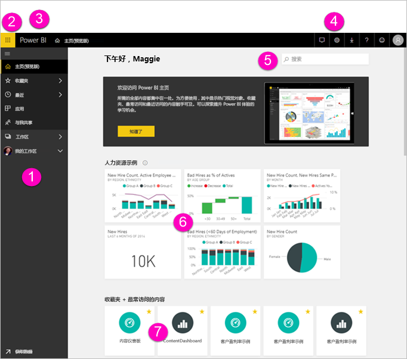
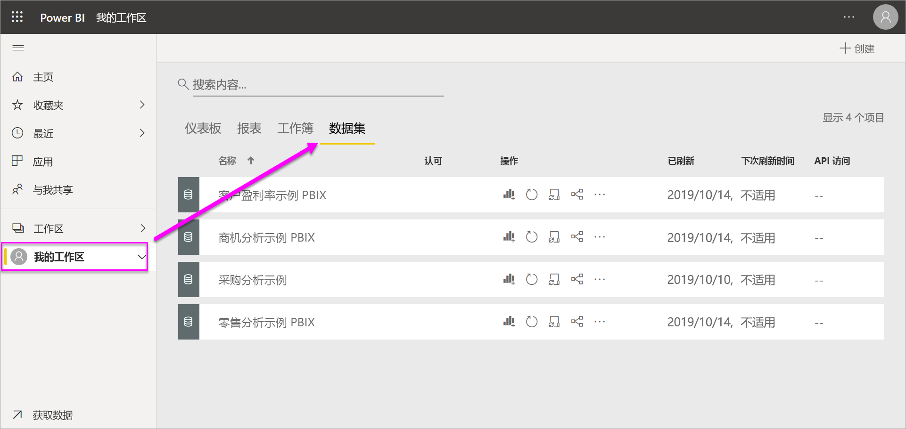
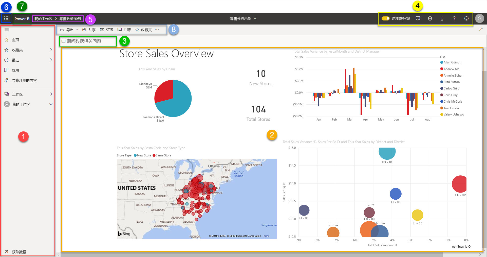

# Power BI 服务中设计器的基本概念

本文旨在让你了解 Power BI 服务：有哪些不同的元素，它们如何协作，以及如何使用它们。 如果你已[注册 Power BI 服务](service-self-service-signup-for-power-bi.md)并已[添加了一些数据](connect-data/service-get-data.md)，那么就可以更充分地利用它。 通常情况下，设计人员的典型工作流程是首先在 Power BI Desktop 中创建报表。 然后将报表发布到 Power BI 服务，可在其中继续修改报表。 还可以在 Power BI 服务中根据报表创建仪表板。 

根据本文内容，如果你还没有自己的报表，请尝试安装一个 [Power BI 示例](create-reports/sample-datasets.md)。

在浏览器中打开 Power BI 服务时，首先进入主屏幕。 可能会看到以下元素：

1. 导航窗格
2. Office 365 应用程序启动程序
3. Power BI 主页按钮
4. 图标按钮，包括设置、帮助和反馈
5. 搜索框
6. 收藏的和经常使用的仪表板、报表和工作区
7. 最近使用的仪表板、报表和工作区
8. 你的工作区

你以及报表和仪表板的最终用户在浏览器的 Power BI 服务中具有相同的启动体验。

我们稍后将深入了解这些功能，不过首先让我们了解一些 Power BI 概念。 或者你可能想先观看此视频。  在视频中，Will 回顾了基本概念并提供了 Power BI 服务的教程。

<iframe width="560" height="315" src="https://www.youtube.com/embed/B2vd4MQrz4M" frameborder="0" allowfullscreen></iframe>

## Power BI 概念
Power BI 的 5 个主要构建基块是仪表板、报表、工作簿、数据集和数据流      。 它们都整理到工作区中，且在容量上进行创建   。  在深入了解这五个构建基块之前，有必要了解容量和工作区。让我们开始吧。

## 容量
容量是一个 Power BI 核心概念，表示用于托管和交付 Power BI 内容的一组资源（存储、处理器和内存）。 容量可以是共享容量，也可以是专用容量   。 共享容量与其他 Microsoft 客户共享，专用容量则完全委派给单个客户。 需要[订阅](admin/service-premium-what-is.md)才能使用专用容量，其详尽说明请参阅[管理高级容量](admin/service-premium-capacity-manage.md) 一文。

默认情况下，工作区是在共享容量上创建的。 在共享容量中，工作负载可在与其他客户共享的计算资源上运行。 由于容量必须共享资源，因此会施加限制以确保“公平竞争”，例如最大模型大小 (1 GB) 和每日刷新频率上限（每天 8 次）。

## 工作区
工作区是基于容量创建的。 本质上，它们是 Power BI 中仪表板、报表、工作簿、数据集和数据流的容器。

有两种类型的工作区：“我的工作区”和“工作区”   。

- “我的工作区”  是个人工作区，供任何 Power BI 客户在其中处理自己的内容。 只有你自己才有权访问你的工作区。 可以从“我的工作区”共享仪表板和报表。 如果想要在仪表板和报表上展开合作或创建应用，那么你会想要在工作区中工作。      
-  工作区用于与同事展开协作和共享内容  。 可将同事添加到工作区，然后在仪表板、报表、工作簿和数据集方面进行协作。 有一个例外，就是所有工作区成员都需要 Power BI Pro 许可证。 详细了解[新建工作区](collaborate-share/service-create-the-new-workspaces.md)。 

    也可在工作区中为组织创建、发布和管理应用  。 可将工作区看作构成 Power BI 应用的内容的暂存区域和容器。 什么是应用？  它是仪表板和报表的集合，生成它的目的是为组织中的 Power BI 使用者提供关键指标。 应用是交互式的，但使用者无法编辑它们。 应用使用者（有权访问应用的同事）不一定需要 Pro 许可证。  

若要详细了解共享的常规信息，请首先了解[共享正在处理的仪表板的方式](collaborate-share/service-how-to-collaborate-distribute-dashboards-reports.md)。

现在来了解 5 个 Power BI 构建基块。

## 数据流
数据流可帮助组织统一来自不同源的数据  。 它们是可选的，通常在复杂或大型项目中使用。 它们表示数据已准备好且已暂存供数据集使用。 但是，它们不可直接用作报告的源。 它们使用 Microsoft 数据连接器的广泛集合，让你能够从本地和基于云的数据源引入数据。

数据流仅在工作区中创建和管理（但不是在“我的工作区”中），而且作为实体存储在 Azure Data Lake Storage Gen2 的 Common Data Model (CDM) 中  。 通常，它们计划定期刷新以存储最新数据。 它们非常适合准备数据供数据集使用（可能是重复使用）。 有关详细信息，请参阅 [Power BI 中的自助服务数据准备](transform-model/service-dataflows-overview.md)一文。

仪表板和报表必须具有数据（当然，可具有空的仪表板和空报表，但它们有数据后才有用），因此让我们来了解一下数据集  。

## 数据集
数据集  是导入  或连接  到的数据集合。 通过 Power BI，你可以连接到并导入各种类型的数据集并将它们组合在一起。 数据集还可从数据流中获取数据。

数据集与工作区相关联，单个数据集可以包含在多个工作区中。  打开某个工作区时，关联的数据集会列在“数据集”选项卡下面。  每个列出的数据集表示一个数据源，例如，OneDrive 上的 Excel 工作簿，或本地 SSAS 表格数据集或 Salesforce 数据集。 支持许多不同的数据源，并且我们一直在添加新的数据源。 请参阅[可与 Power BI 一起使用的数据集类型](connect-data/service-get-data.md)列表。

在下面的示例中，我已选择“销售和市场营销”工作区，并单击了“数据集”选项卡  。

**一个**数据集...

* 可在一个或多个工作区中反复使用。
* 可以用于许多不同的报表。
* 可以在许多不同的仪表板上显示该数据集的可视化对象。

  

要[连接或导入数据集](connect-data/service-get-data.md)，请选择导航窗格底部的“获取数据”  。 按照说明连接到或导入特定的源，并将该数据集添加到活动的工作区。 新的数据集项目带有黄色星号标记。 在 Power BI 中所做的工作不会更改基础数据集。

如果具有管理员、成员或参与者角色，那么一个工作区成员添加的数据集也可供其他工作区成员使用    。

可以刷新、重命名、浏览和删除数据集。 使用数据集从头开始创建报表，或运行[快速见解](create-reports/service-insights.md)创建报表。  若要查看哪些报表和仪表板已使用数据集，请选择“查看相关项”。  若要浏览数据集，请选择数据集。 你实际要做的是在报表编辑器中打开数据集，可在此处创建可视化效果，从而开始真正地深入了解数据。

接下来，我们进入下一主题 - 报表。

### 深入了解
* [Power BI 服务中的数据集](connect-data/service-datasets-understand.md)
* [Power BI 服务中的数据集模式](connect-data/service-dataset-modes-understand.md)
* [什么是 Power BI Premium？](admin/service-premium-what-is.md)
* [获取 Power BI 的数据](connect-data/service-get-data.md)
* [Power BI 的示例数据集](create-reports/sample-datasets.md)

## 报表
Power BI 报表是一页或多页可视化对象（如折线图、地图和树状图）。 可视化效果也称为视觉对象  。 报表中所有可视化对象来自单个数据集。 可在 Power BI 中从头开始创建报表，使用同事与你共享的仪表板导入报表，或者 Power BI 可以在从 Excel、Power BI Desktop、数据库和 SaaS 应用程序连接到数据集时创建报表。  例如，当你连接到包含 Power View 表的 Excel 工作簿时，Power BI 将基于这些表创建报表。 当连接到 SaaS 应用程序时，Power BI 将导入预先构建的报表。

有两种模式可用来查看报表并与之交互：阅读视图和编辑视图   。 打开报表时，报表将在“阅读视图”中打开。 如果你具有编辑权限，会看到左上角的“编辑报表”，可以在“编辑视图”中查看报表  。  如果报表位于工作区中，则具有管理员、成员或参与者角色的所有人都可以对其进行编辑    。 他们有权访问该报表的“编辑视图”的所有浏览、设计、生成和共享功能。 共享报表的用户可以使用“读取视图”了解报表并与之进行交互。   

打开某个工作区时，关联的报表会列在“报表”选项卡下面。  每个列出的报表代表只基于其中一个基础数据集的一页或多页可视化对象。 若要打开报表，选择报表即可。

打开某个应用时，会同时显示一个仪表板。  若要访问基础报表，请选择从报表固定的仪表板磁贴（稍后将详细介绍）。 请记住，并非所有磁贴都是从报表固定的，因此，可能需要单击几个磁贴才能找到所需的报表。

默认情况下，报表将在“阅读”视图中打开。  只需选择“编辑报表”  即可将其在编辑视图下打开（如果有所需的权限）。

在下面的示例中，我选择了“销售和市场营销”工作区，并单击了“报表”选项卡  。

**一个**报表...

* 包含在单个工作区中。
* 可与该工作区内的多个仪表板相关联。 该报表中固定的磁贴可以显示在多个仪表板上。
* 可以使用来自一个数据集的数据进行创建。 Power BI Desktop 可以将多个数据集组合到一个报表的单个数据集中，并且该报表可以导入到 Power BI。

  

### 深入了解
- [通过导入数据集在 Power BI 服务中创建报表](create-reports/service-report-create-new.md)
- [针对 Power BI 移动应用优化报表](create-reports/desktop-create-phone-report.md)

## 仪表板
可以在 Power BI 服务中  创建仪表板  ，或者由同事在 Power BI 服务中  创建仪表板并与你共享。 它是一个画布，其中包含零个或多个磁贴和小组件。 从报表或[问答](power-bi-q-and-a.md)固定的每个磁贴显示通过数据集创建并固定到仪表板的单个[可视化对象](power-bi-report-visualizations.md)。 可将整个报表页作为单个磁贴固定到仪表板。 有多种方法可将磁贴添加到仪表板中，本概述主题中将会介绍很多。 若要了解详细信息，请参阅 [Power BI 中的仪表板磁贴](create-reports/service-dashboard-tiles.md)。

人们为什么创建仪表板？  下面只是其中一些原因：

* 为了快速查看做出决策所需的所有信息。
* 为了监视有关业务的最重要信息。
* 为了确保同一页面上的所有同事均查看和使用相同的信息。
* 为了监视业务、产品、业务部门或市场营销活动的运行状况。
* 为了创建更大仪表板的个性化视图（所有指标都很重要）。

打开某个工作区时，关联的仪表板会列在“仪表板”选项卡下面。  若要打开仪表板，选择仪表板即可。 打开某个应用时，会同时显示一个仪表板。  每个仪表板代表一个自定义视图，其中包含基础数据集的某个子集。  如果你拥有该仪表板，则还对基础数据集和报表拥有编辑访问权限。  如果仪表板是共享的，则可与仪表板和任何基础报表交互，但无法保存任何更改。

你或同事可以多种不同方式[共享仪表板](collaborate-share/service-share-dashboards.md)。 共享仪表板时需要 Power BI Pro，查看共享的仪表板时可能也需要它。

**一个**仪表板...

* 与单个工作区相关联
* 可以显示来自许多不同数据集的可视化对象
* 可以显示来自许多不同报表的可视化对象
* 可以显示从其他工具（例如 Excel）固定的可视化对象

  

### 深入了解
* [创建空白仪表板并获取一些数据](create-reports/service-dashboard-create.md)。
* [复制仪表板](create-reports/service-dashboard-copy.md)
* [创建仪表板电话视图](create-reports/service-create-dashboard-mobile-phone-view.md)

## 工作簿
工作簿是特殊类型的数据集。 如果你已阅读前面的**数据集**部分，则大致已了解有关工作簿的所有信息。 但你可能想要知道，为何 Power BI 有时将 Excel 工作簿分类为**数据集**，而有时又将它分类为**工作簿**。

对 Excel 文件使用“获取数据”时，可以选择“导入”或“连接”文件。    选择“连接”时，工作簿会显示在 Power BI 中，就像在 Excel Online 中那样。 但与 Excel Online 不同的是，有一些超棒的功能，可有助于将工作表中的元素固定到仪表板。

无法在 Power BI 中编辑工作簿。 但是，如果你需要进行一些更改，你可以单击“编辑”，然后选择在 Excel Online 中编辑你的工作簿或在计算机上的 Excel 中打开工作簿。 你所作的任何更改都会保存到 OneDrive 上的工作簿中。

### 深入了解
* [从 Excel 工作簿文件中获取数据](connect-data/service-excel-workbook-files.md)
* [从 Excel 发布到 Power BI](connect-data/service-publish-from-excel.md)

## 我的工作区中的仪表板
前面已介绍工作区和构建基块。 将它们整合在一起，并回顾构成 Power BI 服务中仪表板体验的各个部分。

### 1.**导航窗格**
使用导航窗格可在工作区与 Power BI 构建基块（仪表板、报表、工作簿和数据集）之间定位和切换。  

  

* 选择“获取数据”  ，以[将数据集、报表和仪表板添加到 Power BI](connect-data/service-get-data.md)。
* 使用此图标展开和折叠导航窗格 。
* 选择“收藏夹”可以打开或管理收藏的内容。 
* 选择“最近”可以查看和打开最近访问的内容。 
* 选择“应用”可以查看、打开或删除某个应用。 
* 同事是否与你共享了内容？ 选择“与我共享”可以搜索和排序内容，以找到所需的内容。 
* 选择“工作区”可以显示和打开工作区  。

单击这些元素：

* 某个图标或标题可在内容视图中打开内容
* 向右箭头 (>) 可以打开“收藏夹”、“最近”和“工作区”的浮出菜单。
* V 形图标可以显示包含仪表板、报表、工作簿和数据集的“我的工作区”滚动列表  。

### 2.**画布**
由于我们打开了一个仪表板，画布区域中显示了可视化对象磁贴。 例如，如果我们已打开报表编辑器，则画布区域会显示报表页。

仪表板由[磁贴](create-reports/service-dashboard-tiles.md)组成。  磁贴在报表编辑视图、问答和其他仪表板中创建，并且可从 Excel、SSRS 等应用中进行固定。 称为[小组件](create-reports/service-dashboard-add-widget.md)的特殊类型的磁贴将直接添加到仪表板中。 显示在仪表板上的磁贴是由报表创建者/所有者专门放在仪表板上的。  向仪表板添加磁贴的操作称为固定  。

有关详细信息，请参阅[仪表板](#dashboards)（上述）。

### 3.问题解答问题框 
浏览你数据的一种方法是提出问题并让 Power BI 问题与解答为你提供答案（采用可视化对象的形式） 可以使用问答将内容添加到仪表板或报表。

问题与解答会在连接到仪表板的数据集中查找答案。  已连接的数据集是至少有一个磁贴固定到仪表板的数据集。

开始键入问题后，问题与解答将带你进入问题与解答页面。 键入时，问题与解答将帮助你询问相应的问题并通过改换、自动填充、建议以及更多功能来查找最佳答案。 当你拥有想要的可视化对象（答案）时，将其固定到仪表板中。 有关详细信息，请参阅 [Power BI 中的问题与解答](power-bi-q-and-a.md)。

### 4.**黑色标题栏中的图标**
右上角的图标是用于指定设置、获取通知、下载内容、获取帮助、启用或禁用“新外观”  以及向 Power BI 团队提供反馈的资源。  

### 5.**仪表板标题**（导航路径，或称为痕迹导航）
有时，我们难以判断哪个工作区和仪表板处于活动状态，为此，Power BI 将会创建导航路径。  在本示例中，可以看到工作区（“我的工作区”）和仪表板标题（“零售分析示例”）。  如果我们打开了某个报表，该报表的名称将追加到导航路径的末尾。  路径的每个部分是活动的超链接。  

请注意仪表板标题后面的“C”图标。 此仪表板包含“机密”类型的[数据分类标记](create-reports/service-data-classification.md)。 标记确定数据的敏感度和安全级别。 如果管理员已启用数据分类，则每个仪表板中都会设置一个默认标记。 仪表板所有者应根据其仪表板的适当安全性级别更改该标记。

### 6.Office 365 应用启动程序 
使用应用启动程序，只需单击一下鼠标，就能轻松访问所有 Office 365 应用。 在应用启动程序中，可以快速启动电子邮件、文档、日历和其他应用。

### 7.Power BI 主页 
选择“Power BI”可返回到 Power BI 主页  。

   

### 8.**灰色菜单栏中的已标记图标**
此屏幕区域包含用来与内容（在本例中为仪表板）交互的其他选项。  除了显示的带标签图标以外，选择“更多选项(…)”  将显示用于复制、打印和刷新仪表板和其他内容的选项。

   

## 后续步骤
- [什么是 Power BI？](fundamentals/power-bi-overview.md)  
- [Power BI 视频](videos.md)  
- [报表编辑器 - 教程](create-reports/service-the-report-editor-take-a-tour.md)
- 更多问题？ [尝试咨询 Power BI 社区](https://community.powerbi.com/)
