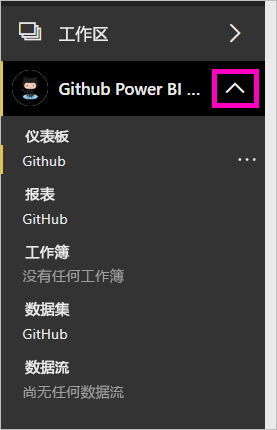
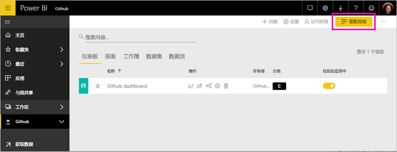

# 使用 Power BI 连接到 GitHub
本文逐步提取你的数据与 Power BI 模板应用与 GitHub 帐户。 模板应用会生成一个仪表板、 一组报告和一个数据集以便你可以浏览 GitHub 数据的工作区。 适用于 Power BI 的 GitHub 应用显示 GitHub 存储库时，也称为存储库，发布内容、 问题、 拉取请求和活动用户的相关数据的见解。

你已安装模板应用后，可以更改仪表板和报表。 然后您可以将其分发到同事的应用为你的组织中。

连接到[GitHub 模板应用](https://app.powerbi.com/getdata/services/github)或阅读更多有关[GitHub 集成](https://powerbi.microsoft.com/integrations/github)使用 Power BI。

此外可以尝试[GitHub 教程](service-tutorial-connect-to-github.md)。 它将安装 Power BI 文档的公共存储库有关的实际 GitHub 数据。

>[!NOTE]
>模板应用需要 GitHub 帐户有权访问存储库。 以下是有关要求的详细信息。

## 如何连接
[!INCLUDE [powerbi-service-apps-get-more-apps](./includes/powerbi-service-apps-get-more-apps.md)]
   
3. 选择**GitHub** \> **立即获取**。
4. 在中**安装此 Power BI 应用？** 选择**安装**。
4. 在中**应用程序**窗格中，选择**GitHub**磁贴。

    

6. 在中**开始使用新的应用程序**，选择**将数据连接**。

    

5. 输入该存储库的存储库名称和存储库所有者。 请参阅下面有关[查找这些参数](#FindingParams)的详细信息。
   
    

5. 输入 GitHub 凭据 （可能会跳过此步骤如果已使用你的浏览器登录）。 
6. 对于**身份验证方法**，选择**oAuth2**\>**登录**。 
7. 按照 GitHub 验证界面。 向适用于对 GitHub 数据的 Power BI 模板应用权限。
   
   
   
    Power BI 连接到 GitHub 和你的数据。  数据会每天刷新一次。 Power BI 导入数据后，您将看到新的 GitHub 工作区的内容。

## 修改和分发您的应用程序

已安装 GitHub 模板应用。 这意味着还创建了 GitHub 应用工作区。 在工作区中，更改报表和仪表板中，，然后将其作为分发*应用*给你的组织中的同事。 

1. 在左侧的导航栏中选择工作区名称旁边的箭头。 你看到工作区包含一个仪表板和报表。

    

8. 选择新[GitHub 仪表板](https://powerbi.microsoft.com/integrations/github)。    
    

3. 若要查看左侧的导航栏中的新的 GitHub 工作区中，所有内容，请选择**工作区** > **GitHub**。
 
   

    此视图是工作区内容列表。 在右上角中，您会看到**更新应用**。 如果你已准备好将应用到你的同事分发，这是将开始位置。 

    

2. 选择**报表**并**数据集**若要查看工作区中的其他元素。

    阅读有关[分发应用](service-create-distribute-apps.md)给你的同事。

## 应用程序中包含的内容
在 Power BI 中 GitHub 提供以下数据：     

| 表名 | 说明 |
| --- | --- |
| 参与 |参与者表提供总新增、 删除和提交每周汇总的参与者。 包括前 100 个参与者。 |
| 问题 |列出所选存储库的所有问题，其中包含计算，如：解决问题的总时间和平均时间、未解决问题总数和已解决问题总数。 存储库中没有任何问题时，此表为空。 |
| 拉取请求 |此表包含此存储库和拉取请求者的所有拉取请求。 它还包含有关打开、 关闭状态，和总的拉取请求数计算、 所用的时间到拉取请求和花费了多长时间平均拉取请求。 存储库中没有任何问题时，此表为空。 |
| 用户数 |此表提供 GitHub 用户或具有做出贡献、 提出问题，或解决所选存储库的拉取请求的参与者的列表。 |
| 里程碑 |它具有所选存储库的所有里程碑。 |
| DateTable |此表包含从今天和允许你按日期分析 GitHub 数据在过去几年的日期。 |
| ContributionPunchCard |此表可用作所选存储库的参与穿孔卡。 它会按一周中各天和一天中各小时来显示提交。 此表未连接到模型中的其他表。 |
| RepoDetails |此表提供所选存储库的详细信息。 |

## 系统要求
* 具有存储库访问权限的 GitHub。  
* 第一次登录期间授予给适用于 GitHub 的 Power BI 应用的权限。 有关撤消访问权限的详细信息，请参阅下文。  
* 具有足够可用的 API 调用以拉取和刷新数据。  

### 取消授权 Power BI
若要取消授权 Power BI 连接到 GitHub 存储库，可以撤销 GitHub 中的访问权限。 请参阅此[GitHub 帮助](https://help.github.com/articles/keeping-your-ssh-keys-and-application-access-tokens-safe/#reviewing-your-authorized-applications-oauth)主题有关的详细信息。

## 查找参数
你可以通过查看 GuiHub 本身的存储库来确定所有者和存储库：

第一部分“Azure”是所有者，第二部分“azure-sdk-for-pho”是存储库本身。  将在存储库的 URL 中看到这两个相同的项目：

    <https://github.com/Azure/azure-sdk-for-php> .

## 故障排除
如有必要，可以验证你的 GitHub 凭据。  

1. 在另一个浏览器窗口中，转到 GitHub 网站上并登录到 GitHub。 将在 GitHub 网站的右上角看到你已登录。    
2. 在 GitHub 中，导航到你计划要在 Power BI 中访问的存储库的 URL。 例如： https://github.com/dotnet/corefx。  
3. 返回到 Power BI，尝试连接到 GitHub。 在“配置 GitHub”对话框中，使用相同存储库的存储库名称和存储库所有者。  

## 后续步骤

* [教程：连接到包含 Power BI 的 GitHub 存储库](service-tutorial-connect-to-github.md)
* [在 Power BI 中创建新的工作区](service-create-the-new-workspaces.md)
* [在 Power BI 中安装并使用应用](consumer/end-user-apps.md)
* [连接到外部服务的 Power BI 应用](service-connect-to-services.md)
* 是否有任何问题? [尝试咨询 Power BI 社区](http://community.powerbi.com/)

