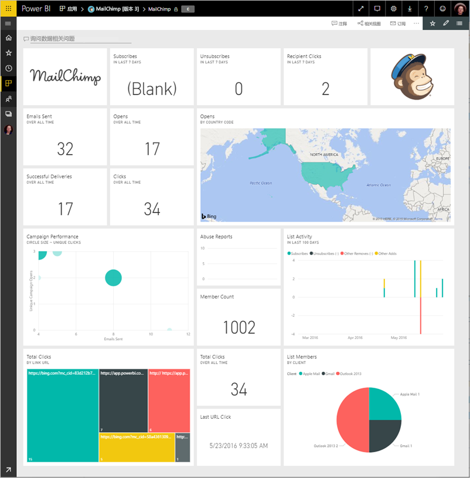
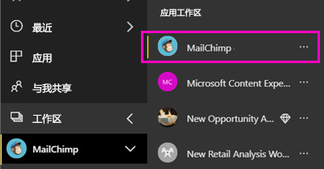
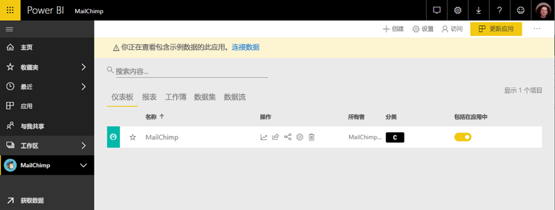

# 使用 Power BI 连接到 MailChimp
本文逐步拉出将数据从 Power BI 模板应用到 MailChimp 帐户。 模板应用会生成一个仪表板、 一组报告和一个数据集以便你可以浏览你的 MailChimp 数据的工作区。 拉入分析以创建 [MailChimp 仪表板](https://powerbi.microsoft.com/integrations/mailchimp)，并快速确定你的活动、报表和个人订阅者中的趋势。 确保正在监视的数据最新的每日、 刷新数据。

你已安装模板应用后，可以更改仪表板和报表。 然后您可以将其分发到同事的应用为你的组织中。

连接到[MailChimp 模板应用](https://app.powerbi.com/getdata/services/mailchimp)适用于 Power BI。

## 如何连接

[!INCLUDE [powerbi-service-apps-get-more-apps](./includes/powerbi-service-apps-get-more-apps.md)]

3. 选择**MailChimp** \> **立即获取**。
4. 在中**安装此 Power BI 应用？** 选择**安装**。
4. 在中**应用程序**窗格中，选择**MailChimp**磁贴。

    

6. 在中**开始使用新的应用程序**，选择**将数据连接**。

    

1. 对于身份验证方法，选择 **oAuth2** \> **登录**。
   
    出现提示时，输入 MailChimp 凭据，然后按照身份验证过程进行操作。
   
    首次连接时，Power BI 会提示你允许对你的帐户进行只读访问。 选择**允许**以开始导入过程。 可能需要几分钟，具体取决于你的帐户中的数据量。
   
    

5. Power BI 导入数据后，将打开 MailChimp 仪表板。
   
    

## 修改和分发您的应用程序

已安装 MailChimp 模板应用。 这意味着还创建了 MailChimp 应用工作区。 在工作区中，更改报表和仪表板中，，然后将其作为分发*应用*给你的组织中的同事。 

1. 若要查看左侧的导航栏中的新的 MailChimp 工作区中，所有内容，请选择**工作区** > **MailChimp**。 

    

    此视图是工作区内容列表。 在右上角中，您会看到**更新应用**。 如果你已准备好将应用到你的同事分发，这是将开始位置。

    

2. 选择**报表**并**数据集**若要查看工作区中的其他元素。 

    阅读有关[分发应用](service-create-distribute-apps.md)给你的同事。

## 后续步骤

* [在 Power BI 中创建新的工作区](service-create-the-new-workspaces.md)
* [在 Power BI 中安装并使用应用](consumer/end-user-apps.md)
* [适用于外部服务的 Power BI 应用](service-connect-to-services.md)
* 是否有任何问题? [尝试咨询 Power BI 社区](http://community.powerbi.com/)

