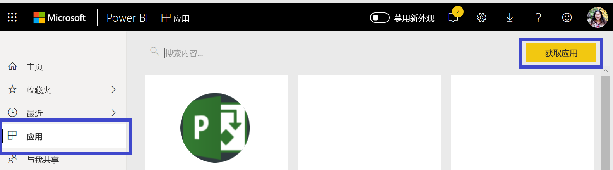

# 使用 Power BI 连接到 Project Web 应用
Microsoft Project Web 应用是一个灵活的在线解决方案，用于项目组合管理 (PPM) 和日常工作。 Project Web 应用使组织能够开始运转、排定项目资产组合投资优先级以及交付预期业务价值。 Power BI 的 Project Web 应用模板应用可使你从 Project Web 应用发掘见解，以帮助管理项目、项目组合和资源。

连接到 Power BI 的 [Project Web 应用模板应用](https://appsource.microsoft.com/product/power-bi/pbi_msprojectonline.pbi-microsoftprojectwebapp)。

## 如何连接

1. 选择导航窗格中的“应用”，然后选择右上角的“获取应用”   。

    

2. 在**服务**框中，选择**获取**。
   
   
3. 在 AppSource 中，选择“应用”选项卡，然后搜索/选择“Microsoft Project Web 应用”   。
   
4. 你会收到一条消息，询问“是否安装此 Power BI 应用？”。选择“安装”   。 

   
5. 在“应用”窗格中，选择“Microsoft Project Web 应用”磁贴   。 
   
   
6. 在“开始使用新应用”中，选择“连接数据”   。
   
   
7. 在 Project Web 应用 URL 文本框中，输入你要连接到的 Project Web Add (PWA) 的 URL  。  请注意，如果你使用自定义域，则它可能与示例不同。 在“PWA 站点语言”  文本框中，键入与 PWA 站点语言相对应的数字。 对于英语，键入单个数字“1”；法语键入“2”；德语键入“3”；葡萄牙语（巴西）键入“4”；葡萄牙语（葡萄牙）键入“5”以及西班牙语键入“6”。 
   
   
8. 对于身份验证方法，选择 **oAuth2** \> **登录**。 出现提示时，输入 Project Web 应用凭据，然后按照身份验证过程进行操作。

    > [!NOTE]
    > 你需要具有项目组合查看者、项目组合经理或管理员权限才能连接到 Project Web App。

9. 你将看到一个通知，指示你的数据正在加载。 根据帐户的大小，这可能需要一些时间。 Power BI 导入数据之后，将显示新工作区的内容。 可能需要刷新数据集以获取最新更新。 

    Power BI 导入数据之后，导航窗格中将显示含 13 个页面的报表和数据集。 

10. 报表准备就绪后，即可开始浏览你的 Project Web 应用数据！ 模板应用附带 13 个丰富而详细的报表，分别用于项目组合概述（6 个报表页面）、资源概述（5 个报表页面）和项目状态（2 个报表页面）。 

    
   
    
   
    

**下一步？**

* 虽然数据集将按计划每日刷新，但你可以更改刷新计划或根据需要使用“立即刷新”来尝试刷新  。

扩展模板应用 

下载 [GitHub PBIT 文件](https://github.com/OfficeDev/Project-Power-BI-Content-Packs)，进一步自定义和更新内容包。

## 后续步骤
[Power BI 入门](service-get-started.md)

[在 Power BI 中获取数据](service-get-data.md)

