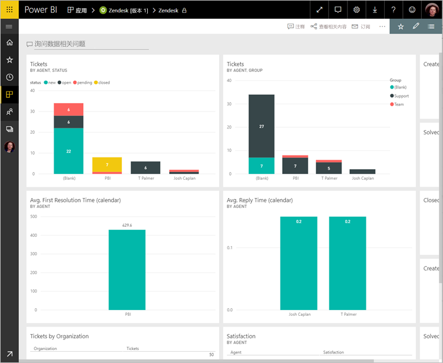

# 使用 Power BI 连接到 Zendesk

本文逐步提取从 Power BI 模板应用到 Zendesk 帐户的数据。 Zendesk 应用提供了 Power BI 仪表板和一组 Power BI 报表提供有关你的票量和代理性能的见解。 此数据每天自动刷新一次。 

你已安装模板应用后，你可以自定义仪表板和报表以突出显示你最关注的信息。 然后您可以将其分发到同事的应用为你的组织中。

连接到 [Zendesk 内容包](https://app.powerbi.com/getdata/services/zendesk)或进一步了解 Power BI 与 [Zendesk 集成](https://powerbi.microsoft.com/integrations/zendesk)。

你已安装模板应用后，可以更改仪表板和报表。 然后您可以将其分发到同事的应用为你的组织中。

>[!NOTE]
>需要 Zendesk 管理员帐户连接。 以下是有关[要求](#system-requirements)的详细信息。

## 如何连接

[!INCLUDE [powerbi-service-apps-get-more-apps](./includes/powerbi-service-apps-get-more-apps.md)]

3. 选择**Zendesk** \> **立即获取**。
4. 在中**安装此 Power BI 应用？** 选择**安装**。
4. 在中**应用程序**窗格中，选择**Zendesk**磁贴。

    

6. 在中**开始使用新的应用程序**，选择**将数据连接**。

    

4. 提供与你的帐户相关联的 URL。 该 URL 具有窗体 **https://company.zendesk.com** 。 请参阅下面有关[查找这些参数](#finding-parameters)的详细信息。
   
   

5. 出现提示时，输入你的 Zendesk 凭据。  选择 **oAuth 2** 作为身份验证机制，然后单击**登录**。 按照 Zendesk 身份验证流程进行操作。 （如果已在你的浏览器中登录到 Zendesk，你可能不会提示输入凭据。）
   
   > [!NOTE]
   > 此内容包需要使用 Zendesk 管理员帐户连接。 
   > 
   
   
6. 单击**允许**以允许 Power BI 访问你的 Zendesk 数据。
   
   
7. 单击  “连接”以开始导入过程。 
8. Power BI 导入数据后，你看到内容列表为 Zendesk 应用： 新的仪表板、 报表和数据集。
9. 选择仪表板开始探索过程。

    
   
## 修改和分发您的应用程序

已安装 Zendesk 模板应用。 这意味着还创建了 Zendesk 应用工作区。 在工作区中，更改报表和仪表板中，，然后将其作为分发*应用*给你的组织中的同事。 

1. 若要查看左侧的导航栏中的新的 Zendesk 工作区中，所有内容，请选择**工作区** > **Zendesk**。 

    

    此视图是工作区内容列表。 在右上角中，您会看到**更新应用**。 如果你已准备好将应用到你的同事分发，这是将开始位置。 

    

2. 选择**报表**并**数据集**若要查看工作区中的其他元素。

    阅读有关[分发应用](service-create-distribute-apps.md)给你的同事。

## 系统要求
访问 Zendesk 内容包需要 Zendesk 管理员帐户。 如果你是代理或最终用户以及有兴趣查看你的 Zendesk 数据，添加一项建议并察看 Zendesk 连接器中的[Power BI Desktop](desktop-connect-to-data.md)。

## 查找参数
Zendesk URL 将与你用于登录 Zendesk 帐户的 URL 相同。 如果不能确定你的 Zendesk URL，可以使用 Zendesk [登录帮助](https://www.zendesk.com/login/)。

## 故障排除
如果你遇到连接问题，请检查你的 Zendesk URL，并确认使用 Zendesk 管理员帐户。

## 后续步骤

* [在 Power BI 中创建新的工作区](service-create-the-new-workspaces.md)
* [在 Power BI 中安装并使用应用](consumer/end-user-apps.md)
* [连接到外部服务的 Power BI 应用](service-connect-to-services.md)
* 是否有任何问题? [尝试咨询 Power BI 社区](http://community.powerbi.com/)

