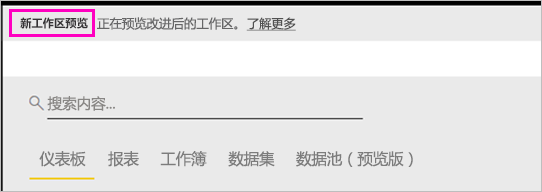
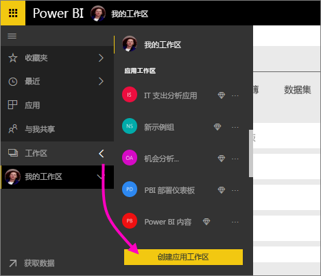
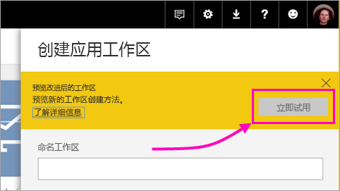
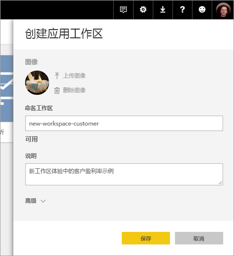
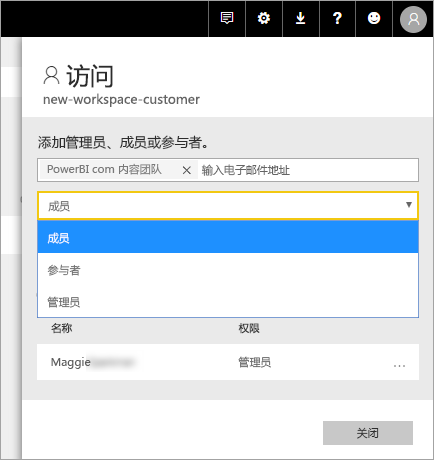
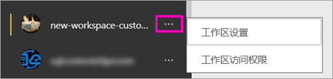

# 在 Power BI 中创建新工作区（预览）

Power BI 以预览的形式引入了新工作区体验。 工作区仍是与同事协作创建仪表板和报表集合的地方，可将其捆绑到应用并分发到整个组织或者特定人员或组。 

使用新的工作区预览，现在可以执行以下操作：

- 将工作区角色分配给用户组：安全组、通讯组列表、Office 365 组和个人。
- 在 Power BI 中创建工作区，而无需创建 Office 365 组。
- 使用更精细的工作区角色在工作区中实现更灵活的权限管理。

有关详细背景信息，请参阅[新工作区（预览版）](service-new-workspaces.md)一文。

## 创建一个新的应用工作区

1. 首先，创建应用工作区。 选择“工作区” > “创建应用工作区”。
   
     

2. 在“预览改进的工作区”，选择“立即试用”。
   
     

2. 为工作区命名。 如果命名不可用，则对其进行编辑以给定一个唯一的 ID。
   
     应用将与工作区同名。
   
1. 如果需要，可添加图像。 文件大小必须小于 45 KB。
 
    

1. 选择**保存**。

    下面是新工作区的“欢迎”屏幕，可在其中添加数据。 

    

1. 例如，选择“示例” > “客户盈利率示例”。

    现在，在工作区内容列表中，可看到“新工作区预览”。 管理员还可看到新操作“访问”。

    

1. 选择“访问”。

1. 将安全组、通讯组列表、Office 365 组或个人作为成员、参与者或管理员添加到这些工作区中。 有关不同角色的说明，请参阅后文的[新工作区中的角色](#roles-in-the-new-workspaces)。

    

9. 选择“添加” > “关闭”。

1. Power BI 创建工作区并将其打开。 可以在你所属的工作区列表中看到它。 管理员可以选择省略号 (…)，返回并更改工作区设置（添加新成员或更改其权限）。

     

## 将内容添加到应用工作区

创建新样式的应用工作区后，便可向其中添加内容。 在新旧样式的工作区中添加内容的过程类似，但有一个例外。 在任一应用工作区中，都可以上传文件或连接到文件，这类似于在“我的工作区”中所执行的操作。 在新工作区中，无法连接到组织内容包或第三方内容包（如 Microsoft Dynamics CRM、Salesforce 或 Google Analytics）。 在当前工作区中，可以连接到内容包。

在应用工作区内容列表中查看内容时，应用工作区名称列为所有者。

### 在新工作区中连接到第三方服务（预览）

在新工作区体验中，我们正在做出改变以专注于应用。 适用于第三方服务的应用使用户可以轻松地从他们使用的服务（如 Microsoft Dynamics CRM、Salesforce 或 Google Analytics）中获取数据。
组织应用为用户提供所需内部数据。 我们计划为组织应用添加相关功能，以便用户可以自定义他们在应用中找到的内容。 该功能将不再需要内容包。 

使用新工作区预览，无法创建或使用组织内容包。 但可以使用为连接到第三方服务提供的应用，或要求内部团队为当前正在使用的任何内容包提供应用。 

## 分发应用

内容准备好后，选择想要发布的仪表板和报表，然后将其作为应用发布。 可从每个工作区创建一个应用。 你的同事可通过几种不同的方式获取你的应用。 如果 Power BI 管理员已授予权限，则可将这些应用自动安装到同事的 Power BI 帐户中。 另外，他们可从 Microsoft AppSource 查找并安装应用，或者你可向他们发送一个直接链接。 他们将自动获得更新，你可以控制数据刷新的频率。 有关详细信息，请参阅[在 Power BI 中发布包含仪表板和报表的应用](service-create-distribute-apps.md)。

## 将旧应用工作区转换为新应用工作区

在预览期间，无法自动将旧应用工作区转换为新应用工作区。 但是，可以创建新应用工作区并将内容发布到新位置。 

当新工作区共正式发布 (GA) 后，用户可以选择自动迁移旧工作区。 在 GA 后的某个时刻，必须进行迁移。

## 后续步骤
* 请参阅[在 Power BI 的新工作区（预览版）中组织工作](service-new-workspaces.md)
* [创建当前工作区](service-create-workspaces.md)
* [在 Power BI 中安装并使用应用](service-create-distribute-apps.md)
* 是否有任何问题? [尝试咨询 Power BI 社区](http://community.powerbi.com/)
