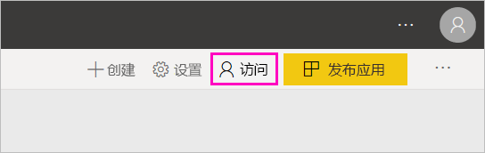

# 在 Power BI 中创建新工作区

Power BI 引入了新工作区体验。 工作区仍是与同事协作创建仪表板、报表和分页报表的集合的地方。 然后可将该集合捆绑到应用，并可将该应用分发到整个组织或特定人员或组  。 

下面是不同之处。 在新工作区中，可以：

- 将工作区角色分配给用户组：安全组、通讯组列表、Office 365 组和个人。
- 在 Power BI 中创建工作区，而无需创建 Office 365 组。
- 使用更精细的工作区角色在工作区中实现更灵活的权限管理。

> [!NOTE]
> 若要对在工作区中浏览内容的 Power BI Pro 用户强制执行行级别安全性 (RLS)，请向用户分配查看者角色。

有关详细背景信息，请参阅[新工作区](service-new-workspaces.md)一文。

## 创建一个新工作区

1. 首先，创建工作区。 选择“工作区”   > “创建工作区”  。
   
     

2. 将自动创建已升级的工作区，除非选择“还原为经典”  。
   
     
     
     如果选择“还原为经典”，则会[基于 Office 365 组创建工作区](service-create-workspaces.md)  。 

2. 为工作区命名。 如果命名不可用，则对其进行编辑以给定一个唯一名称。
   
     工作区的应用将与工作区具有相同的名称和图标。
   
1. 下面是可以为工作区设置的一些可选项：

    上传工作区图像  。 文件可以是 .png 或 .jpg 格式。 文件大小必须小于 45 KB。
    
    [添加联系人列表](#workspace-contact-list)  。 默认情况下，工作区管理员是联系人。 
    
    只需键入现有 Office 365 组的名称（而不是 URL）即可[指定工作区 OneDrive](#workspace-onedrive)  。 现在，此工作区可以使用该 Office 365 组的文件存储位置。 

    

    若要将工作区分配给专用容量，请在“高级”选项卡上选择“专用容量”    。
     
    

1. 选择“保存”。 

    Power BI 创建工作区并将其打开。 可以在你所属的工作区列表中看到它。 

## 工作区联系人列表

可以指定哪些用户接收关于工作区中发生的问题的通知。 默认情况下，任何指定为工作区管理员的用户或组都会收到通知，但你可以通过将列表添加到联系人列表  来自定义列表。 联系人列表中的用户或组将在用户界面 (UI) 中列出，以帮助用户获得与工作区相关的帮助。

1. 使用以下两种方法之一访问新的“联系人列表”设置  ：

    第一次创建工作区时，在“创建工作区”窗格中  。

    在导航窗格中，选择“工作区”旁边的箭头，然后选择工作区名称旁边的“更多选项”(…)，接下来选择“工作区设置”    。 随即打开“设置”窗格。 

    

2. 在“高级” > “联系人列表”下，接受默认的“工作区管理员”，或添加自己的“特定用户或组”列表     。 

    

3. 选择“保存”。 

## 工作区 OneDrive

借助工作区 OneDrive 功能，可以配置 Office 365 组，而它的 SharePoint 文档库文件存储可供工作区用户使用。 首先在 Power BI 之外创建组。 

Power BI 不会将配置为拥有工作区访问权限的用户或组的权限，与 Office 365 组成员身份同步。 最佳做法是，为在此设置 Office 365 组中配置其文件存储的同一个 Office 365 组提供[工作区访问权限](#give-access-to-your-workspace)。 然后通过管理 Office 365 组的成员身份来管理工作区访问权限。 

1. 使用以下两种方法之一访问新的“工作区 OneDrive”设置  ：

    第一次创建工作区时，在“创建工作区”窗格中  。

    在导航窗格中，选择“工作区”旁边的箭头，然后选择工作区名称旁边的“更多选项”(…)，接下来选择“工作区设置”    。 随即打开“设置”窗格。 

    

2. 在“高级”   > “工作区 OneDrive”  下，键入之前创建的 Office 365 组的名称。 Power BI 会自动为组选择 OneDrive。

    

3. 选择“保存”。 

### 访问工作区 OneDrive 位置

配置 OneDrive 位置之后，访问该位置的方式与访问 Power BI 服务中的其他数据源的方式相同。

1. 在导航窗格中选择“获取数据”  ，然后在“文件”  框中选择“获取”  。

    

1.   “OneDrive – Business”条目是你自己的 OneDrive for Business。 第二个 OneDrive 是你添加的 OneDrive。

    

### 在新工作区中连接到第三方服务

在新工作区体验中，我们正在做出改变以专注于应用  。 适用于第三方服务的应用使用户可以轻松地从他们使用的服务（如 Microsoft Dynamics CRM、Salesforce 或 Google Analytics）中获取数据。

在新工作区体验中，无法创建或使用组织内容包。 但可以使用为连接到第三方服务提供的应用，或要求内部团队为当前正在使用的任何内容包提供应用。 

## 授予对工作区的访问权限

1. 在工作区内容列表中，由于你是管理员，因此会看到一个新操作，即“访问”  。

    

1. 将安全组、通讯组列表、Office 365 组或个人作为成员、参与者或管理员添加到这些工作区中。 有关不同角色的说明，请参阅[新工作区中的角色](service-new-workspaces.md#roles-in-the-new-workspaces)。

    

9. 选择“添加” > “关闭”   。

## 分发应用

如果要将官方内容分发给组织内的大量受众，可以从工作区发布应用。  内容准备好后，选择想要发布的仪表板和报表，然后将其作为应用发布  。 可从每个工作区创建一个应用。

请参阅[从新工作区发布应用](service-create-distribute-apps.md)

## 后续步骤
* 请参阅[在 Power BI 的新工作区体验中组织工作](service-new-workspaces.md)
* [创建经典工作区](service-create-workspaces.md)
* [从 Power BI 的新工作区发布应用](service-create-distribute-apps.md)
* 是否有任何问题? [尝试咨询 Power BI 社区](https://community.powerbi.com/)
