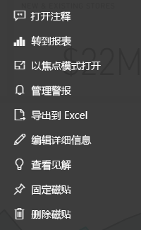

# Power BI 设计器的仪表板磁贴简介

磁贴就是固定到仪表板的数据快照。 可以从报表、数据集、仪表板、问答框、Excel 和 SQL Server Reporting Services (SSRS) 报表等位置创建磁贴。  此屏幕截图显示了固定到仪表板的许多不同的磁贴。

仪表板和仪表板磁贴是 Power BI 服务的一项功能，而不是 Power BI Desktop 的功能。 无法在移动设备上创建仪表板，但可以[查看和共享](mobile-apps-view-dashboard.md)仪表板。

除了固定的磁铁，还可使用[添加磁贴](service-dashboard-add-widget.md)直接在仪表板上创建独立磁贴。 独立磁贴包含：文本框、图像、视频、流数据和 Web 内容。

是否需要了解构成 Power BI 的构建块的帮助？  请参阅 [Power BI - 基本概念](service-basic-concepts.md)。

> [!NOTE]
> 如果原始可视化效果用于创建磁贴更改，则磁贴不会更改。  例如，如果从报表固定一个折线图，然后将折线图更改为条形图，则仪表板磁贴将继续显示为折线图。 数据将会刷新，但可视化效果类型不会。
> 
> 

## 固定磁贴，从...
向仪表板添加（固定）磁贴有多种不同的方法。 可从以下位置固定磁贴：

* [Power BI 问答](service-dashboard-pin-tile-from-q-and-a.md)
* [报表](service-dashboard-pin-tile-from-report.md)
* [其他仪表板](service-pin-tile-to-another-dashboard.md)
* [OneDrive for Business 上的 Excel 工作簿](service-dashboard-pin-tile-from-excel.md)
* [Power BI Publisher for Excel](publisher-for-excel.md)
* [快速见解](service-insights.md)
* [Reporting Services](https://docs.microsoft.com/sql/reporting-services/pin-reporting-services-items-to-power-bi-dashboards)

还可以直接在仪表板上使用“[添加磁贴](service-dashboard-add-widget.md)”创建图像、文本框、视频、流数据和 Web 内容的独立磁贴。

  

## 与仪表板上的磁贴进行交互
### 移动和重设磁贴大小
获取一个磁贴并[将它在仪表板上移动](service-dashboard-edit-tile.md)。 将鼠标悬停在该图柄 ，并选择它重设磁贴大小。

### 将鼠标悬停在磁贴上以更改外观和行为
1. 将鼠标悬停在磁贴上以显示省略号。
   
    
2. 选择省略号以打开磁贴操作菜单。
   
    
   
    此处你可以：
   
   * [打开用于创建此磁贴的报表](service-reports.md)   
   
   * [打开用于创建此磁贴的工作表](service-reports.md)   
     
    * [在焦点模式下查看](service-focus-mode.md)   
     * [导出磁贴中使用的数据](visuals/power-bi-visualization-export-data.md) 
     * [编辑标题和副标题、添加超链接](service-dashboard-edit-tile.md) 
     * [运行见解](service-insights.md) 
     * [将磁贴固定到另一个仪表板](service-pin-tile-to-another-dashboard.md) 
       
     * [删除图标](service-dashboard-edit-tile.md)
     
3. 若要关闭操作菜单，请在画布中选择空白区域。

### 选择（单击）磁贴
选择磁贴时，出现的下一步取决于该磁贴的创建方式。 同样，如果磁贴有[自定义链接](service-dashboard-edit-tile.md)，则选择该磁贴将转到该链接。 否则，选择磁贴将转到报表、Excel Online 工作簿、本地 Reporting Services 报表或用于创建该磁贴的问答问题。

> [!NOTE]
> 这对在仪表板上直接使用“**添加磁贴**”创建的视频磁贴不适用。 选择视频磁贴（以这种方式创建的）将导致视频直接在仪表板上播放。   
> 
> 

## 注意事项和疑难解答

* 如果未保存用于创建可视化效果的报表，则选择磁贴将不会产生任何操作。
* 如果是从 Excel Online 工作簿创建磁贴，则至少需要该工作簿的“读取”权限。 否则，选择磁贴将不会打开 Excel Online 工作簿。
* 假设使用“添加磁贴”直接在仪表板上创建磁贴，并为其设置自定义超链接。 此时，选择标题、副标题或磁贴时将打开该 URL。 否则，默认情况下，选择直接在仪表板上创建的图像、Web 代码或文本框磁贴都不会产生任何反应。
* 如果没有 Reporting Services 内的报表的权限，则选择从 Reporting Services 报表创建的磁贴时，会出现一个页面，表明你没有访问权限 (rsAccessDenied)。
* 如果没有 Reporting Services 服务器所在网络的访问权限，则选择从 Reporting Services 创建的磁贴时，会出现一个页面，表明找不到服务器 (HTTP 404)。 设备需要具有对报表服务器的网络访问权限方可查看该报表。
* 如果原始可视化效果用于创建磁贴更改，则磁贴不会更改。  例如，如果从报表固定一个折线图，然后将折线图更改为条形图，则仪表板磁贴会继续显示为折线图。 数据将会刷新，但可视化效果类型不会。

## 后续步骤
[为仪表板创建卡片（大数字磁贴）](power-bi-visualization-card.md)

[Power BI 中的仪表板](service-dashboards.md)  

[数据刷新](refresh-data.md)

[Power BI - 基本概念](service-basic-concepts.md)

[将磁贴导出到 Power Point](http://blogs.msdn.com/b/powerbidev/archive/2015/09/28/integrating-power-bi-tiles-into-office-documents.aspx)

[将 Reporting Services 项目固定到 Power BI 仪表板](https://msdn.microsoft.com/library/mt604784.aspx)

更多问题？ [尝试参与 Power BI 社区](http://community.powerbi.com/)

