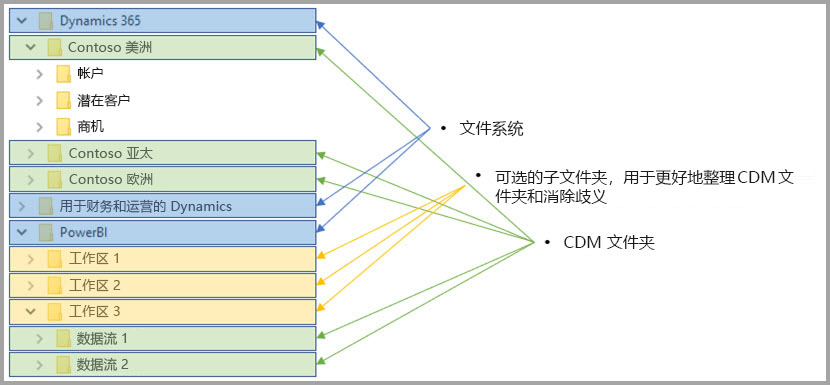

# 数据流和 Azure Data Lake 集成（预览）

默认情况下，Power BI 中使用的数据存储在由 Power BI 提供的内部存储中。 通过数据流与 Azure Data Lake Storage Gen2 (ADLS Gen2) 的集成，可将数据流存储在组织的 Azure Data Lake Storage Gen2 帐户中。 

## CDM 文件夹如何与数据流关联

使用数据流  ，用户和组织可以统一来自不同来源的数据并为建模做好数据准备。 使用通用数据模型 (CDM)，组织可以使用跨应用程序和部署提供语义一致性的数据格式。 使用 Azure Data Lake Storage gen2 (ADLS Gen2)，可向 Azure 中的 Data Lake 应用细粒度访问和授权控制。 结合使用两者时，这些元素为应用提供极具吸引力的集中式数据、结构化数据、细粒度访问控制和语义一致性并在整个企业内启用。

以 CDM 格式存储的数据在组织中提供跨应用程序和部署的语义一致性。 通过 CDM 与 ADLS Gen2 的集成，使用包含标准 CDM 格式的架构化数据的 CDM 文件夹，可向存储在 (ADLS Gen2) 中的数据应用相同的结构一致性和语义含义。 Azure Data Lake 中的标准化元数据和自述性数据可实现更为简单的元数据发现，以及数据生成者和使用者之间的互操作性，例如 Power BI、Azure 数据工厂、Azure Data Lake、Databricks 和 Azure 机器学习 (ML)。 

数据流将其定义和数据存储在 CDM 文件夹中，格式如下：

**Model.json**
* Model.json  元数据说明文件包含有关实体记录和属性的语义信息，以及基础数据文件的链接。 存在 model.json 文件指示符合 CDM 元数据格式，且可能包括具有应用程序可以使用的其他丰富现成可用的语义元数据的标准实体。
* Power BI 还将每个数据源信息与在 Power BI 服务中的数据流编辑器体验生成的查询和转换  一起存储。 数据源的密码不会存储在模型文件中。

**数据文件**
* 数据文件以定义明确的结构和格式包含在 CDM 文件夹中（子文件夹为可选项，如本文稍后所述）并在 model.json 文件中被引用。 目前，数据文件必须使用 .csv 格式，但在后续更新中可能支持其他格式。 

下图显示了由 Power BI 数据流创建的示例 CDM 文件夹，它包含三个实体：

上图中的 model.json 或元数据文件将提供整个 CDM 文件夹的实体数据文件的指针。

## Power BI 在 Data Lake 中组织 CDM 文件夹

通过使用 Power BI 数据流并将其与 ADLS Gen2 集成，Power BI 可以在 Data Lake 中生成数据。 作为数据生成者，Power BI 必须为包含 model.json 文件及其关联的数据文件的每个数据流创建 CDM 文件夹。 Power BI 通过使用文件系统  将其数据存储在独立于其他数据生成者的位置。 可以在[说明 Azure Data Lake Storage Gen2 文件系统和分层命名空间的文章](https://docs.microsoft.com/azure/storage/data-lake-storage/namespace)中阅读有关它们的详细信息。

Power BI 使用子文件夹来消除歧义，并在 Power BI 服务  中呈现时提供改进的数据组织。 文件夹命名和结构表示工作区（文件夹）和数据流（CDM 文件夹）。 下图显示了 Power BI 共享 Data Lake 的方式以及可能结构化的其他数据生成者。 每种服务（在此示例中为 Dynamics 365、用于财务和运营的 Dynamics 和 Power BI）都将创建和维护其自己的文件系统。 将根据在每种服务中的体验来创建子文件夹，以更好地组织文件系统中的 CDM 文件夹。 

## Power BI 保护 Data Lake 中的数据

Power BI 使用由 Azure Data Lake Storage Gen2. 提供的 Active Directory OAuth 持有者  令牌和 POSIX ACL  功能。 这些功能允许将 Power BI 对文件系统的访问权限限制在它在 Data Lake 中管理的文件系统，并将用户的访问权限限制在仅可访问其创建的数据流或 CDM 文件夹。 

若要在 Power BI 文件系统中创建和管理 CDM 文件夹，需要具有文件系统的读取、写入和执行权限。 在 Power BI 中创建的每个数据流都存储在其自己的 CDM 文件夹中，且数据流的所有者被授予对 CDM 文件夹及其内容的只读权限。 此方法保护了 Power BI 生成的数据的完整性，并为管理员提供了使用审核日志监视哪些用户访问了 CDM 文件夹的功能。 

### 向用户或服务授予访问 CDM 文件夹的权限

通过 Active Directory OAuth 持有者令牌和 POSIX ACL 将 CDM 文件夹与数据使用者（例如，需要读取数据的用户或服务）共享的过程进行了简化。 执行此操作可为管理员提供监视访问了 CDM 文件夹的用户的功能。 所需的唯一操作是向所选的 Active Directory 对象（例如用户组或服务）授予对 CDM 文件夹的访问权限。 我们建议将对 CDM 文件夹的所有访问（除数据生成者以外的任何身份）授予只读权限。 执行此操作可保护生成者生成的数据的完整性。

若要将 CDM 文件夹添加到 Power BI，添加 CDM 文件夹的用户应具有对 CDM 文件夹本身和其中的任何文件或文件夹的只读  Access ACL 权限。 此外，还具有对 CDM 文件夹本身和其中的任何文件夹中执行  Access ACL 的权限。 建议查看[文件和目录上的访问控制列表](https://docs.microsoft.com/azure/storage/blobs/data-lake-storage-access-control#access-control-lists-on-files-and-directories)和[使用 Azure Data Lake Storage Gen2 的最佳做法](https://docs.microsoft.com/azure/storage/blobs/data-lake-storage-best-practices)以了解详细信息。

### 授权的替代形式

Power BI 外部的人员或服务也可以利用授权的替代形式。这些替代形式允许密钥持有者访问帐户中的所有  资源，完全访问 Data Lake 中的所有资源且不会被限制为仅能访问文件系统或 CDM 文件夹。 这些替代形式可能是授予访问权限的简单方法，但是它们限制了在 Data Lake 中共享特定资源的功能，且不向用户提供审核访问了存储的用户的功能。 [Azure Data Lake Storage Gen2 中的访问控制文章](https://docs.microsoft.com/azure/storage/blobs/data-lake-storage-access-control
)中提供了可用的授权方案的完整详细信息。

## 后续步骤

本文提供了 Power BI 数据流、CDM 文件夹和 Azure Data Lake Storage Gen2 的集成的概述。 有关详细信息，请参阅以下文章：

有关数据流、CDM 和 Azure Data Lake Storage Gen2 的详细信息，请参阅以下文章：

* [配置工作区数据流设置（预览）](service-dataflows-configure-workspace-storage-settings.md)
* [将 CDM 文件夹添加到 Power BI 作为数据流（预览）](service-dataflows-add-cdm-folder.md)
* [连接 Azure Data Lake Storage Gen2 以存储数据流（预览）](service-dataflows-connect-azure-data-lake-storage-gen2.md)

有关总体数据流的信息，请查看以下这些文章：

* [在 Power BI 中创建和使用数据流](service-dataflows-create-use.md)
* [在 Power BI Premium 上使用计算实体](service-dataflows-computed-entities-premium.md)
* [将数据流与本地数据源配合使用](service-dataflows-on-premises-gateways.md)
* [Power BI 数据流的开发人员资源](service-dataflows-developer-resources.md)

有关 Azure 存储的详细信息，可以阅读以下这些文章：
* [Azure 存储安全指南](https://docs.microsoft.com/azure/storage/common/storage-security-guide)
* [开始使用 Azure 数据服务中的 github 示例](https://aka.ms/cdmadstutorial)

有关通用数据模型的详细信息，可以阅读其概述文章：
* [通用数据模型 - 概述](https://docs.microsoft.com/powerapps/common-data-model/overview)
* [CDM 文件夹](https://go.microsoft.com/fwlink/?linkid=2045304)
* [CDM 模型文件定义](https://go.microsoft.com/fwlink/?linkid=2045521)

也可以随时尝试[通过 Power BI 社区提问](https://community.powerbi.com/)。
