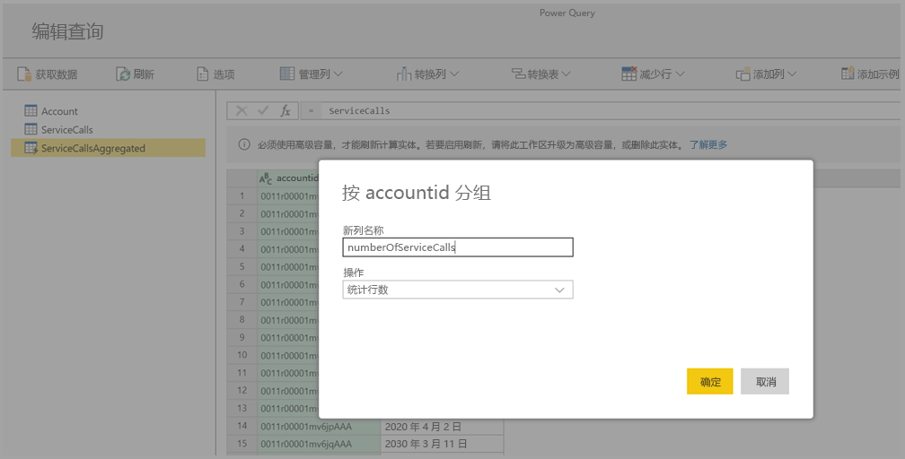

# 在 Power BI Premium 上使用计算实体（预览）

在 Power BI Premium 订阅中使用“数据流”时，可以执行“存储中计算”。 这让你能够对现有数据流执行计算，并返回让你能够专注于报表创建和分析的结果。 

若要执行“存储中计算”，首先必须创建数据流并将数据导入该 Power BI 数据流存储。 一旦具有包含数据的数据流后，就可以创建“计算实体”，它们是执行存储中计算的实体。 

有两种方法可以将数据流数据连接到 Power BI：

* [使用数据流的自助服务创作](service-dataflows-create-use.md)
* 使用外部数据流

以下部分介绍如何在数据流数据上创建计算实体。

> [!NOTE]
> 数据流功能处于预览状态，可能会在正式版推出前更改和更新。

## 如何创建计算实体 

一旦具有含有实体列表的数据流后，就可以在这些实体上执行计算。

在 Power BI 服务中的数据流创作工具中，选择“编辑实体”，然后右键单击想要用作计算实体基础的实体和想要执行计算的实体。 在上下文菜单中，选择“引用”。

若要使实体符合计算实体的条件，必须选中“启用加载”，如下图中所示。 右键单击实体以显示此上下文菜单。

选择“启用加载”，将创建一个新的实体，其源是引用的实体。 图标更改并显示“计算”图标，如下图中所示。

在此新建的实体上执行的任何转换都将在已驻留在 Power BI 数据流存储中的数据上运行。 这意味着查询不会在导入数据的外部数据源上运行（例如，拉取数据的 SQL 数据库），相反，它在驻留在数据流存储中的数据上执行。

### 示例用例
可以使用计算实体执行哪些类型的转换？ 在执行存储中计算时，将支持所有通常使用 Power BI 或 M 编辑器中的转换用户界面指定的任何转换。 

请考虑以下示例：你具有含有来自 Dynamics 365 订阅的所有客户的原始数据的帐户实体。 你还具有来自服务中心的 ServiceCalls 原始数据，其中包含每年每天从不同的帐户执行的支持调用的数据。

假设你想要使用 ServiceCalls 中的数据扩充帐户实体。 

首先，需要聚合来自 ServiceCalls 的数据，以计算最后一年为每个帐户执行的支持调用数。 

接下来，你想要将帐户实体与 ServiceCallsAggregated 实体合并，以计算浓集缩的“帐户”表。

然后可以看到结果，在下图中显示为 EnrichedAccount。

就是这么简单 - 在 Power BI Premium 订阅中驻留的数据流中的数据上执行转换，而不是在源数据上执行转换。

## 注意事项和限制

请务必注意，如果将工作区从 Power BI Premium 容量中删除，则相关联的数据流将不再刷新。 

使用组织的 Azure Data Lake Storage Gen2 帐户中专门创建的数据流时，仅当链接实体和计算实体位于同一存储帐户中时，这些实体才能正常工作。 有关详细信息，请参阅[连接 Azure Data Lake Storage Gen2 以存储数据流（预览）](service-dataflows-connect-azure-data-lake-storage-gen2.md)。

此外，链接实体不适用于 CDM 文件夹中创建的数据流。 请参阅[将 CDM 文件夹添加到 Power BI 作为数据流（预览）](service-dataflows-add-cdm-folder.md)。

## 后续步骤

本文介绍了 Power BI 服务中可用的计算实体和数据流。 下面列出了一些可能有用的文章。

* [数据流自助服务数据准备](service-dataflows-overview.md)
* [在 Power BI 中创建和使用数据流](service-dataflows-create-use.md)
* [将数据流与本地数据源配合使用（预览）](service-dataflows-on-premises-gateways.md)
* [Power BI 数据流的开发人员资源（预览）](service-dataflows-developer-resources.md)
* [配置工作区数据流设置（预览）](service-dataflows-configure-workspace-storage-settings.md)
* [将 CDM 文件夹添加到 Power BI 作为数据流（预览）](service-dataflows-add-cdm-folder.md)
* [连接 Azure Data Lake Storage Gen2 以存储数据流（预览）](service-dataflows-connect-azure-data-lake-storage-gen2.md)

有关 Power Query 和计划刷新的详细信息，可以阅读以下文章：
* [Power BI Desktop 中的查询概述](desktop-query-overview.md)
* [配置计划刷新](refresh-scheduled-refresh.md)

有关通用数据模型的详细信息，可以阅读其概述文章：
* [通用数据模型 - 概述](https://docs.microsoft.com/powerapps/common-data-model/overview)

