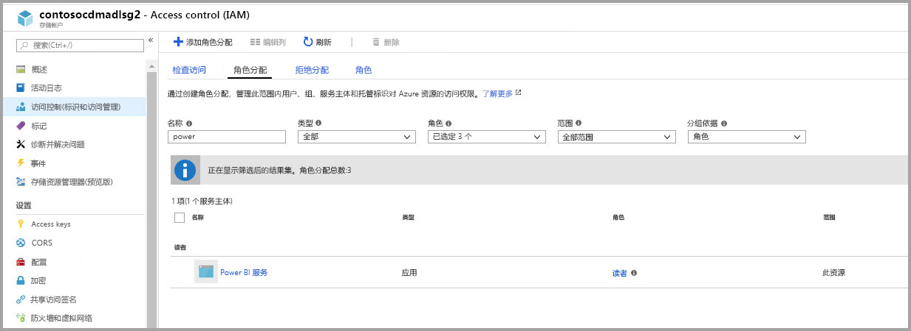
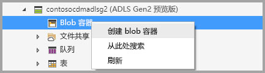
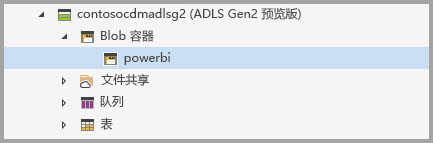
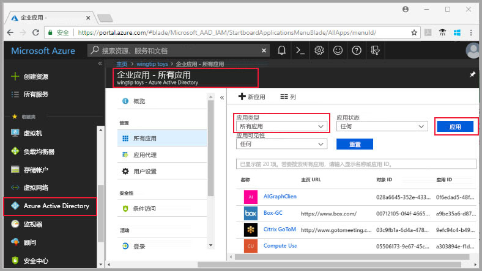
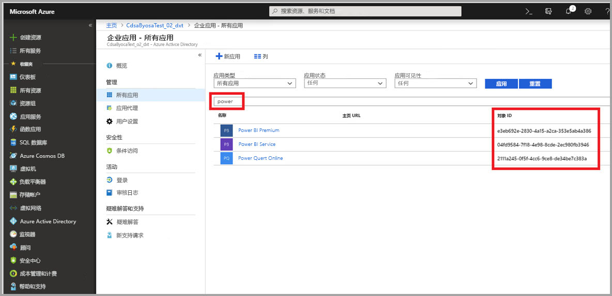
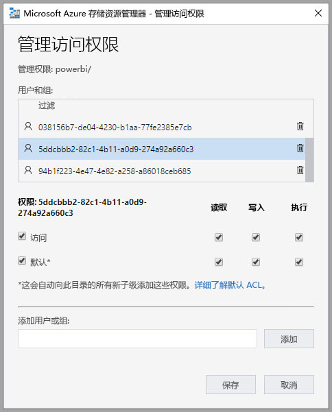
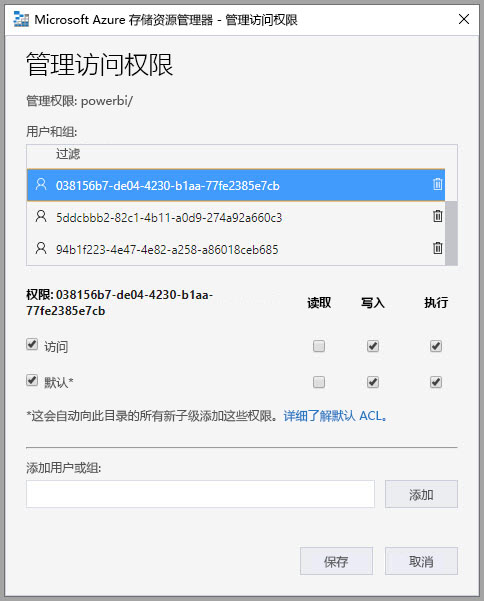
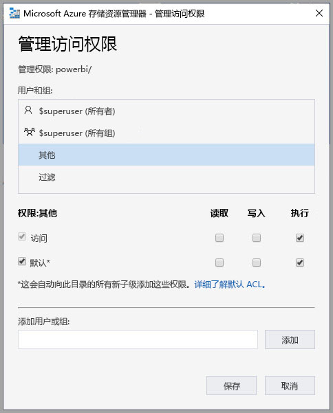

# 连接 Azure Data Lake Storage Gen2 以存储数据流（预览）

可以将 Power BI 工作区配置为在组织的 Azure Data Lake Storage Gen2 帐户中存储数据流。 本文介绍了执行此操作所需的一般步骤，并提供各步骤的指导和最佳做法。 配置工作区以在 Data Lake 中存储数据流定义和数据文件有以下优势，包括：

* Azure Data Lake Storage Gen2 为数据提供了极大的可缩放存储功能
* IT 部门的开发人员可利用数据流数据和定义文件来利用 Azure 数据和人工智能 (AI) 服务，如 [Azure 数据服务的 GitHub 示例](https://aka.ms/cdmadstutorial)所示
* 让组织中的开发人员能够使用数据流和 Azure 的开发人员资源将数据流数据集成到内部应用程序和业务线解决方案中

要将 Azure Data Lake Storage Gen2 用于数据流，需要以下内容：

* **Power BI 租户** - Azure Active Directory (AAD) 租户中至少必须至少有一个帐户已注册 Power BI
* **全局管理员帐户** - 此帐户是连接和配置 Power BI 以在 Azure Data Lake Storage Gen2 帐户中存储数据流定义和数据所必需的
* **Azure 订阅** - 需要 Azure 订阅才能使用 Azure Data Lake Storage Gen2
* **资源组** - 使用已有的资源组或创建新的资源组
* 启用了 Data Lake Storage Gen2 功能的 Azure 存储帐户  

> [!TIP]
> 如果没有 Azure 订阅，请在开始之前先创建一个[免费帐户](https://azure.microsoft.com/free/)。

> [!WARNING]
> 数据流存储位置一旦配置即无法更改。 请参阅本文结尾处的[注意事项和限制](#considerations-and-limitations)部分，了解要考虑的其他重要元素。

## 准备将 Azure Data Lake Storage Gen2 连接到 Power BI

在使用 Azure Data Lake Storage Gen2 帐户配置 Power BI 之前，必须创建并配置存储帐户。 我们来看看 Power BI 的要求：

1. 必须在与 Power BI 租户相同的 AAD 租户中创建存储帐户。
2. 必须在 Power BI 租户所在的同一区域中创建存储帐户。 要确定 Power BI 租户的位置，请参阅 [Power BI 租户的所在位置](service-admin-where-is-my-tenant-located.md)。
3. 存储帐户必须启用  “层次结构命名空间”功能。
4. 必须在存储帐户上为 Power BI 服务授予  读取者角色。
5. 必须创建名为  powerbi 的文件系统。
6. 必须授权 Power BI 服务使用用户创建的  powerbi 文件系统。

以下部分详细介绍了配置 Azure Data Lake Storage Gen2 帐户所需的步骤。

### 创建存储帐户

按照[创建 Azure Data Lake Storage Gen2 存储帐户](https://docs.microsoft.com/azure/storage/blobs/data-lake-storage-quickstart-create-account)一文中的步骤进行操作。

1. 确保选择与 Power BI 租户相同的位置，并将存储设置为“StorageV2 (常规用途 v2)” 
2. 确保启用分层命名空间功能
3. 建议将复制设置设置为  “读取访问权限异地冗余存储 (RA-GRS)”

### 授予 Power BI 服务读取者角色

接下来，需要在创建的存储帐户中授予 Power BI 服务读取者角色。 这是内置角色，因而步骤很简单。 

按照[分配内置 RBAC 角色](https://docs.microsoft.com/azure/storage/common/storage-auth-aad-rbac#assign-a-built-in-rbac-role)中的步骤操作。

在  “添加角色分配”窗口中，选择要分配给 Power BI 服务的  读取者角色。 然后使用搜索来查找  Power BI 服务。 下图显示了分配给 Power BI 服务的  读取者角色。

> [!NOTE]
> 留出至少 30 分钟等待权限从门户传播到 Power BI。 每次在门户中更改权限后，都留出 30 分钟让这些权限在 Power BI 中得到反映。 

### 为 Power BI 创建文件系统

在将存储帐户添加到 Power BI 之前，必须创建名为  powerbi 的文件系统。 创建此类文件系统的方法有多种，包括使用 Azure Databricks、HDInsight、AZCopy 或 Azure 存储资源管理器创建。 本节介绍使用 Azure 存储资源管理器创建文件系统的简单方法。

此步骤要求安装 Azure 存储资源管理器 1.6.2 版本或更高版本。 要安装适用于 Windows、Macintosh 或 Linux 的 Azure 存储资源管理器，请参阅 [Azure 存储资源管理器](https://azure.microsoft.com/features/storage-explorer/)。

1. 成功安装 Azure 存储资源管理器后，首次启动时将显示 Microsoft Azure 存储资源管理器 - 连接窗口。 虽然存储资源管理器提供了多种连接存储帐户的方法，但目前只支持一种方式进行所需的设置。 

2. 在左侧窗格中，找到并展开上面创建的存储帐户。

3. 右键单击“Blob 容器”，然后从上下文菜单中选择“创建 Blob 容器”。

   

4. Blob 容器文件夹下方将出现一个文本框。 输入名称“powerbi”  

   

5. 完成后按 Enter 键以创建 blob 容器

   

在下一节中，为 Power BI 系列服务授予对创建的文件系统的完全访问权限。 

### 为 Power BI 授予对文件系统的权限

要授予对文件系统的权限，请应用授予 Power BI 服务访问权限的访问控制列表 (ACL) 设置。 该操作第一步是在租户中获取 Power BI 服务标识。 可以在 Azure 门户的  “企业应用”部分中查看 Azure Active Directory (AAD) 应用程序。

要查找租户应用程序，请按照下列步骤操作：

1. 在 [Azure 门户](https://portal.azure.com/)中，从左侧导航面板选择“Azure Active Directory”  。
2. 在 Azure“Active Directory”  边栏选项卡中，选择  “企业应用程序”。
3. 从  “应用程序类型”下拉菜单中，选择  “所有应用程序”，然后选择“应用”  。 然后将显示租户应用程序示例，如下图所示。

    

4. 在搜索栏中，键入 Power  ，将显示 Power BI 和 Power Query 应用程序的对象 ID 集合。 需要在后续步骤中用到这三个值。  

    

5. 从搜索结果中在线选择并复制 Power BI 服务和 Power Query 的对象 ID。 准备好在后续步骤中粘贴这些值。

7. 接下来，使用 Azure存储资源管理器  导航到在上一节中创建的  powerbi 文件系统。 按照[使用 Azure 存储资源管理器设置文件和目录级别权限](https://docs.microsoft.com/azure/storage/blobs/data-lake-storage-how-to-set-permissions-storage-explorer)一文的[管理访问权限](https://docs.microsoft.com/azure/storage/blobs/data-lake-storage-how-to-set-permissions-storage-explorer#managing-access)部分中的说明进行操作。

8. 对于在步骤 5 中收集的两个 Power BI 对象 ID 中的每一个，将  读取、  写入、  执行访问权限和默认 ACL 分配给  powerbi 文件系统。

   

9. 对于在步骤 4 中收集的 Power Query Online 对象 ID，将写入、执行访问权限和默认 ACL 分配给 powerbi 文件系统    。

   

10. 此外，对于  其他对象 ID，还分配  执行访问权限和默认 ACL。

    

## 将 Azure Data Lake Storage Gen2 连接到 Power BI

在 Azure 门户中设置 Azure Data Lake Storage Gen2 帐户后，可以将其连接到 Power BI 管理门户  中的 Power BI。 还可以在 Power BI 管理门户的  “数据流存储”设置部分中管理 Power BI 数据流存储。 有关启动和基本使用的指南，请参阅[如何访问管理门户](service-admin-portal.md)，获取详细信息。

使用以下步骤连接  Azure Data Lake Storage Gen2 帐户：

1. 导航到  Power BI 管理门户的  “数据流设置”选项卡

     

2. 选择“连接 Azure Data Lake Storage Gen2”  按钮。 将显示以下窗口。

     

3. 提供存储帐户的  订阅 ID。
4. 提供在其中创建存储帐户的  资源组名称。
5. 提供存储帐户名称。 
6. 选择“连接”  。

成功完成这些步骤后，Azure Data Lake Storage Gen2 帐户已连接到 Power BI。 

> [!NOTE]
> 若要在 Power BI 管理门户中配置与 Azure Data Lake Storage Gen2 的连接，必须具有全局管理员权限。 但是，全局管理员无法在管理门户中连接外部存储。  

接下来，需要让组织中的人员配置其工作区，这使他们能够使用此存储帐户进行数据流定义和数据存储。 我们将在下一节中执行该操作。 

## 允许管理员分配工作区

默认情况下，数据流定义和数据文件存储在 Power BI 提供的存储空间中。 若要访问用户自己的存储帐户中的数据流文件，工作区管理员必须首先配置工作区，以允许在新存储帐户中分配和存储数据流。 在工作区管理员可以配置数据流存储设置之前，必须在  Power BI 管理门户中授予管理员存储分配权限。

要授予存储分配权限，请转至  Power BI 管理门户中的“数据流设置”  选项卡。 存在  “允许工作区管理员将工作区分配给此存储帐户”单选按钮，该按钮必须设置为  “允许”。 启用该滑块后，选择  “应用”按钮以使更改生效。 

 

分配过程如上所述。 而 Power BI 工作区管理员现在可以将工作流分配到所创建的文件系统。

## 注意事项和限制

此功能是预览功能，其行为可能会随着临近发布而发生变化。 使用数据流存储功能时，有几个注意事项和限制需要牢记：

* 数据流存储位置一旦配置即无法更改。
* 只有在 Azure Data Lake Storage Gen2 中存储的数据流的所有者才能默认访问其数据。 要授权其他人员访问存储在 Azure 中的数据流，则必须将他们添加到数据流的 CDM 文件夹中 
* 仅当链接实体与数据流存储在同一存储帐户中时才可以创建带有链接实体的数据流
* 存储在组织 Data Lake 中的数据流不支持 Power BI 共享容量中的本地数据源
* ADLS Gen 2 上不会自动删除快照。 若要释放空间，可创建 Azure 函数来定期清理旧快照。

还存在一些已知问题，如本节所述。

Power BI Desktop 客户无法访问存储在 Azure Data Lake Storage 帐户  中的数据流，除非他们是这些数据流的所有者，或者已被授权访问 Data Lake 中的 CDM 文件夹。 场景如下：

1. Anna 创建了一个新的应用工作区，并将其配置为存储组织 Data Lake 中的数据流。 
2. Ben 也是 Anna 所创建工作区的成员，他希望利用 Power BI Desktop 和数据流连接器从 Anna 创建的数据流获取数据。
3. Ben 收到类似错误，因为他未获得访问 Data Lake 中数据流的 CDM 文件夹的授权。

常见问题和答案包括以下内容：

**问：** 如果我之前在工作区中创建了数据流并想要更改其存储位置，该怎么办？

**答：** 创建数据流后，无法更改数据流的存储位置。 

**问：** 我什么时候可以更改工作区的数据流存储位置？

**答：** 仅当工作区不包含任何数据流时才允许更改工作区的数据流存储位置。

## 后续步骤

本文提供了有关如何连接 Azure Data Lake Gen2 以进行数据流存储的指南。 有关详细信息，请参阅以下文章：

有关数据流、CDM 和 Azure Data Lake Storage Gen2 的详细信息，请参阅以下文章：

* [数据流和 Azure Data Lake 集成（预览）](service-dataflows-azure-data-lake-integration.md)
* [配置工作区数据流设置（预览）](service-dataflows-configure-workspace-storage-settings.md)
* [将 CDM 文件夹添加到 Power BI 作为数据流（预览）](service-dataflows-add-cdm-folder.md)

有关总体数据流的信息，请查看以下这些文章：

* [在 Power BI 中创建和使用数据流](service-dataflows-create-use.md)
* [在 Power BI Premium 上使用计算实体](service-dataflows-computed-entities-premium.md)
* [将数据流与本地数据源配合使用](service-dataflows-on-premises-gateways.md)
* [Power BI 数据流的开发人员资源](service-dataflows-developer-resources.md)

有关 Azure 存储的详细信息，可以阅读以下这些文章：
* [Azure 存储安全指南](https://docs.microsoft.com/azure/storage/common/storage-security-guide)

有关通用数据模型的详细信息，可以阅读其概述文章：
* [通用数据模型 - 概述](https://docs.microsoft.com/powerapps/common-data-model/overview)
* [CDM 文件夹](https://go.microsoft.com/fwlink/?linkid=2045304)
* [CDM 模型文件定义](https://go.microsoft.com/fwlink/?linkid=2045521)

也可以随时尝试[通过 Power BI 社区提问](http://community.powerbi.com/)。
