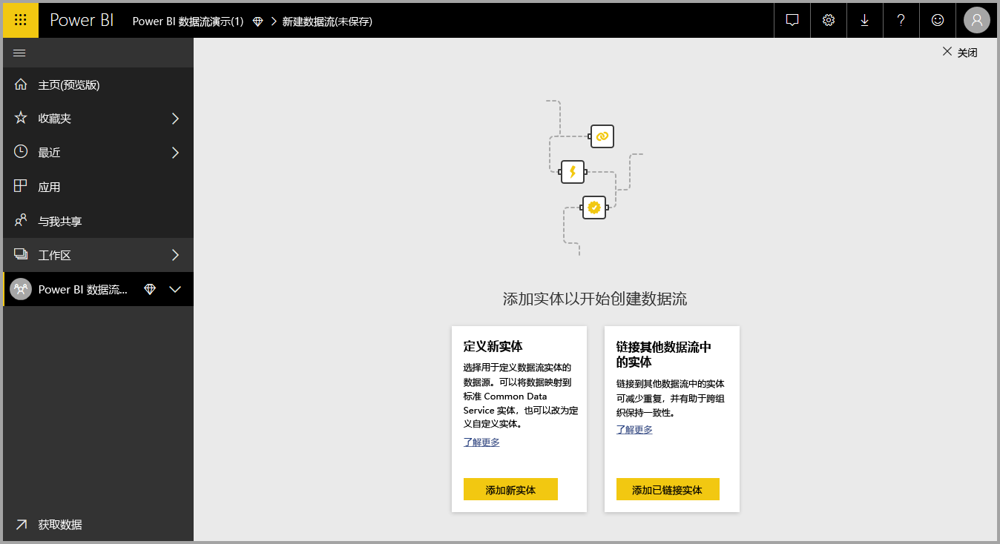
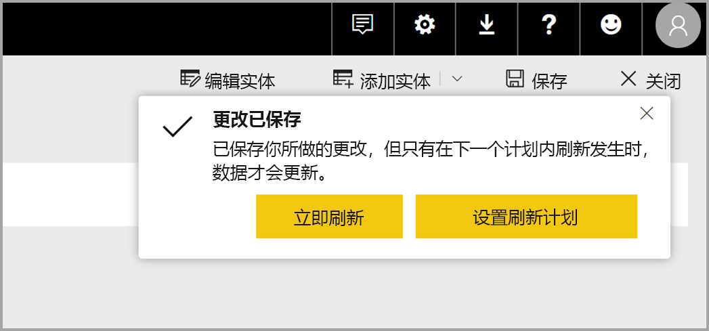
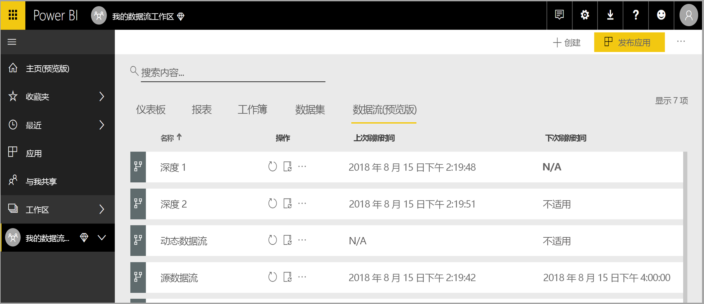
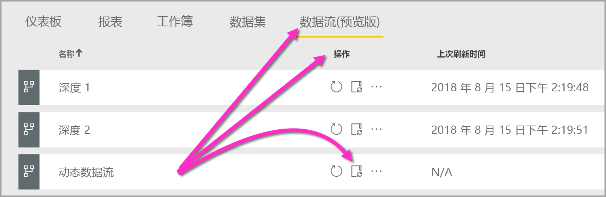
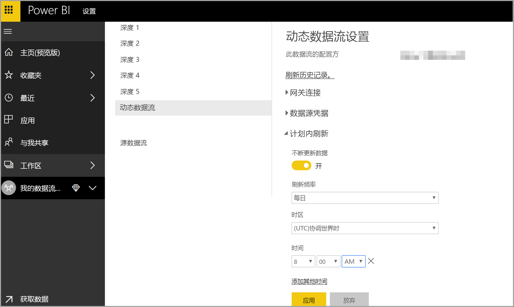

# 在 Power BI 中创建和使用数据流

借助 Power BI 提供的高级数据准备功能，可以创建数据集合（称之为数据流），之后则可以使用此集合连接来自各种源的业务数据、清理和转换该数据，然后将其加载到 Power BI 存储。 

数据流是在 Power BI 服务的应用工作区中创建和管理的实体（实体类似于表）集合。   可以添加和编辑数据流中的实体，还可以直接从创建数据流的工作区管理数据刷新计划。

创建数据流后，则可以基于置于 Power BI 数据流的数据使用 Power BI Desktop 和 Power BI 服务创建数据集、报表、仪表板和应用，以此方式来获取关于业务活动的见解。  

使用数据流时，有以下三个主要步骤：

1. 编写数据流（使用专门用于简化此操作的 Microsoft 工具）
2. 计划要置于数据流的数据的刷新频率
3. 使用 Power BI Desktop 和数据流生成数据集 

通过以下各节，我们可以了解以上各个步骤，并熟悉用于完成各个步骤的工具。 让我们开始吧。

## 创建数据流
若要创建数据流，请在浏览器中启动 Power BI 服务，然后从左侧导航窗格选择一个应用工作区（数据流在 Power BI 服务的“我的工作区”中不可用），如以下屏幕所示。   也可以新建一个工作区，用于创建新的工作流。 

处于可用于创建数据流的应用工作区区域后，画布的右上角会出现“+ 创建”按钮。   选择“+ 创建”按钮，然后从下拉列表选择“数据流”。   

须知任何数据流均只有一个所有者，即创建该数据流的人。  只有所有者可以编辑该数据流。 对创建该数据流的应用工作区具有读取或写入权限的所有应用工作区成员都可以从 Power BI Desktop 中连接到该数据流，如本文后续部分中所述。  

从该位置添加实体，下一节将详细介绍此过程。 

### 添加实体

实体  是一组用于存储数据的字段，非常类似于数据库中的表。 下图演示了选择数据源的过程，以从其中将数据引入 Power BI。

选择数据源时，会提示你提供连接设置，其中包括连接到该数据源时要使用的帐户，如下图所示。

连接后，可以选择要用于实体的数据。 选择数据和源时，Power BI 随后将重新连接到数据源，以按照在后面的设置过程中所选的频率持续刷新数据流中的数据。

选择用于实体的数据后，可以使用数据流编辑器将该数据塑造或转换为用于数据流所需的格式。

### 使用数据流编辑器

从源选择要用于实体的数据后，可以使用 Power Query 编辑体验（类似于 Power BI Desktop 中的 Power Query 编辑器）将选择的数据塑造为最适用于实体的格式。   有关 Power Query（Power Query 已作为 Power Query 编辑器并入 Power BI Desktop）的详细信息，可查看针对 Power BI Desktop 的[查询概述文章](desktop-query-overview.md)。 

如果想要查看查询编辑器正使用每个步骤创建的代码，或想要创建自己的调整代码，可以使用**高级编辑器**。 

### 数据流和通用数据模型 (CDM)

数据流实体包含新工具，通过它们可将业务数据轻松映射到通用数据模型（Microsoft 的标准化架构）、使用 Microsoft 和第三方数据丰富此模型，并可轻松访问机器学习。 可利用这些新功能提供关于业务数据的智能可操作见解。 完成“编辑查询”步骤中的任意转换后，可将数据源表中的列映射到通用数据模型定义的标准实体字段。 标准实体具有通用数据模型定义的已知架构。

有关此方法和通用数据模型的详细信息，请参阅[什么是通用数据模型](https://docs.microsoft.com/powerapps/common-data-model/overview)一文。

若要将通用数据模型用于数据流，则在“编辑查询”对话框中单击“映射到标准”转换。   可以在出现的“映射实体”屏幕中选择要映射到的标准实体。 

将源列映射到标准字段时，会发生以下操作：

1. 源列采用标准字段名称（若名称不同会重命名列）
2. 源列获得标准字段数据类型

所有未映射的标准字段将获得 Null 值，以便保存通用数据模型标准实体。 

所有未映射的源列保持原样，以确保映射的结果是包含自定义字段的标准实体。

完成选择且实体及其数据设置已就绪并可供保存后，可从菜单中选择“保存”。  请注意，可通过选择“添加实体”按钮创建多个实体，并且可以通过编辑实体来优化所创建的查询和实体。 

选择“保存”时，会提示你为数据流命名并提供说明。 

准备就绪后选择“保存”按钮，会出现一个窗口，用于通知你已创建数据流。   

太棒了 – 现在你已为下一个步骤做好准备了，即计划数据源的刷新频率。

## 计划刷新频率

保存数据流后，需要为各个已连接的数据源计划刷新频率。

Power BI 数据流使用 Power BI 数据刷新过程使数据保持最新状态。 在 Power BI 服务的应用工作区区域中有可列出信息的区域的集合，其中包括数据流，如下图所示。  

上一个图片中的“Dynamics 数据流”项是在上一节中创建的数据流。  若要计划刷新，则在“操作”区域下选择“计划刷新”图标，如下图所示。   

选择“计划刷新”时，将转到“计划刷新”窗格，可在其中设置数据流刷新频率和时间。  

有关计划刷新的详细信息，请参阅[配置计划刷新](refresh-scheduled-refresh.md)一文，其中介绍了 Power BI 数据集的刷新行为。 在刷新设置方面，数据流的行为与 Power BI 数据集的行为相同。 

## 在 Power BI Desktop 中连接到数据流

创建数据流并已为用于填充模型的各个数据源计划刷新频率后，则为第三个步骤（也是最后一步）做好了准备，即从 Power BI Desktop 中连接到数据流。  

若要连接到数据流，则在 Power BI Desktop 中选择“获取数据 > Power BI > Power BI 数据流 (Beta)”，如下图中所示  。

从该位置导航到保存数据流的“应用工作区”，选择数据流，然后从列表选择所创建的实体。 

另外，还可以使用窗口顶部附近的搜索栏从众多数据流实体中快速找到你的数据流或实体的名称。 

选择实体并选择“加载”按钮后，相应的实体会显示在 Power BI Desktop 的“字段”窗格中，并且其外观和行为与任何其他数据集中的表相似。    

## 使用存储在 Azure Data Lake Storage Gen2 中的数据流

某些组织可能希望使用自己的存储来创建和管理数据流。 如果遵循要求并正确管理权限，则可以将数据流与 Azure Data Lake Storage Gen2 集成。 可以从概述文档[数据流和 Azure Data Lake 集成（预览）](service-dataflows-azure-data-lake-integration.md)开始，找到有关此方法的所有要求的文档。

## 数据连接故障排除

连接到数据流的数据源时可能会遇到问题。 此节提供了此类问题出现时可使用的故障排除建议。 

* Salesforce 连接器  - 将 Salesforce 试用帐户用于数据流导致连接失败，且未提供任何信息。 若要解决此问题，请使用 Salesforce 生产帐户或开发人员帐户进行测试。

* SharePoint 连接器  - 确保提供了 SharePoint 站点的根地址，不包含任何子文件夹或文档。 例如，使用类似于以下内容的链接： https://microsoft.sharepoint.com/teams/ObjectModel/。 

* **JSON 文件连接器** - 当前你只可使用基本身份验证连接到 JSON 文件。  当前不支持通过在 URL 中提供凭据来连接到 JSON 文件（例如， https://XXXXX.blob.core.windows.net/path/file.json?sv=2019-01-01&si=something&sr=c&sig=123456abcdefg..。）  。  

* **Azure SQL 数据仓库** - 数据流目前不支持对 Azure SQL 数据仓库使用 Azure Active Directory (AAD) 身份验证。 对于此情况请使用基本身份验证。

## 后续步骤

本文介绍了如何创建自己的数据流，以及如何在 Power BI Desktop 中创建数据集和报表来使用此数据流。   以下文章有助于了解关于使用数据流的详细信息和方案：

* [数据流自助服务数据准备](service-dataflows-overview.md)
* [使用 Power BI Premium 上的计算的实体](service-dataflows-computed-entities-premium.md)
* [数据流中使用的本地数据源](service-dataflows-on-premises-gateways.md)
* [Power BI 数据流的开发人员资源](service-dataflows-developer-resources.md)
* [数据流和 Azure Data Lake 集成（预览）](service-dataflows-azure-data-lake-integration.md)

有关通用数据模型的详细信息，可以阅读其概述文章：
* [通用数据模型 - 概述](https://docs.microsoft.com/powerapps/common-data-model/overview)
* [了解 GitHub 上有关通用数据模型架构和实体的详细信息](https://github.com/Microsoft/CDM)

Power BI Desktop 相关文章：

* [通过 Power BI Desktop 连接 Power BI 服务中的数据集](desktop-report-lifecycle-datasets.md)
* [Power BI Desktop 中的查询概述](desktop-query-overview.md)

Power BI 服务相关文章：
* [配置计划刷新](refresh-scheduled-refresh.md)
