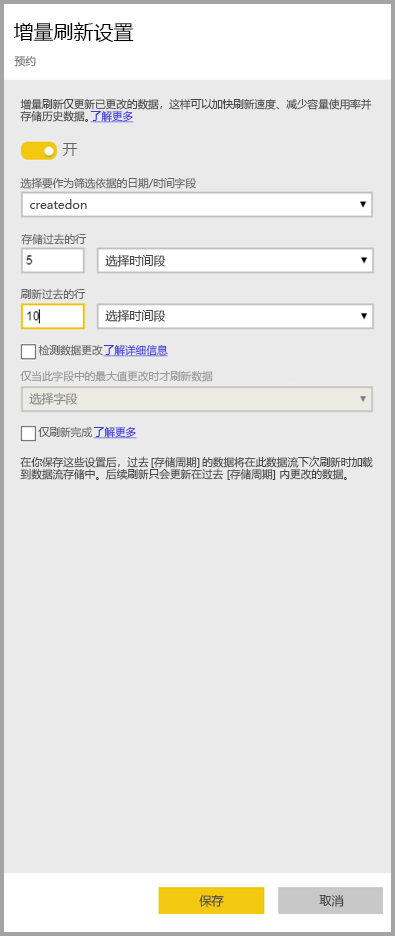

# 将增量刷新与 Power BI 数据流配合使用

借助数据流，用户可以将大量数据引入 Power BI，以创建有说服力的报表和分析。 但是，在某些情况下，每次刷新时均更新源数据的完整副本是不切实际的。 一个很好的替代方法是增量刷新  ，它为数据流提供以下优势：

* 刷新更快捷  - 只需刷新已更改的数据。 例如，只刷新 10 年数据流中最近 5 天的数据。
* 刷新更可靠  - 例如，无需维护与不稳定的源系统的长期连接。
* 降低资源消耗  - 要刷新的数据量减少，这降低了内存和其他资源的整体消耗。

对 Power BI 数据流使用增量刷新要求数据流所在的工作区在[高级容量](service-premium-what-is.md)中运行，并且引入数据流的数据源必须具有增量刷新可以基于其进行筛选的日期时间  字段。 

## 配置数据流的增量刷新

数据流可以包含许多实体。 在实体级别设置增量刷新，允许一个数据流保存完全刷新的实体和增量刷新的实体。

若要设置增量刷新实体，请首先像配置任何其他实体一样配置实体。 若要了解有关数据流设置的详细信息，请参阅 [Power BI 中的自助服务数据准备](service-dataflows-overview.md)。

创建并保存数据流后，在实体视图中选择“增量刷新”  图标，如下图所示：

单击该图标时，将显示“增量刷新设置”  窗口。 将增量刷新切换到“打开”  位置时，可以配置增量刷新。

以下列表说明了“增量刷新设置”  窗口中的设置。 

1. 增量刷新打开/关闭切换  - 此滑块可切换实体的增量刷新策略打开/关闭
2. 筛选器字段下拉列表  - 选择实体应在其上进行筛选以进行增量的查询字段。 该字段仅包含“日期时间”  字段。 如果实体不包含“日期时间”  字段，则无法使用增量刷新。
3. 存储以前的行  - 以下示例有助于解释接下来的几个设置。

    对于本示例，我们定义了一个刷新策略，用于存储总共 5 年的数据，并以增量方式刷新 10 天的数据。 如果每天都要刷新实体，则如下执行每个刷新操作：

    * 添加新的一天的数据。
    * 刷新截至当前日期的 10 天的数据。
    * 删除比当前日期早 5 年的日历年的数据。 例如，如果当前日期为 2019 年 1 月 1 日，则删除 2013 年的数据。

    第一个数据流刷新可能需要一段时间才能导入所有五年的数据，但后续刷新很可能在初始刷新时间的一小部分时间内就能完成。

4. 检测数据更改  - 增量刷新 10 天的数据比完全刷新 5 年的数据更加高效，但我们可以做得更好。 如果选中“检测数据更改”复选框，则可选择用于仅标识和刷新数据更改日期的日期/时间列  。 此操作假定源系统中存在通常用于审核的列。 将针对增量范围中的每个周期评估此列的最大值。 如果自上次刷新后数据未更改，则无需刷新周期。 在示例中，这可将增量刷新的天数从 10 天进一步减少到 2 天。

> [!TIP]
> 当前的设计要求将用于检测数据更改的列保留并缓存到内存中。 可能需要考虑采用以下某项技术来降低基数和内存消耗：
>
>    * 刷新时仅保留此列的最大值（可能是通过 Power Query 功能实现）。
>    * 根据刷新频率要求，将精度降低到可接受的水平。

5. 仅刷新完整周期  - 假设刷新计划在每天凌晨 4:00 运行。 如果在该天前四个小时期间源系统中出现数据，则无需进行刷新。 根据部分天数来解释一些业务指标（例如石油和天然气行业每天的桶数）是不切实际或不合理的。

    另一个仅刷新完整周期的示例是从财务系统刷新数据。 假设一个财务系统，其中前一个月的数据在该月的第 12 个公历日获得批准。 可将增量范围设置为 1 个月，并安排在该月的第 12 天运行刷新。 选中此选项后，它将在 2 月 12 日刷新 1 月数据（最近的完整月度周期）。

> [!NOTE]
> 数据流增量刷新根据以下逻辑确定日期：如果计划刷新，则数据流的增量刷新使用刷新策略中定义的时区。 如果不存在刷新计划，则增量刷新将使用运行刷新的计算机的时间。

## 增量刷新查询

配置增量刷新后，数据流会自动更改查询以包括按日期筛选。 可以使用“高级 Power Query 编辑器”  编辑自动生成的查询，以微调或自定义刷新。 请在接下来的部分中阅读有关增量刷新及其工作原理的详细信息。

## 增量刷新和链接实体与计算实体

对于链接  实体，增量刷新会更新源实体。 由于链接实体只是指向原始实体的指针，因此增量刷新对链接实体没有影响。 当源实体根据其定义的刷新策略进行刷新时，任何链接实体都应该假定源中的数据已刷新。

计算  实体基于在数据存储上运行的查询，该数据存储可能是另一个数据流。 因此，计算实体的行为方式与链接实体的行为方式相同。

由于计算实体和链接实体的行为相似，因此两者的要求和配置步骤相同。 区别在于，对于计算实体，在某些配置中，由于生成分区的方式，增量刷新无法以优化方式运行。 

## 在增量刷新和完全刷新之间切换

数据流支持在增量刷新和完全刷新之间更改刷新策略。 当在任一方向上发生更改（从完全刷新到增量刷新，或从增量刷新到完全刷新）时，更改会在下次刷新后影响数据流。

将数据流从完全刷新移动到增量刷新时，新刷新逻辑会更新遵循刷新窗口的数据流，并按增量刷新设置中的定义进行增量。

将数据流从增量刷新移动到完全刷新时，增量刷新中累积的所有数据都将被完全刷新中定义的策略覆盖。 必须批准此操作。

## 数据流增量刷新和数据集

数据流增量刷新和数据集增量刷新旨在协同开展工作。 可以接受并支持将数据流中以增量方式刷新的实体完全加载到数据集中，或者将数据流中完全加载的实体以增量方式加载到数据集中。 

两种方法根据的是刷新设置中的指定定义。
可以在 [Power BI Premium 中的增量刷新](service-premium-incremental-refresh.md)中了解有关增量刷新的详细信息。

## 增量刷新中的时区支持

数据流增量刷新取决于刷新运行的时间。 查询的筛选取决于查询运行的日期。

为了适应这些依赖关系并确保数据一致性，数据流的增量刷新为立即刷新  方案实现了以下启发式解决方法：

* 在系统中定义计划刷新的情况下 - 增量刷新使用计划刷新中的时区设置。 这确保刷新数据流的用户所处的时区，该时区始终与系统的定义保持一致。

* 如果未定义计划刷新，则数据流将使用刷新用户计算机的时区。

另外还可以使用 API 调用增量刷新。 在这种情况下，API 调用可能保留刷新中使用的时区设置。 使用 API 有助于进行测试和验证。

## 增量刷新实现详细信息

数据流使用分区进行增量刷新。 一旦 Power BI Premium 的 XMLA 终结点可用，分区就变得可见。 数据流中的增量刷新保留了满足刷新策略要求的最小分区数。 将删除超出范围的旧分区，从而保持滚动窗口。 分区可适时合并，减少所需的分区总数。 这可以改善压缩，在某些情况下，可以提高查询性能。

本部分中的示例共享以下刷新策略：

* 存储最近 1 个季度的行
* 刷新最近 10 天的行
* 检测数据更改 = False
* 仅刷新完整的天数 = True

### 合并分区

在此示例中，日分区一旦超出增量范围，就会自动合并到月级别。 增量范围中的分区需要以每日粒度维护，以便仅刷新那些天数。
运行日期 2016 年 12 月 11 日  的刷新操作合并了 11 月的天数，因为它们超出了增量范围。

### 删除旧分区

超出总范围的旧分区将被删除。 运行日期 2017 年 1 月 2 日  的刷新操作会删除 2016 年第 3 季度的分区，因为它超出了总范围。

### 从长时间故障中恢复

此示例模拟系统如何从长时间故障中正常地恢复。 假设刷新未成功运行，因为数据源凭据已过期，问题需要 13 天才能解决。 增量范围仅为 10 天。

运行日期 2017 年 1 月 15 日的下一次成功的刷新操作  需要回填缺少的 13 天并刷新它们。 它还需要刷新前 9 天，因为它们没有按正常计划刷新。 换句话说，增量范围从 10 天增加到 22 天。

运行日期 2017 年 1 月 16 日的下一次刷新操作  借此机会合并 12 月中的天数和 2016 年第 4 季度的月份。

## 后续步骤

本文介绍了数据流的增量刷新。 下面列出了一些可能有用的文章。

* [数据流自助服务数据准备](service-dataflows-overview.md)
* [在 Power BI 中创建和使用数据流](service-dataflows-create-use.md)
* [将数据流与本地数据源配合使用](service-dataflows-on-premises-gateways.md)
* [Power BI 数据流的开发人员资源](service-dataflows-developer-resources.md)

有关 Power Query 和计划刷新的详细信息，可以阅读以下文章：
* [Power BI Desktop 中的查询概述](desktop-query-overview.md)
* [配置计划刷新](refresh-scheduled-refresh.md)

有关通用数据模型的详细信息，可以阅读其概述文章：
* [通用数据模型 - 概述](https://docs.microsoft.com/powerapps/common-data-model/overview)

