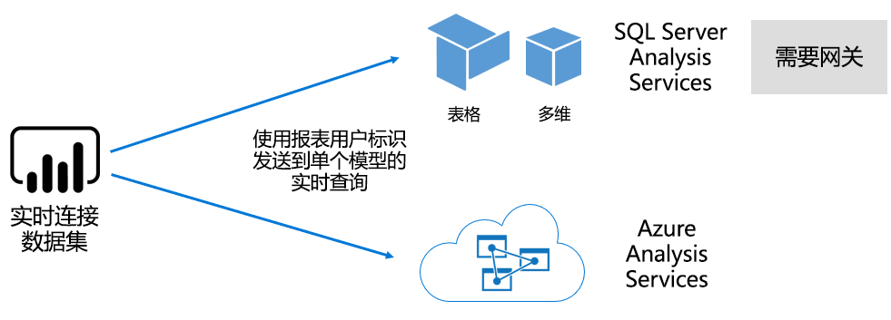

# Power BI 服务中的数据集

本文提供 Power BI 数据集的技术说明。

## 数据集类型

Power BI 数据集表示可报告和可视化的数据源。 有五种不同的数据集类型，它们通过以下方式生成：

- 连接到非 Power BI 容量托管的现有数据模型
- 上传包含模型的 Power BI Desktop 文件
- 上传 Excel 工作簿（包含一个或多个 Excel 表和/或工作簿数据模型），或上传 CSV（逗号分隔值）文件
- 使用 Power BI 服务创建[推送数据集](developer/automation/walkthrough-push-data.md)
- 使用 Power BI 服务创建[流或混合流数据集](service-real-time-streaming.md)

除了流数据集以外，数据集均表示使用成熟的 [Analysis Services](/analysis-services/analysis-services-overview) 建模技术的数据模型。

> [!NOTE]
> 在我们的文档中，有时交替使用术语“数据集”和“模型”。   通常，从 Power BI 服务角度而言，它是指数据集；从开发角度而言，它是指模型。   在我们的文档的上下文中，它们的含义相差无几。

### 外部托管模型

有两种外部托管模型类型：SQL Server Analysis Services 和 [Azure Analysis Services](/azure/analysis-services/analysis-services-overview)。

无论是本地还是 VM 托管的基础服务即服务 (IaaS)，连接到 SQL Server Analysis Services 模型均涉及安装[本地数据网关](service-gateway-onprem.md)。 Azure Analysis Services 无需网关。

当存在现有模型时（它们往往会成为企业数据仓库 (EDW) 的一部分），连接到 Analysis Services 通常很有意义。 Power BI 可以实时连接到 Analysis Services，使用 Power BI 报表用户身份执行数据权限。  SQL Server Analysis Services 同时支持多维模型（多维数据集）和表格模型。 “实时连接”数据集会将查询传递到外部托管模型，如下图所示。

### Power BI Desktop 开发的模型

Power BI Desktop 是专门用于 Power BI 开发的客户端应用程序，可使用它开发模型。 此模型实际上是 Analysis Services 表格模型。 可通过以下方式开发模型：从数据流导入数据，然后将它与外部数据源集成。 尽管关于如何建模的详细信息不属于本文讨论范围，但了解可使用 Power BI Desktop 开发三种不同类型（模式）的模型非常重要。  这些模式决定了是将数据导入到模型，还是将它保留在数据源中。 这三种模式包括：导入、DirectQuery 和复合。 有关每个模式的详细信息，请参阅文章 [Power BI 服务中的数据集模式](service-dataset-modes-understand.md)。

外部托管模型和 Power BI Desktop 模型可以执行行级别安全性 (RLS)，来限制为某个用户检索的数据。 例如，分配到“销售人员”安全组的用户只能查看其所分配到的销售区域的报表数据。  RLS 角色是动态或静态角色。   动态角色按报表用户进行筛选，而静态角色向分配给该角色的所有用户应用同样的筛选器。 有关详细信息，请参阅 [Power BI 行级别安全性 (RLS)](service-admin-rls.md)。

### Excel 工作簿模型

基于 [Excel 工作簿](service-excel-workbook-files.md)或 [CSV 文件](service-comma-separated-value-files.md)创建数据集会自动生成模型。 将导入 Excel 表和 CSV 数据，以创建模型表；将转置 Excel 工作簿数据模型，以生成 Power BI 模型。 在任何情况下，都会将文件数据导入到模型。

## 摘要

接下来，可以对表示模型的 Power BI 数据集进行区分：

- 它们或托管在 Power BI 服务中，或由 Analysis Services 进行外部托管。
- 它们可以存储导入的数据，或者向基础数据源发出传递查询请求，还可以结合使用这两种方式。

下面汇总了关于表示模型的 Power BI 数据集的重要事项：

- SQL Server Analysis Services 托管的模型需要使用网关执行实时连接查询。
- 将导入数据的 Power BI 托管的模型：
  - 必须完全加载到内存中，以便可以对其进行查询。
  - 需要通过刷新使数据保持最新，并且当无法直接通过 Internet 访问源数据时必须使用网关。
- 使用 [DirectQuery](desktop-directquery-about.md) 存储模式的 Power BI 托管的模型需要连接到源数据。 查询模型时，Power BI 向源数据发出查询，以检索最新数据。 当无法直接通过 Internet 访问源数据时，此模式必须使用网关。
- 模型可以执行 RLS 规则，强制筛选器将数据访问权限限定于某些用户。

## 注意事项

要成功部署和管理 Power BI，请务必了解模型的托管位置、模型存储模式、所有网关依赖项、导入的数据大小以及筛选类型和频率。 这些配置均可对 Power BI 容量资源产生重大影响。 此外，模型设计本身，包括它的数据准备查询、关系和计算，这些均增加了要考虑的因素的复杂性。

此外，Power BI 托管的导入模型可以按照计划刷新，也可以由 Power BI 服务用户按需触发它，了解这一点很重要。

## 后续步骤

- [Power BI 服务中的数据集模式](service-dataset-modes-understand.md)
- 更多问题？ [尝试咨询 Power BI 社区](https://community.powerbi.com/)
