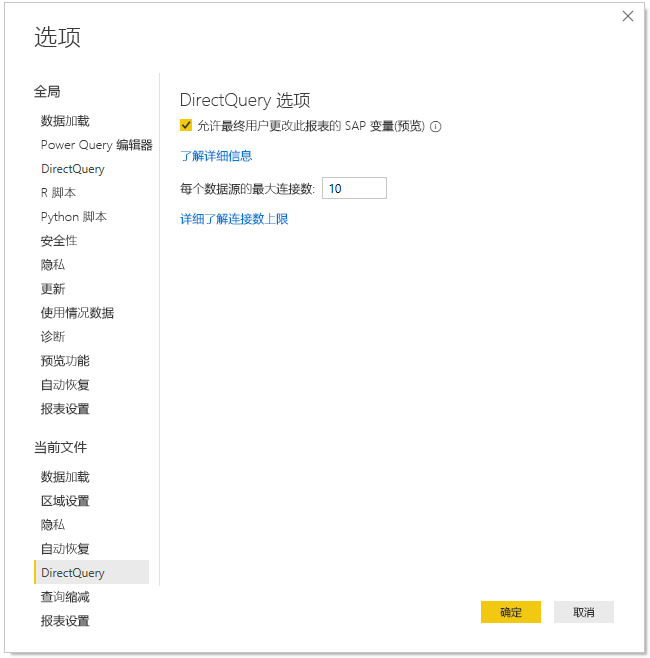
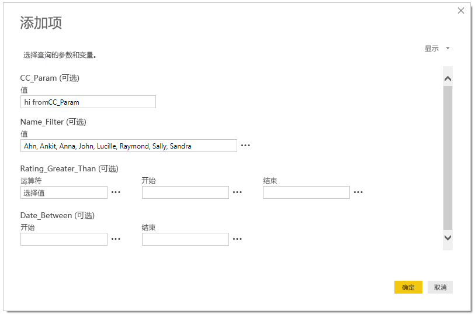

# 在 Power BI 服务中编辑 SAP 变量

将 SAP Business Warehouse 或 SAP HANA 与 DirectQuery 结合使用时，报表作者现可允许最终用户在高级和共享工作区的 Power BI 服务中编辑 SAP 变量  。 请注意，此功能不适用于基于 V1 工作区创建的“我的工作区和应用”的“与我共享”选项卡中的报表。 

本文档介绍了在 Power BI 中编辑变量的要求、如何启用此功能以及在 Power BI 服务中编辑变量的位置。

## SAP 编辑变量的要求

使用 SAP 编辑变量功能有一些要求。 下表描述了这些要求。

**需要新筛选器体验** - 必须为报表启用[新筛选器体验](power-bi-report-filter.md)。 以下是在 Power BI Desktop 中为报表启用它的方法：
- 在 Power BI Desktop 中，选择“文件” > “选项和设置” > “选项”   
- 在导航窗格的“当前文件”下方，选择“报表设置”   。
- 在“筛选体验”下，选择“启用更新的筛选器窗格”   。

**需要 DirectQuery 连接** - 必须使用 DirectQuery 连接到 SAP 数据源。 不支持导入连接。

**需要进行 SSO 设置** - 要使此功能正常工作，必须配置单一登录 (SSO)。 有关详细信息，请参阅[单一登录 (SSO) 概述](service-gateway-sso-overview.md)。

**需要新建网关位** - 下载最新网关并更新现有网关。 有关详细信息，请参阅[服务网关](service-gateway-onprem.md)。

**仅适用于 SAP HANA 的多维** - 对于 SAP HANA，SAP 编辑变量功能仅适用于多维模型，不适用于关系源。

**在主权云中不受支持** - 目前 Power Query Online 在主权云中不可用；因此，主权云也不支持此功能。

## 如何启用该功能

若要启用“SAP 编辑变量”功能，请在 Power BI Desktop 中连接到 SAP HANA 或 SAP BW 数据源  。 然后转到“文件”>“选项和设置”>“选项”，然后在左窗格的当前文件部分中选择“DirectQuery”   。 选择该选项后，可在右侧窗格中看到 DirectQuery 选项和一个复选框，可在其中“允许最终用户更改报表中的 SAP 变量”，如下图所示  。

## 在 Power BI Desktop 中使用 SAP 编辑变量

在 Power BI Desktop 中使用 SAP 编辑变量时，可以通过从功能区中的“编辑查询”菜单中选择“编辑变量”链接来编辑变量  。 此时将显示以下对话框。 此功能已在 Power BI Desktop 中提供了一段时间。 报表创建者可以使用以下对话框为报表选择变量。

## 在服务中使用 SAP 编辑变量

将报表发布到 Power BI 服务后，用户可以在新的“筛选器”窗格中看到“编辑变量”链接  。 如果是首次发布报表，则可能需要最多 5 分钟才能显示“编辑变量”链接。 如果未显示链接，则需要手动刷新数据集。
为此，可以执行以下操作:

1. 在 Power BI 服务中，选择工作区内容列表中的“数据集”选项卡  。

2. 找到需要刷新的数据集，然后选择“刷新”图标  。

    

3. 选择“编辑变量”链接会弹出“编辑变量”对话框，用户可以在其中覆盖变量  。 选择“重置”按钮会将变量重置为打开此对话框时显示的原始值  。

    

4. “编辑变量”对话框中的任何更改仅对此用户持续存在（类似于 Power BI 中的其他持久性行为）  。 选择“重置为默认值”，如下图所示，将报表重置为报表创建者的原始状态，包括变量  。

    

如果 Power BI 服务使用启用了“编辑变量”功能的 SAP HANA 或 SAP BW，则在该服务中处理已发布报表时，报表所有者可以更改这些默认值  。 报表所有者可以在编辑模式下更改变量，并保存报表以使这些设置为该报表的新默认设置  。 在报表所有者进行此类更改后，访问该报表的任何其他用户都将看到这些新设置已为默认设置。

## 后续步骤

有关 SAP HANA、SAP BW 或 DirectQuery 的详细信息，请参阅以下文章：

- [在 Power BI Desktop 中使用 SAP HANA](desktop-sap-hana.md)
- [DirectQuery 和 SAP Business Warehouse (BW)](desktop-directquery-sap-bw.md)
- [DirectQuery 和 SAP HANA](desktop-directquery-sap-hana.md)
- [在 Power BI 中使用 DirectQuery](desktop-directquery-about.md)
