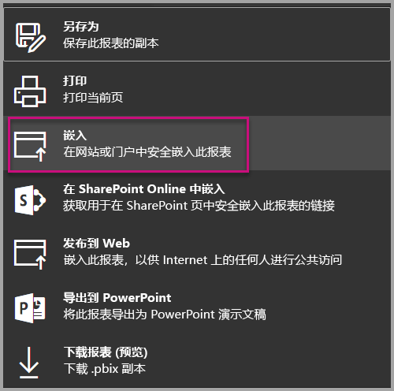
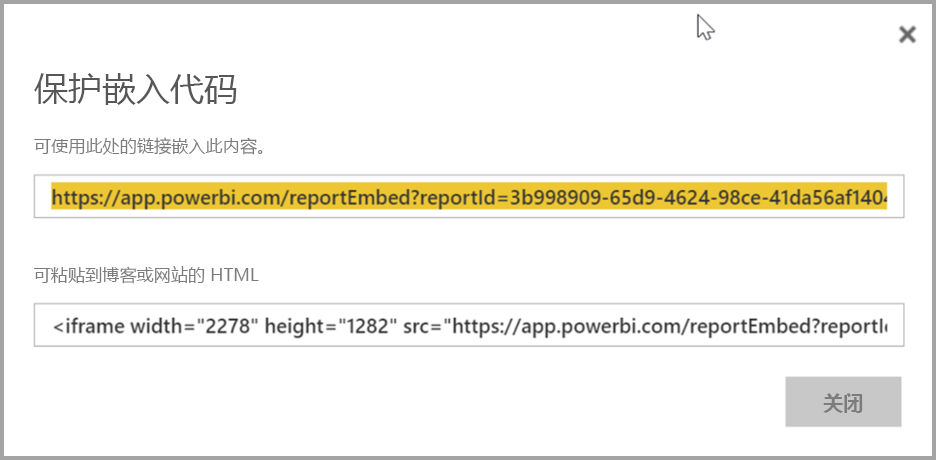
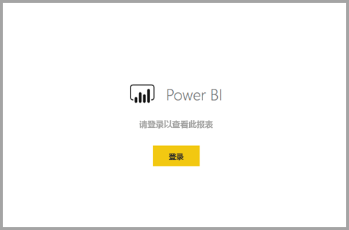

# <a name="embed-a-report-in-a-secure-portal-or-website"></a>在安全门户或网站中嵌入报表

借助 Power BI 报表的新“嵌入”选项，你可以轻松、安全地在内部 Web 门户中嵌入报表  。 这些门户可以是基于云的，也可以是本地托管的，例如 SharePoint 2019   。 嵌入的报表通过[行级别安全性 (RLS)](service-admin-rls.md) 尊重所有项目权限和数据安全性。 它们在任何接受 URL 或 iFrame 的门户中提供无代码嵌入。 

“嵌入”选项支持 [URL 筛选器](service-url-filters.md)和 URL 设置  。 它使你可以使用只需要基本 HTML 和 JavaScript 知识的低代码方法来与门户集成。

## <a name="how-to-embed-power-bi-reports-into-portals"></a>如何将  Power BI 报表嵌入门户

1. 在 Power BI 服务中报表的“文件”  菜单上提供新的“嵌入”  选项。

    

2. 选择“嵌入”选项将打开一个对话框，该对话框提供一个链接和一个可用于安全嵌入报表的 iFrame  。

    

3. 无论用户是直接打开报表 URL，还是打开嵌入在 Web 门户中的报表 URL，都需要进行身份验证才能访问报表。 如果用户未在其浏览器会话中登录 Power BI，将会显示以下屏幕。 当用户选择“登录”时，可能会打开新的浏览器窗口或标签页  。 如果未提示用户进行登录，请让他们检查是否启用了弹出窗口阻止程序。

    

4. 用户登录后，将打开报表，其中显示了数据并允许进行页面导航和筛选器设置。 只有拥有查看权限的用户才能在 Power BI 中查看报表。 此外，还应用了所有[行级别安全性 (RLS)](service-admin-rls.md) 规则。 最后，用户需要获得正确许可，要么需要 Power BI Pro 许可证，要么报表必须位于处于 Power BI Premium 容量范围内的工作区中。 用户每次打开新的浏览器窗口时都需要登录。 不过，登录后，其他报表会自动加载。

    

5. 使用 iFrame 时，可能需要编辑“高度”和“宽度”，以使其适合门户的网页   。

    

## <a name="granting-report-access"></a>授予报表访问权限

“嵌入”选项不会自动允许用户查看报表  。 查看权限在 Power BI 服务中设置。

在 Power BI 服务中，你可以与需要访问权限的用户共享嵌入的报表。 如果使用 Office 365 组，你可以将该用户列为工作区成员。 有关详细信息，请参阅如何[管理 Power BI 和 Office 365 中的工作区](service-manage-app-workspace-in-power-bi-and-office-365.md)。

## <a name="licensing"></a>许可

要查看嵌入的报表，用户需要具有 Power BI Pro 许可证，或该内容需要位于处于 [Power BI Premium 容量（EM 或 P SKU）](service-admin-premium-purchase.md)范围内的工作区中。

## <a name="customize-your-embed-experience-using-url-settings"></a>使用 URL 设置自定义嵌入体验

你可以使用嵌入 URL 的输入设置来自定义用户体验。 在提供的 iFrame 中，可以更新 URL 的 src 设置  。

| 属性  | 说明  |  |  |  |
|--------------|-----------------------------------------------------------------------------------------------------------------------------------------------------------------------------------------------------------------------|---|---|---|
| pageName  | 你可以使用 pageName 查询字符串参数来设置要打开的报表页面  。 在 Power BI 服务中查看报表时，你可以在报表 URL 的末尾找到此值，如下所示。 |  |  |  |
| URL 筛选器  | 你可以在从 Power BI UI 接收到的嵌入 URL 中使用 [URL 筛选器](service-url-filters.md)来筛选嵌入的内容。 借助这种方式，可以通过基本 HTML 和 JavaScript 体验生成低代码集成。  |  |  |  |

## <a name="set-which-page-opens-for-an-embedded-report"></a>为嵌入的报表设置要打开的页面 

在 Power BI 服务中查看报表时，你可以在报表 URL 处找到 pageName 值  。

1. 从 Web 浏览器中的 Power BI 服务打开报表，然后复制地址栏中的 URL。

    

2. 将 pageName  设置追加到此 URL。

    

## <a name="filter-report-content-using-url-filters"></a>使用 URL 筛选器筛选报表内容 

你可以使用 [URL 筛选器](service-url-filters.md)来提供不同的报表视图。 例如，下面的 URL 筛选报表以显示能源行业的数据。

将 pageName  和 [URL 筛选器](service-url-filters.md)结合使用的功能非常强大。 可以使用基本 HTML 和 JavaScript 生成体验。

例如，可以将以下按钮添加到 HTML 页面：

```html
<button class="textLarge" onclick='show("ReportSection", "Energy");' style="display: inline-block;">Show Energy</button>
```

选择此按钮时，此按钮会调用一个函数，以使用更新的 URL 来更新 iFrame，其中包含能源行业筛选器。

```javascript
function show(pageName, filterValue)

{

var newUrl = baseUrl + "&pageName=" + pageName;

if(null != filterValue && "" != filterValue)

{

newUrl += "&$filter=Industries/Industry eq '" + filterValue + "'";

}

//Assumes there's an iFrame on the page with id="iFrame"

var report = document.getElementById("iFrame")

report.src = newUrl;

}
```


可以根据需要添加任意数量的按钮，以创建低代码自定义体验。 

## <a name="considerations-and-limitations"></a>注意事项和限制

* 安全嵌入方案支持分页报表，并且还支持带有 URL 参数的分页报表。 阅读有关[在分页报表的 URL 中传递报表参数](paginated-reports/report-builder-url-pass-parameters.md)的详细信息。

* 不支持外部来宾用户访问 Azure 企业到企业 (B2B)。

* 安全嵌入适用于发布到 Power BI 服务的报表。

* 用户每次打开新的浏览器窗口时都需要登录才能查看报表。

* 某些浏览器要求用户在登录后刷新页面，尤其是在使用 InPrivate 或 Incognito 模式的情况下。

* 如果使用不受支持的浏览器版本，则可能会遇到问题。 Power BI 支持[以下浏览器列表](power-bi-browsers.md)。

* 经典 SharePoint Server 不受支持，因为它需要 11 之前的 Internet Explorer 版本或启用“兼容性视图”模式。

* 要实现单一登录体验，请使用[“在 SharePoint Online 中嵌入”选项](service-embed-report-spo.md)，或使用[用户拥有数据](developer/embedded/embed-sample-for-your-organization.md)嵌入方法生成自定义集成。 

* 随“嵌入”  选项提供的自动身份验证功能不适用于 Power BI JavaScript API。 对于 Power BI JavaScript API，请使用[用户拥有数据](developer/embedded/embed-sample-for-your-organization.md)嵌入方法。 

* 身份验证令牌生存期基于 AAD 设置进行控制。 当身份验证令牌过期时，用户需要刷新其浏览器以获取更新的身份验证令牌。 默认生存期为一小时，但你的组织可能设置更短或更长的时间。

## <a name="next-steps"></a>后续步骤

* [在 Power BI 中共享工作的方式](service-how-to-collaborate-distribute-dashboards-reports.md)

* [在 URL 使用查询字符串参数筛选报表](service-url-filters.md)

* [在 SharePoint Online 中嵌入报表 Web 部件](service-embed-report-spo.md)

* [从 Power BI 发布到 Web](service-publish-to-web.md)
