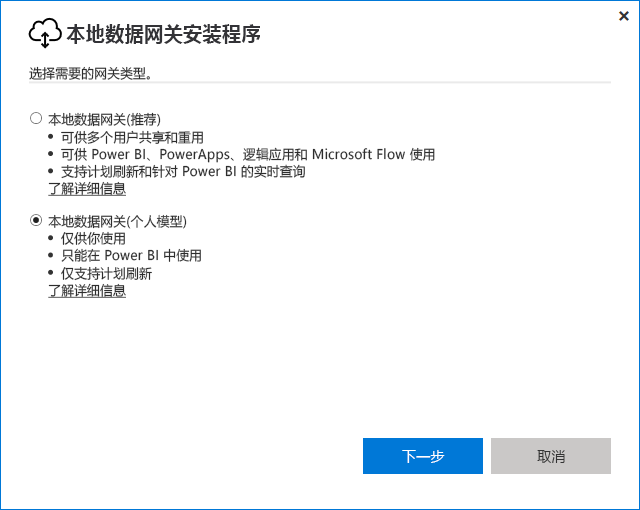

# <a name="use-personal-gateways-in-power-bi"></a>在 Power BI 中使用个人网关

[!INCLUDE [gateway-rewrite](includes/gateway-rewrite.md)]

本地数据网关（个人模式）是仅适用于 Power BI 的本地数据网关版本。 个人使用个人网关可在自己的计算机上安装网关并访问本地数据。

> [!NOTE]
> 只能为每个 Power BI 用户运行一个个人模式网关。 如果为同一用户安装另一个人模式网关，即使是在其他计算机上，最新安装也会替换现有旧安装。

## <a name="on-premises-data-gateway-vs-on-premises-data-gateway-personal-mode"></a>本地数据网关与本地数据网关（个人模式）

下表介绍了本地数据网关与本地数据网关（个人模式）之间的差异。

|   |本地数据网关 | 本地数据网关(个人模型) |
| ---- | ---- | ---- |
|支持的云服务 |Power BI、PowerApps、Azure 逻辑应用、Microsoft Flow、Azure Analysis Services、数据流 |Power BI |
|运行 |以由有权访问网关的用户配置的身份 |以你的身份进行 Windows 身份验证，以由你配置的用户身份进行其他类型的身份验证 |
|只能以计算机管理员身份进行安装 |是 |否 |
|集中式网关和数据源管理 |是 |否 |
|导入数据和计划刷新 |是 |是 |
|DirectQuery 支持 |是 |否 |
|Analysis Services 的 LiveConnect 支持 |是 |否 |

## <a name="install-the-on-premises-data-gateway-personal-mode"></a>安装本地数据网关（个人模式）

若要安装本地数据网关（个人模式），执行以下操作：

1. [下载本地数据网关](https://go.microsoft.com/fwlink/?LinkId=820925&clcid=0x409)。

2. 在安装程序中，选择本地数据网关（个人模式），然后选择“下一步”按钮  。

   

成功完成安装并登录之后，将显示以下内容。


## <a name="using-fast-combine-with-the-personal-gateway"></a>将快速合并用于个人网关

在个人网关上使用快速合并可帮助在执行查询时忽略指定的隐私级别。 若要确保快速合并能够用于本地数据网关（个人模式）：

1. 使用文件资源管理器，打开以下文件：

   `%localappdata%\Microsoft\On-premises data gateway (personal mode)\Microsoft.PowerBI.DataMovement.Pipeline.GatewayCore.dll.config`

2. 在文件底部添加下列文本：

    ```xml
    <setting name="EnableFastCombine" serializeAs="String">
       <value>true</value>
    </setting>
    ```

3. 完成后，该设置将在大约一分钟后生效。 若要检查设置是否有效，请尝试在 Power BI 服务中执行按需刷新，确认快速合并是否正常工作   。

## <a name="frequently-asked-questions-faq"></a>常见问题解答 (FAQ)

**问：** 是否可以同时运行本地数据网关（个人模式）和本地数据网关（以前称为“企业版网关”）   ？
  
**答：** 是，两者可同时运行。

**问：** 是否可以将本地数据网关（个人模式）作为服务运行  ？
  
**答：** 否。 本地数据网关（个人模式）只能作为应用程序运行  。 如果需要将网关作为服务并/或在管理模式下运行，请考虑使用[**本地数据网关**](/data-integration/gateway/service-gateway-onprem)（以前称为“企业网关”）。

**问：** 本地数据网关（个人模式）多久更新一次  ？
  
**答：** 我们计划每月更新一次个人网关。

**问：** 为什么要求我更新凭据？
  
**答：** 很多情况都会触发对凭据的请求。 安装本地数据网关（个人模式）的计算机与已安装“Power BI - 个人版”网关的计算机不同是最常见的情况   。 还可能是数据源问题、Power BI 未能执行测试连接，或是出现超时或系统错误。 可以在 Power BI 服务中更新凭据，方法是转到齿轮图标，依次选择“设置”、“数据集”，找到有问题的数据集，然后选择“数据源凭据”      。

**问：** 升级期间，以前版本个人网关会有多长时间处于脱机状态？
  
**答：** 将个人网关升级到新版本应该仅需几分钟。

**问：** 我使用的是 R 和 Python 脚本。 它受支持吗？
  
**答：** 个人模式支持 R 和 Python 脚本。

## <a name="next-steps"></a>后续步骤

* [为本地数据网关配置代理设置](/data-integration/gateway/service-gateway-proxy)  

更多问题？ [尝试参与 Power BI 社区](http://community.powerbi.com/)

